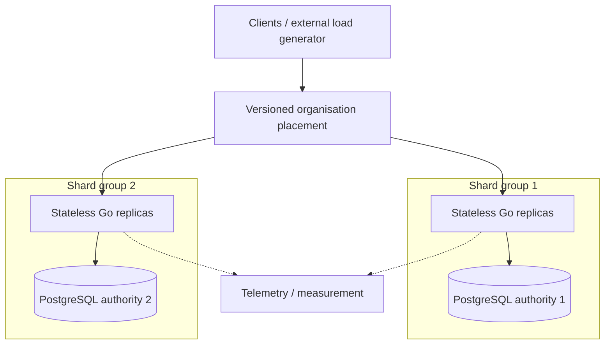

# Alloca-Go

Alloca-Go is a Go/PostgreSQL systems-engineering project that uses a production-oriented booking
service to explore **correctness under contention, performance, failure behaviour, and horizontal
scaling** with explicit invariants and retained evidence.

The project does not start from a predetermined distributed architecture. It keeps the booking
problem and synthetic workloads stable, measures where the real boundaries are, and changes the
system when the evidence gives a reason to do so.

**New here?** Read the [Project Journey](docs/project-journey.md) for the short story of how the
architecture and questions evolved.

## Architecture at a glance



A **shard group** is one independently writable PostgreSQL authority plus compatible stateless
service replicas bound to it. Adding service replicas and adding writable database authorities are
treated as separate scaling axes.

The current Phase 1 design keeps each supported mutation inside one writable transaction domain.
Cross-database-authority booking is explicitly refused rather than approximated with unrelated
local commits.

The accepted architecture is described in
[`docs/design/high-level-design.md`](docs/design/high-level-design.md) and
[`docs/design/horizontal-scaling.md`](docs/design/horizontal-scaling.md).

## What the project explores

Alloca uses a stateful booking system as a reusable test bed for transaction correctness,
idempotency and ambiguous outcomes, contention and workload shape, latency and saturation,
failure containment, writable-state scaling, and eventually elasticity. Observability and evidence
are part of the experiment rather than an afterthought.

The [exploration roadmap](docs/planning/alloca-go-roadmap.md) records broader areas that may be
worth investigating. More concrete unresolved questions are kept in
[`docs/planning/open-questions.md`](docs/planning/open-questions.md).

All workloads are synthetic engineering models. They are not descriptions of any organisation's
real traffic or architecture.

## Evidence so far

| Area | What the retained evidence establishes | Boundary / open question |
|---|---|---|
| **Single-authority frontier** | On the retained developer-workstation run, throughput reached roughly **4,300 booking req/s** and PostgreSQL, not available Go service compute, set the first measured frontier. | Workstation result only. The exact PostgreSQL limiting mechanism and the source of large run-to-run variance remain open. |
| **Multiple writable authorities** | Two authorities can serve independent organisation work while preserving the accepted transaction semantics and containing authority failure. | This is a correctness and failure-isolation result, **not** a throughput multiplier claim. |
| **Independent capacity scaling** | The local scheduler-partitioned G1/G2/G4 experiment produced useful diagnostic evidence, but G1 and G2 did not reproduce tightly enough for scale efficiency to be accepted. | Independently provisioned scaling remains unproven. PR4c stopped at cloud provisioning and produced no performance cell. |

The corresponding reports are:

- [single-instance frontier](docs/measurements/reports/ag-sept-pr2-single-instance-frontier.md);
- [Phase 1 multi-authority correctness](docs/measurements/reports/ag-sept-pr3c-phase1-correctness.md);
- [scheduler-partitioned capacity checkpoint](docs/measurements/reports/ag-sept-pr4-scheduler-partitioned-capacity.md).

AG-Sept Iteration C remains open. Its independently provisioned capacity question has not yet been
answered; the project will not infer that result from the co-resident workstation experiment.

## Quick start

Requires Go **1.26.5** (the pinned toolchain) and Docker, including the Compose plugin that
`make ci` renders the container topology through. `make smoke` additionally needs `curl`, `psql`
and `python3` on the host, because it seeds and removes its own rows with SQL.

```sh
make dev
```

This starts PostgreSQL in Docker, applies migrations, and runs the service on `:8080`. It holds the
terminal, so run the smoke test in another one:

```sh
make smoke
```

Run the normal local validation gate with:

```sh
make ci
```

The load-generation and measurement procedure is documented in
[`docs/operations/load-harness.md`](docs/operations/load-harness.md). Retained measurement reports
and artifacts live under [`docs/measurements/`](docs/measurements/).

## Documentation map

- **[Project Journey](docs/project-journey.md)** — the short narrative: where the project started,
  what the experiments changed, and the direction of future investigation.
- **[High-level design](docs/design/high-level-design.md)** — current architecture, design
  principles, and links to the documents that own each design concern.
- **[Requirements](docs/requirements/)** — durable requirements and the current engineering
  Problem.
- **[Transaction semantics](docs/design/transaction-semantics.md)** — correctness invariants,
  locking, idempotency, replay, and outcomes.
- **[Measurement contract](docs/design/measurement-contract.md)** — evidence labels, workload/result
  vocabulary, reconciliation, SLIs, and admissibility rules.
- **[Architecture decisions](docs/decisions/)** — durable ADRs.
- **[Planning](docs/planning/)** — milestone plans and validation, the exploration roadmap, and open
  engineering questions.
- **[Measurements](docs/measurements/)** — retained reports and evidence artifacts.
- **[Operations](docs/operations/)** — running, load generation, and experiment procedures.
- **[Engineering process](docs/development/engineering-process.md)** — the Problem → Requirements →
  Design → Validation → implementation → Evidence → Analyse & Review loop.

## Working principle

> **Methodology informs the investigation. Evidence decides the conclusion. Engineering judgement
> chooses the next useful question.**
