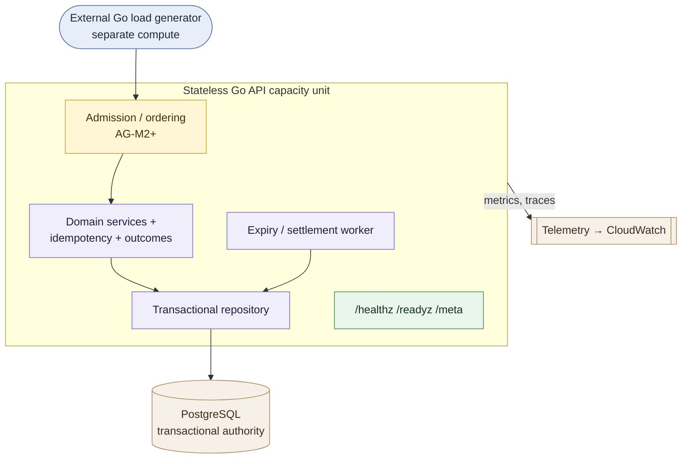

# Alloca-Go — High-Level Design

**Status:** Living — the design entry point (current through AG-M1)
**Scope:** the problem Alloca-Go exists to answer, the design principles that shape
every part of it, the architecture at a glance, and a map of which document owns each
detailed decision.

This is the **entry point** to the design record. Read it first. It owns the
*high-level* framing — the problem, the unifying principles, and the shape of the
system — and then hands off to the documents that own each concern in normative
detail. It deliberately does **not** restate the outcome taxonomy, the timeout budget,
the domain rules, or the package rules: those live once, in their owning documents
(see [§5](#5-where-each-decision-lives)), so a change is made in exactly one place.

---

## 1. What Alloca-Go is

Alloca-Go is a production-shaped distributed reservation system in Go, exploring
correctness, contention, scalability, overload behaviour, and capacity economics.

Its central lens is that a booking system of this kind is not mainly a CRUD service. It
is an **allocation system under contention**: many users try to acquire the same small
set of units at the same moment — amplified by refreshes, retries, stale availability
reads, and confirmation flows. The interesting failures are not ordinary request
volume; they are oversell, duplicate bookings, stranded holds, bookings that land after
a window has closed, availability that "lies", and latency that grows until everything
times out. From there the project also asks how independent authorities scale, how the
system should behave under overload, and what it costs per useful operation.

Alloca-Go treats those as first-class engineering questions and measures them. It uses
two **synthetic** representative workloads — a fitness-club synchronized release across
many independent organisations, and a shared-resource contention workload — as
engineering models, never as descriptions of any organisation's real system
([`system-context.md`](system-context.md) §1;
[`../public-disclosure-policy.md`](../public-disclosure-policy.md)).

The project's questions, milestone plan, and measurement vocabulary are set out in the
[roadmap](../planning/alloca-go-roadmap.md). Its **core principle** — the single
optimisation objective the whole system serves — is:

> Optimise for sustainable, SLO-compliant, resilient throughput per unit cost — not
> peak accepted request rate.

### 1.1 Relationship to RuntimeIQ, the predecessor prototype

Alloca-Go did not start from a blank page. **RuntimeIQ** is a personal project by the
same author, and its booking prototype **RuntimeIQ-Alloca** is the direct predecessor
of this system — the reason several questions here are already sharp rather than
exploratory. The lineage is stated openly so that prior evidence can be cited honestly
instead of appearing as an unsourced assumption.

What carries over:

- **Domain knowledge.** The shape of the booking problem — holds and their expiry,
  synchronized release waves, capacity as the contended resource — is inherited, not
  rediscovered.
- **Questions and failure modes.** `[PRIOR-UNREPRODUCED]` The prototype found that
  latency grew with concurrency until timeouts became the visible failure, without
  isolating *why*. That unresolved "why" is a large part of what Alloca-Go is built to
  answer.
- **Design lessons**, restated synthetically for this repository.

What does **not** carry over:

- **Code.** Alloca-Go is a new implementation in Go, not a port
  ([roadmap](../planning/alloca-go-roadmap.md) §1).
- **Results — as results.** Prototype figures *do* enter this repository, but only as
  `[PRIOR-UNREPRODUCED]` evidence ([`measurement-contract.md`](measurement-contract.md)
  §2). Such a figure sets a starting hypothesis and never settles a question; when an
  experiment here reproduces it, the reproduction — not the prior figure — becomes the
  `[MEASURED]` result.
- **Private material.** Nothing private about RuntimeIQ — source, paths, hosts, plans —
  enters this repository. The naming rule is owned by
  [`../public-disclosure-policy.md`](../public-disclosure-policy.md); RuntimeIQ's own
  release status is independent of this repository's.

## 2. Design principles

The core principle above is the *objective*; the principles here are the *means*. They
are the cross-cutting engineering commitments that serve that objective and the
correctness it depends on — they explain *why* the system is shaped the way it is. They
sit above any single document; each one is **made concrete** in the doc named after it,
which is where its normative form lives.

1. **Correct authority before distribution.** Every scarce or conserved resource has
   exactly one write authority. Adding API nodes never removes the serialization limit
   of a single hot authority, so correctness of that authority is settled before any
   scaling concern. For booking, the authority is the slot.
   → *concrete in* [`system-context.md`](system-context.md) §3,
   [`transaction-semantics.md`](transaction-semantics.md) §2.

2. **Goodput over accepted load.** A request that is accepted but later times out,
   violates a correctness gate, or amplifies retries is not capacity. Outcomes are
   classified so that useful domain operations, valid business refusals, timeouts,
   unknown commits, and replays are each counted distinctly and never conflated.
   → *concrete in* [`measurement-contract.md`](measurement-contract.md) §3–§4.

3. **Overload is explicit and bounded.** Under pressure the service prefers an
   explicit, bounded answer (sold out, retry-after, admission-rejected, queue-position,
   or "unknown — safe to replay") to unbounded latency growth ending in generic
   timeouts.
   → *concrete in* [`measurement-contract.md`](measurement-contract.md) §4,
   the roadmap §6.2, and the admission tier (AG-M2+).

4. **Time and policy are service-owned.** Booking decisions use authoritative
   service-observed time, never a client-supplied timestamp; the reservation hold TTL
   is a service policy, not a client choice. This keeps competing requests ordered by
   service decision time and stops clients manipulating hold timing.
   → *concrete in* [`transaction-semantics.md`](transaction-semantics.md) §1.5–§1.6.

5. **Idempotency is domain-local, and every ambiguous outcome is replay-safe.** A
   client-supplied key, scoped so it cannot collide across organisations/users/
   operations, records one logical mutation with its outcome in the same transaction as
   the mutation. A timeout or unknown-commit outcome is resolved by replaying the *same*
   key, never by issuing a new mutation.
   → *concrete in* [`transaction-semantics.md`](transaction-semantics.md) §5,
   [`latency-timeouts-and-retries.md`](latency-timeouts-and-retries.md) §4.

6. **Deadlines nest, innermost-first.** The per-request deadline chain is ordered so
   the innermost responsible layer times out first and returns a classified outcome,
   rather than a generic outer timeout tearing the request down. The ordering is a
   checked startup invariant, not just a documented intention.
   → *concrete in* [`measurement-contract.md`](measurement-contract.md) §8/§8.1,
   [`latency-timeouts-and-retries.md`](latency-timeouts-and-retries.md).

7. **Evidence discipline: no number graduates silently.** Every quantitative claim
   carries exactly one label — measured, prior-unreproduced, derived, or hypothesis —
   so a modelled assumption can never be read as an observed result. This is also a
   disclosure safeguard.
   → *concrete in* [`measurement-contract.md`](measurement-contract.md) §2.

8. **Dependencies point inward; boundaries are enforced in code.** The domain owns its
   interfaces and depends on nothing but the standard library; transport and
   persistence types stay at the edges. A change that would need a prohibited import is
   an ADR trigger, not a quiet exception.
   → *concrete in* [`project-structure.md`](project-structure.md) §4.

9. **Modular monolith first; decompose on evidence.** One deployable with enforced
   internal boundaries, split into services only when measured scaling, availability,
   or ownership evidence justifies the distributed-system cost.
   → *concrete in* [`../decisions/0001-modular-monolith-first.md`](../decisions/0001-modular-monolith-first.md),
   [`project-structure.md`](project-structure.md) §8.

## 3. Architecture at a glance

Alloca-Go is a stateless Go API in front of PostgreSQL as the single transactional
authority, driven for measurement by an external load generator, and observed through
OpenTelemetry-compatible telemetry. The diagram below is orientation only; the
authoritative system-context, module, and authority-boundary diagrams — and the exact
status of each region — live in [`system-context.md`](system-context.md).

The load-bearing structural facts:

- **The slot row is the aggregate and the write authority.** Every capacity-changing
  operation locks the slot row inside one transaction, giving single-writer
  serialization per slot within PostgreSQL. Different slots never contend **on this
  lock** — the basis for dispersed-authority horizontal scaling — though they still
  share PostgreSQL resources (connection pool, CPU, I/O, WAL), so this is not a claim of
  linear independence; AG-M2/AG-M4 measure that. An in-process router is a per-node
  optimisation only; PostgreSQL is the sole cross-node serialization authority.
- **Correctness does not depend on the background worker.** Elapsed holds are settled
  lazily under the slot lock by any capacity-changing operation; the worker only makes
  release *prompt*.
- **Idempotency records commit with their mutation**, so one scoped key can only ever
  produce one logical mutation.

Each of these is stated normatively — with the state machines, the lock protocol,
expiry settlement, and the full outcome mapping — in
[`transaction-semantics.md`](transaction-semantics.md).

## 4. Reading order

1. **This document** — problem, principles, architecture shape.
2. [`../planning/alloca-go-roadmap.md`](../planning/alloca-go-roadmap.md) — the
   questions, the 40-day milestone plan, and the measurement vocabulary.
3. [`system-context.md`](system-context.md) — system boundary, module layout, and
   authority boundaries (the authoritative diagrams).
4. [`project-structure.md`](project-structure.md) — how modules map to Go packages and
   the dependency rules that keep the boundary enforceable.
5. [`measurement-contract.md`](measurement-contract.md) — evidence labelling, the
   outcome taxonomy, SLIs, provisional SLOs, and the timeout budget.
6. [`transaction-semantics.md`](transaction-semantics.md) — the normative AG-M1 domain
   model, state machines, lock strategy, expiry, outcome mapping, and idempotency.
7. [`latency-timeouts-and-retries.md`](latency-timeouts-and-retries.md) — latency
   bands, the deadline-budget rationale, and the retry policy.
8. [`../decisions/`](../decisions/) — the architecture decision records.

Milestone-level *plans of work* (how a milestone is split into reviewable PRs) live
under [`../planning/`](../planning/) — currently the
[AG-M1 implementation plan](../planning/ag-m1-implementation-plan.md).

## 5. Where each decision lives

The map from concern to owning document. This table is the one place that should list
them all; the entries below **own** their subject and are the authority for it.

| Concern | Owning document |
|---|---|
| Project intent, theses, milestone plan, measurement vocabulary, SLO lifecycle | [`../planning/alloca-go-roadmap.md`](../planning/alloca-go-roadmap.md) |
| System boundary, actors, module diagram, authority boundaries | [`system-context.md`](system-context.md) |
| Package layout, dependency rules, extraction seams | [`project-structure.md`](project-structure.md) |
| Evidence labelling, **outcome taxonomy**, SLIs, provisional SLOs, **timeout budget** | [`measurement-contract.md`](measurement-contract.md) |
| **Domain model, state machines, aggregate lock, expiry, outcome mapping, idempotency** | [`transaction-semantics.md`](transaction-semantics.md) |
| HTTP contract — routes, request/response shapes, status mapping, operational endpoints | [`api-surface.md`](api-surface.md) |
| What the service emits about itself — observation types, cardinality rule, log shape | [`observability.md`](observability.md) |
| Latency bands, deadline-budget rationale, retry policy | [`latency-timeouts-and-retries.md`](latency-timeouts-and-retries.md) |
| Modular monolith first | [`../decisions/0001-modular-monolith-first.md`](../decisions/0001-modular-monolith-first.md) |
| PostgreSQL as transactional authority | [`../decisions/0002-postgresql-transactional-authority.md`](../decisions/0002-postgresql-transactional-authority.md) |
| Predecessor lineage — what Alloca-Go inherits from RuntimeIQ and what it does not | this document §1.1 |
| Public-release disclosure rules, predecessor naming rule, pre-release checks | [`../public-disclosure-policy.md`](../public-disclosure-policy.md), [`../pre-public-checklist.md`](../pre-public-checklist.md) |
| How to drive an AG-Sept measurement run locally — the procedure, not the rules | [`../operations/load-harness.md`](../operations/load-harness.md) |
| Accepted technical debt — what each gap costs and the trigger that ends the acceptance | [`../planning/tech-debts.md`](../planning/tech-debts.md) |

If a design fact you need is not owned by one of these, it is either high-level enough
to belong in §1–§3 above, or it has no home yet — which is a signal to give it one,
not to record it twice.

## 6. Where the work is

Alloca-Go is built milestone by milestone (roadmap §7). AG-M0 established the
foundation and the measurement contract; AG-M1 is building the correct transactional
core. The current status of each architectural region is tracked in
[`system-context.md`](system-context.md) §2, and the AG-M1 breakdown into PRs in the
[AG-M1 implementation plan](../planning/ag-m1-implementation-plan.md). This document
does not duplicate that status so it cannot fall out of date against it.

**The load-bearing measured result so far** is the single-instance frontier:
**PostgreSQL, not the Go service, is what limits booking throughput** — the service
saturates the database while using a small fraction of its host's CPU, so adding service
replicas against one database buys availability rather than rate. It is the finding that
governs how any scale-out work is read, which is why it is signposted here rather than only
in the milestone tracker. The number, the conditions it was measured under, and what it
cannot be used to claim are all in
[`../measurements/reports/ag-sept-pr2-single-instance-frontier.md`](../measurements/reports/ag-sept-pr2-single-instance-frontier.md) §5; the
architectural consequence is recorded against
[ADR-0002](../decisions/0002-postgresql-transactional-authority.md).

## 7. Evidence and disclosure

This document records no `[MEASURED]` number and states no specific SLO or timeout
value — those are owned, and labelled, by the measurement contract. All workloads and
examples are synthetic engineering models, not descriptions of any organisation's
system. The repository-wide rules are in
[`../public-disclosure-policy.md`](../public-disclosure-policy.md).
