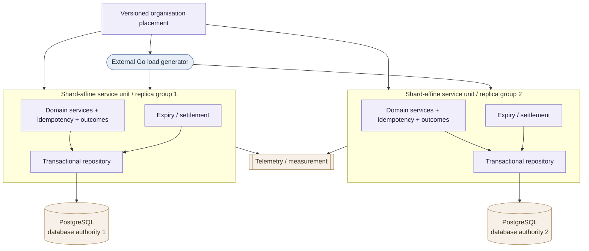

# Alloca-Go — High-Level Design

**Status:** Living — the design entry point (current through AG-Sept horizontal scaling and deployment architecture)
**Scope:** the problem Alloca-Go exists to answer, the design principles that shape
every part of it, the architecture at a glance, and a map of which document owns each
detailed decision.

This is the **entry point** to the design record. Read it first for system shape; the
repository-wide documentation entry point is [`../README.md`](../README.md). This document owns
the *high-level* framing — the problem, the unifying principles, and the shape of the
system — and then hands off to the documents that own each concern in normative
detail. It deliberately does **not** restate the outcome taxonomy, the timeout budget,
the domain rules, or the package rules: those live once, in their owning documents
(see [§5](#5-where-each-decision-lives)), so a change is made in exactly one place.

---

## 1. What Alloca-Go is

Alloca-Go is a production-shaped distributed reservation system in Go, exploring
correctness, contention, scalability, overload behaviour, and capacity economics.

Its central lens is that a booking system of this kind is not mainly a CRUD service. It
is an **allocation system under contention**: many users try to acquire the same small
set of units at the same moment — amplified by refreshes, retries, stale availability
reads, and confirmation flows. The interesting failures are not ordinary request
volume; they are oversell, duplicate bookings, stranded holds, bookings that land after
a window has closed, availability that "lies", and latency that grows until everything
times out. From there the project also asks how independent authorities scale, how the
system should behave under overload, and what it costs per useful operation.

Alloca-Go treats those as first-class engineering questions and measures them. It uses
two **synthetic** representative workloads — a fitness-club synchronized release across
many independent organisations, and a shared-resource contention workload — as
engineering models, never as descriptions of any organisation's real system
([`system-context.md`](system-context.md) §1;
[`../public-disclosure-policy.md`](../public-disclosure-policy.md)).

The project's questions, milestone plan, and measurement vocabulary are set out in the
[roadmap](../planning/alloca-go-roadmap.md). Its **core principle** — the single
optimisation objective the whole system serves — is:

> Optimise for sustainable, SLO-compliant, resilient throughput per unit cost — not
> peak accepted request rate.

### 1.1 Relationship to RuntimeIQ, the predecessor prototype

Alloca-Go did not start from a blank page. **RuntimeIQ** is a personal project by the
same author, and its booking prototype **RuntimeIQ-Alloca** is the direct predecessor
of this system — the reason several questions here are already sharp rather than
exploratory. The lineage is stated openly so that prior evidence can be cited honestly
instead of appearing as an unsourced assumption.

What carries over:

- **Domain knowledge.** The shape of the booking problem — holds and their expiry,
  synchronized release waves, capacity as the contended resource — is inherited, not
  rediscovered.
- **Questions and failure modes.** `[PRIOR-UNREPRODUCED]` The prototype found that
  latency grew with concurrency until timeouts became the visible failure, without
  isolating *why*. That unresolved "why" is a large part of what Alloca-Go is built to
  answer.
- **Design lessons**, restated synthetically for this repository.

What does **not** carry over:

- **Code.** Alloca-Go is a new implementation in Go, not a port
  ([roadmap](../planning/alloca-go-roadmap.md) §1).
- **Results — as results.** Prototype figures *do* enter this repository, but only as
  `[PRIOR-UNREPRODUCED]` evidence ([`measurement-contract.md`](measurement-contract.md)
  §2). Such a figure sets a starting hypothesis and never settles a question; when an
  experiment here reproduces it, the reproduction — not the prior figure — becomes the
  `[MEASURED]` result.
- **Private material.** Nothing private about RuntimeIQ — source, paths, hosts, plans —
  enters this repository. The naming rule is owned by
  [`../public-disclosure-policy.md`](../public-disclosure-policy.md); RuntimeIQ's own
  release status is independent of this repository's.

## 2. Design principles

The core principle above is the *objective*; the principles here are the *means*. They
are the cross-cutting engineering commitments that serve that objective and the
correctness it depends on — they explain *why* the system is shaped the way it is. They
sit above any single document; each one is **made concrete** in the doc named after it,
which is where its normative form lives.

1. **Correct logical authority before distribution.** A correctness invariant has an
   explicit logical authority before the system decides where to place or replicate it.
   Booking currently has three: the slot row owns capacity, the user-identity row owns
   schedule-mutation ordering, and the claim relation owns schedule validity. Those
   three logical authorities form two independent ownership axes — slot and user —
   which are then placed onto writable database authorities. Adding API nodes never
   removes the serialization limit of a hot logical authority, and splitting an
   ownership axis across databases would require an explicit replacement coordination
   protocol rather than an accidental distributed transaction.
   → *concrete in* [`transaction-semantics.md`](transaction-semantics.md) §2,
   [`horizontal-database-authority.md`](horizontal-database-authority.md) §3.

2. **Goodput over accepted load.** A request that is accepted but later times out,
   violates a correctness gate, or amplifies retries is not capacity. Outcomes are
   classified so that useful domain operations, valid business refusals, timeouts,
   unknown commits, and replays are each counted distinctly and never conflated.
   → *concrete in* [`measurement-contract.md`](measurement-contract.md) §3–§4.

3. **Overload is explicit and bounded.** Under pressure the service prefers an
   explicit, bounded answer (sold out, retry-after, admission-rejected, queue-position,
   or "unknown — safe to replay") to unbounded latency growth ending in generic
   timeouts.
   → *concrete in* [`measurement-contract.md`](measurement-contract.md) §4,
   the roadmap §6.2, and the admission tier (AG-M2+).

4. **Time and policy are service-owned.** Booking decisions use authoritative
   service-observed time, never a client-supplied timestamp; the reservation hold TTL
   is a service policy, not a client choice. This keeps competing requests ordered by
   service decision time and stops clients manipulating hold timing.
   → *concrete in* [`transaction-semantics.md`](transaction-semantics.md) §1.5–§1.6.

5. **Idempotency is domain-local, and every ambiguous outcome is replay-safe.** A
   client-supplied key, scoped so it cannot collide across organisations/users/
   operations, records one logical mutation with its outcome in the same transaction as
   the mutation. A timeout or unknown-commit outcome is resolved by replaying the *same*
   key, never by issuing a new mutation. In the partitioned design client idempotency
   follows the user ownership axis, giving every mutation and replay one stable home.
   → *concrete in* [`transaction-semantics.md`](transaction-semantics.md) §5,
   [`horizontal-database-authority.md`](horizontal-database-authority.md) §3.2,
   [`latency-timeouts-and-retries.md`](latency-timeouts-and-retries.md) §4.

6. **Deadlines nest, innermost-first.** The per-request deadline chain is ordered so
   the innermost responsible layer times out first and returns a classified outcome,
   rather than a generic outer timeout tearing the request down. The ordering is a
   checked startup invariant, not just a documented intention.
   → *concrete in* [`measurement-contract.md`](measurement-contract.md) §8/§8.1,
   [`latency-timeouts-and-retries.md`](latency-timeouts-and-retries.md).

7. **Evidence discipline: no number graduates silently.** Every quantitative claim
   carries exactly one label — measured, prior-unreproduced, derived, or hypothesis —
   so a modelled assumption can never be read as an observed result. This is also a
   disclosure safeguard.
   → *concrete in* [`measurement-contract.md`](measurement-contract.md) §2.

8. **Dependencies point inward; boundaries are enforced in code.** The domain owns its
   interfaces and depends on nothing but the standard library; transport and
   persistence types stay at the edges. A change that would need a prohibited import is
   an ADR trigger, not a quiet exception.
   → *concrete in* [`project-structure.md`](project-structure.md) §4.

9. **Modular monolith first; decompose on evidence.** One deployable with enforced
   internal boundaries, split into services only when measured scaling, availability,
   or ownership evidence justifies the distributed-system cost.
   → *concrete in* [`../decisions/0001-modular-monolith-first.md`](../decisions/0001-modular-monolith-first.md),
   [`project-structure.md`](project-structure.md) §8.

10. **Scale service compute and writable database authority as separate axes.** More
    stateless replicas can increase application compute or availability while all of
    them still share one PostgreSQL serialization/resource frontier. Horizontal database
    scaling composes independent writable transaction domains; service scaling multiplies
    compatible replicas inside one database-authority shard group. Every experiment names
    both dimensions rather than treating "scale-out" as one number.
    → *concrete in* [`horizontal-scaling.md`](horizontal-scaling.md), with the database-authority
    half detailed in [`horizontal-database-authority.md`](horizontal-database-authority.md),
    and evidence interpretation in [`measurement-contract.md`](measurement-contract.md).

## 3. Architecture at a glance

Alloca-Go is a stateless Go service whose authoritative transactional state can be
placed across one or more independently writable PostgreSQL **database authorities**.
A versioned organisation-placement map binds organisations to those database
authorities. Each database authority is served by a **shard group** of one or more
compatible stateless service replicas; each replica opens one pool to that authority.
Adding replicas increases service compute inside the shard group without creating a new
write authority.

Three terms are deliberately distinct:

| Term | Meaning |
|---|---|
| **logical authority** | owns a correctness decision: slot capacity, user-schedule serialization, or claim validity |
| **ownership axis** | the entity dimension that naturally partitions those decisions: slot or user |
| **database authority** | one independently writable PostgreSQL transaction domain hosting the logical authorities placed there |

The complete service/database scaling model is normative in
[`horizontal-scaling.md`](horizontal-scaling.md); the detailed database-authority definitions and
Phase 1/Phase 2 booking rules are normative in
[`horizontal-database-authority.md`](horizontal-database-authority.md). The diagram below
is orientation only; module and external-system boundaries remain owned by
[`system-context.md`](system-context.md).

The load-bearing structural facts:

- **Three logical authorities form two independent ownership axes.** The slot row owns
  capacity on the slot axis. The user-identity row serializes schedule mutation and the
  claim relation proves schedule validity on the user axis. The two user-side logical
  authorities remain distinct guarantees but are colocated because they jointly govern
  one `UserRef` schedule and coordinate atomically in the current local transaction.
- **A database authority is a transaction domain, not a service instance.** Several
  stateless replicas can point to one PostgreSQL writer and still share one database
  authority. Adding another writer creates another database authority.
- **Authority selection precedes replica selection.** An operation first resolves the owning
  database authority from the versioned placement model, then load-balances among compatible
  replicas inside that authority's shard group. Replica redundancy never becomes write fallback.
- **Same-database-authority booking keeps the whole correctness protocol local.** When
  `authority(user_organisation_id) == authority(slot_organisation_id)`, the slot and
  user ownership axes are hosted by one PostgreSQL database authority, so reserve can
  coordinate the slot lock, user lock, claims, mutation and idempotency in one local
  transaction. The organisations themselves may be different.
- **Cross-database-authority booking is a different coordination problem.** When those
  placement results differ, the user axis and slot axis lie in independent commit
  domains. Phase 1 refuses that operation explicitly; a later phase must provide a
  distributed protocol rather than composing two local commits and calling them atomic.
- **Correctness does not depend on the background worker.** Elapsed state is settled
  through the same transactional semantics as request paths; workers make release
  prompt, not correct.
- **Idempotency records commit with their mutation** on user-home, so one scoped key
  produces one logical mutation and ambiguous outcomes are resolved by same-key replay.

The local state machines, lock protocol, expiry settlement, outcome mapping and
idempotency semantics are normative in
[`transaction-semantics.md`](transaction-semantics.md). The whole horizontal scaling model is
owned by [`horizontal-scaling.md`](horizontal-scaling.md); how logical authorities are placed and
composed across PostgreSQL writers is detailed in
[`horizontal-database-authority.md`](horizontal-database-authority.md). Deployment lifecycle and
runtime topology properties are owned by
[`deployment-architecture.md`](deployment-architecture.md).

## 4. Reading order

1. **This document** — problem, principles, architecture shape.
2. [`../requirements/system-requirements.md`](../requirements/system-requirements.md) — the
   cross-cutting system requirements the designs must satisfy.
3. [`../planning/alloca-go-roadmap.md`](../planning/alloca-go-roadmap.md) — the
   project theses, milestones, and measurement vocabulary.
4. [`system-context.md`](system-context.md) — system boundary, actors, and module layout.
5. [`project-structure.md`](project-structure.md) — how modules map to Go packages and
   the dependency rules that keep the boundary enforceable.
6. [`measurement-contract.md`](measurement-contract.md) — evidence labelling, the
   outcome taxonomy, SLIs, provisional SLOs, and timeout budget.
7. [`transaction-semantics.md`](transaction-semantics.md) — the normative local domain
   model, state machines, three logical authorities, lock strategy, expiry, outcome
   mapping, and idempotency.
8. [`horizontal-scaling.md`](horizontal-scaling.md) — the complete service-replica and
   writable-database-authority scaling model, routing order, shard groups, connection budgets,
   and failure boundaries.
9. [`horizontal-database-authority.md`](horizontal-database-authority.md) — logical
   authority versus ownership axis versus database authority, organisation placement,
   the same-/cross-database-authority boundary, and Phase 1/Phase 2 database rules.
10. [`deployment-architecture.md`](deployment-architecture.md) — deployment units, shard affinity,
    migration/serving lifecycle, readiness, graceful termination, configuration, and provenance.
11. [`latency-timeouts-and-retries.md`](latency-timeouts-and-retries.md) — latency
    bands, the deadline-budget rationale, and retry policy.
12. [`../test/validation-plan/`](../test/validation-plan/) — how current requirements and design
    claims are intended to be proved or falsified.
13. [`../decisions/`](../decisions/) — architecture decision records.

Milestone schedules — how accepted work is prioritised, budgeted, and split into reviewable PRs —
live under [`../planning/`](../planning/). They stage implementation; they do not own the stable
requirements, architecture, or validation meaning described above.

## 5. Where each decision lives

The map from concern to owning document. This table is the one place in the design entry point
that should list the durable owners; the entries below **own** their subject and are the authority
for it.

| Concern | Owning document |
|---|---|
| Cross-cutting durable problems and system requirements | [`../requirements/system-requirements.md`](../requirements/system-requirements.md) |
| Project intent, theses, milestone roadmap, measurement vocabulary, SLO lifecycle | [`../planning/alloca-go-roadmap.md`](../planning/alloca-go-roadmap.md) |
| System boundary, actors, module diagram | [`system-context.md`](system-context.md) |
| Package layout, dependency rules, extraction seams | [`project-structure.md`](project-structure.md) |
| Evidence labelling, **outcome taxonomy**, SLIs, provisional SLOs, **timeout budget**, run manifest, reconciliation contract | [`measurement-contract.md`](measurement-contract.md) |
| **Local domain model, state machines, three logical authorities, lock protocol, expiry, outcome mapping, idempotency** | [`transaction-semantics.md`](transaction-semantics.md) |
| **Complete horizontal scaling model: service replicas, shard groups, database-authority axis, routing order, connection budgets, replica-vs-authority failure boundaries** | [`horizontal-scaling.md`](horizontal-scaling.md) |
| **Logical authority / ownership axis / database authority terminology; organisation placement; same-/cross-database-authority booking; Phase 1/Phase 2 horizontal database architecture** | [`horizontal-database-authority.md`](horizontal-database-authority.md) |
| **Deployment units and lifecycle: shard-affine serving, migration boundary, liveness/readiness, shutdown, configuration, artifact/topology provenance, orchestration properties** | [`deployment-architecture.md`](deployment-architecture.md) |
| HTTP contract — routes, request/response shapes, status mapping, operational endpoints | [`api-surface.md`](api-surface.md) |
| What the service emits about itself — observation types, cardinality rule, log shape | [`observability.md`](observability.md) |
| Latency bands, deadline-budget rationale, retry policy | [`latency-timeouts-and-retries.md`](latency-timeouts-and-retries.md) |
| Validation intent for AG-Sept workloads, faults, negative controls, and scaling scenarios | [`../test/validation-plan/ag-sept-validation-plan.md`](../test/validation-plan/ag-sept-validation-plan.md) |
| Engineering iteration loop, review/ownership rules, branch and PR process | [`../development/engineering-process.md`](../development/engineering-process.md) |
| Modular monolith first | [`../decisions/0001-modular-monolith-first.md`](../decisions/0001-modular-monolith-first.md) |
| PostgreSQL as transactional authority for local booking state | [`../decisions/0002-postgresql-transactional-authority.md`](../decisions/0002-postgresql-transactional-authority.md) |
| How a run identifies the deployed artifact it measured, and why that is observed rather than self-reported | [`../decisions/0003-deployed-artifact-identity.md`](../decisions/0003-deployed-artifact-identity.md) |
| Predecessor lineage — what Alloca-Go inherits from RuntimeIQ and what it does not | this document §1.1 |
| Public-release disclosure rules, predecessor naming rule, pre-release checks | [`../public-disclosure-policy.md`](../public-disclosure-policy.md), [`../pre-public-checklist.md`](../pre-public-checklist.md) |
| How to drive an AG-Sept measurement run locally — the procedure, not the rules | [`../operations/load-harness.md`](../operations/load-harness.md) |
| How to build the image and raise the multi-authority container topology — the procedure, not the design | [`../operations/container-topology.md`](../operations/container-topology.md) |
| Accepted technical debt — what each gap costs and the trigger that ends the acceptance | [`../planning/tech-debts.md`](../planning/tech-debts.md) |

If a durable fact you need is not owned by one of these, it is either high-level enough
to belong in §1–§3 above, or it has no home yet — which is a signal to give it one,
not to record it twice.

## 6. Where the work is

Alloca-Go is built through engineering iterations and scheduled milestone work. AG-M0 established
the foundation and measurement contract. AG-M1 established the correct transactional core,
including the slot-capacity, user-schedule serialization and claim-validity logical authorities.
AG-Sept first measured the single-authority frontier; that evidence then created the current
problem of composing independently writable organisation-home authorities while preserving those
invariants.

Implementation status and work sequencing live in planning and implementation records rather
than here, so this design entry point does not become a second milestone tracker. The current
validation intent lives in `docs/test/validation-plan/`, and executed evidence lives in
`docs/measurements/`.

**The load-bearing measured result so far** is the single-instance frontier:
**PostgreSQL, not the Go service, is what limits booking throughput** at the measured
frontier. Adding stateless service replicas against the same saturated database cannot
move that database ceiling; the architectural response is to treat service compute and
writable database authority as separate scaling dimensions. The number, conditions,
and limits of the measurement remain in
[`../measurements/reports/ag-sept-pr2-single-instance-frontier.md`](../measurements/reports/ag-sept-pr2-single-instance-frontier.md) §5.

[ADR-0002](../decisions/0002-postgresql-transactional-authority.md) owns the decision to
use PostgreSQL as the local transactional authority. The complete horizontal consequence — how
service replicas and writable transaction domains compose without weakening the correctness
model — is owned by [`horizontal-scaling.md`](horizontal-scaling.md), with database placement and
Phase 1/Phase 2 booking details owned by
[`horizontal-database-authority.md`](horizontal-database-authority.md).

## 7. Evidence and disclosure

This document records no `[MEASURED]` number and states no specific SLO or timeout
value — those are owned, and labelled, by the measurement contract. All workloads and
examples are synthetic engineering models, not descriptions of any organisation's
system. The repository-wide rules are in
[`../public-disclosure-policy.md`](../public-disclosure-policy.md).
