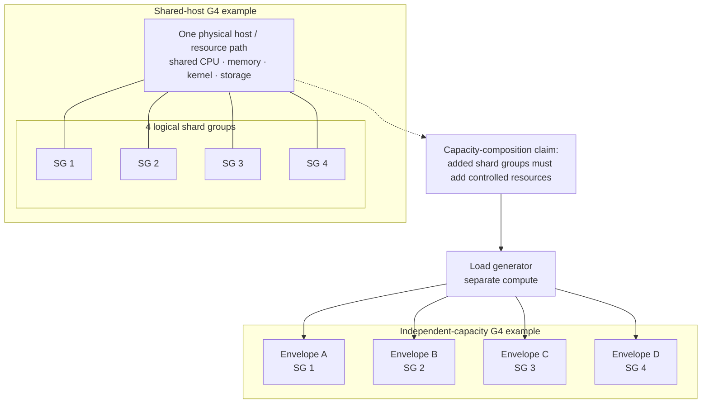

# Horizontal scaling architecture

**Status:** Accepted — normative umbrella for Alloca-Go horizontal scaling.  
**Scope:** define how stateless service replicas and independently writable PostgreSQL database
authorities compose as separate scaling axes, including routing order, shard groups, connection
budgets, failure boundaries, and the limits imposed by hot logical authorities.  
**Detailed database design:**
[`horizontal-database-authority.md`](horizontal-database-authority.md).  
**Transactional semantics:** [`transaction-semantics.md`](transaction-semantics.md).

## 1. Why this document exists

Alloca-Go has two different horizontal scaling mechanisms:

1. add **stateless service replicas** to increase application compute and availability; and
2. add **independently writable database authorities** to partition independent transactional
   state and database resource pressure.

Those mechanisms are related but not interchangeable. A second service process connected to the
same PostgreSQL writer does not create another write authority. A second PostgreSQL writer does
not make a single hot slot or one user's schedule mutations parallel.

The detailed database-authority model is already owned by `horizontal-database-authority.md`.
This document owns the missing whole-system layer: how service-replica scaling composes with
database-authority scaling without blurring their responsibilities or their evidence claims.

## 2. The two-axis model

Describe a topology as:

```text
N service replicas : M writable PostgreSQL database authorities
```

with the workload distribution named alongside it.

`N:M` is not itself a capacity claim. Interpretation depends on where requests land:

- dispersed requests across independent organisations;
- one hot organisation;
- one hot slot;
- one hot user identity;
- one or several replicas sharing one database authority;
- several database authorities sharing one physical host or resource envelope.

A valid scaling conclusion therefore states which axis changed, which shared resource remained
fixed, and which authority or resource became limiting.

## 3. Shard groups and routing order

A **shard group** is the set of stateless service replicas bound to one database authority and
one compatible placement/schema version.

```text
organisation placement
        |
        v
choose database authority / shard group
        |
        v
load-balance within that shard group
        |
   +----+----+
   |    |    |
 replica replica replica
   \    |    /
    \   |   /
 PostgreSQL database authority
```

The order is load-bearing:

1. identify the operation's routing root according to `horizontal-database-authority.md` —
   mutations use `user_organisation_id`, while slot reads use `slot_organisation_id`;
2. resolve that organisation to its database authority;
3. select the shard group that serves that authority;
4. load-balance across eligible replicas inside that group.

A global load balancer that chooses an arbitrary replica first and relies on the service to proxy
or fall through to another database authority would weaken placement enforcement and make failure
boundaries ambiguous. Authority selection therefore precedes replica selection.

Static routing is sufficient for the current evidence. A production routing service, dynamic
placement control plane, or service mesh is not required by this architecture.

## 4. Stateless service-replica semantics

A service replica is **stateless for correctness**:

- authoritative booking, idempotency, and schedule state live in the owning database authority;
- another compatible replica in the same shard group may serve the next request or replay
  without state transfer from the previous replica;
- restarting or removing a replica does not change the transaction protocol;
- replica-local caches, routing helpers, or metrics may exist only as replaceable optimisations
  and must not become the sole authority for a correctness decision.

The service process remains a modular monolith unless an independently deployable boundary is
justified by evidence. Replica scaling means multiple copies of the same accepted application
boundary, not implicit microservice decomposition.

## 5. Database-authority semantics

A database authority is one independently writable PostgreSQL transaction domain, as defined by
`horizontal-database-authority.md`.

Several replicas may share one database authority:

```text
replica 1a --+
replica 1b --+--> database authority 1
replica 1c --+
```

and still provide only one writable transaction domain.

Adding another database authority creates another independently writable domain:

```text
shard group 1 --> database authority 1
shard group 2 --> database authority 2
```

Phase 1 assigns complete organisation homes so every supported mutation remains local to one
database authority. Cross-database-authority booking is a separate coordination problem and
remains governed by `horizontal-database-authority.md`.

## 6. Correctness across replicas

All accepted transactional invariants remain properties of the logical/database authorities,
not of the number of API processes.

In particular:

- one hot slot remains serialized by its slot-capacity logical authority;
- claim-creating mutations for one `UserRef` remain serialized by the user-schedule authority;
- the claim-validity authority still decides schedule overlap;
- idempotency replay resolves at the mutation's stable user-home authority;
- authoritative time remains database-observed according to `transaction-semantics.md`;
- adding replicas must not introduce a second write path that bypasses those authorities.

A hot logical authority therefore has an expected serialization ceiling. More request handlers
cannot parallelise one serial correctness decision; that is a property to measure and explain,
not a reason to weaken the authority.

## 7. Connection budgets are per database authority

Service replicas create database connections. Increasing replica count can therefore change two
things at once:

1. application compute/concurrency; and
2. pressure on the shared database connection/admission boundary.

For one shard group:

```text
aggregate_pool_capacity(authority)
    = sum(pool_size(replica) for replicas serving that authority)
```

With equal pool sizes this becomes:

```text
replicas_in_shard_group x pool_size_per_replica
```

It is **not** `all replicas x all authorities x pool size` because a shard-affine replica opens a
pool to its own authority rather than every database.

Replica scaling experiments must therefore include a connection-budget control when interpreting
service-compute gains: compare a roughly fixed aggregate authority budget with full per-replica
pool multiplication.

The exact pool sizes are configuration/experiment parameters. The durable design rule is that
connection pressure is accounted for per owning database authority.

## 8. Readiness and failure boundaries

A replica's readiness is bound to the database authority it serves. If that authority is
unavailable, the replica is not ready to serve that authority's organisations.

Two failures have different semantics.

### 8.1 Replica failure

If one replica fails while its database authority and another compatible replica in the same
shard group remain healthy, routing may select another replica. This is ordinary
stateless-compute redundancy; the writable authority has not moved.

### 8.2 Database-authority failure

If the owning database authority fails, its organisations remain assigned there. Requests are
**not** redirected to a different writer merely because another shard group is healthy.

Apparent availability obtained by writing an organisation's state on a second authority would
violate ownership and create a distributed-consistency problem rather than solve a routing
problem.

Failure isolation therefore means:

- unrelated authorities continue independently;
- affected organisations fail or time out according to the bounded outcome model;
- restoration resumes against the same authority;
- ambiguous mutations are resolved by idempotent replay, not speculative writes elsewhere.

## 9. Placement, replica identity, and compatibility

Every service unit participating in one deployment must expose enough bounded metadata to
establish:

- database authority identity;
- placement/routing version;
- schema compatibility;
- serving code revision;
- deployed artifact identity where the deployment substrate can provide it.

All replicas in one shard group must agree on the authority and compatible routing/schema
contract they serve. Multi-service measurement runs additionally follow the provenance rules in
`measurement-contract.md`.

Replica identity may be used as a bounded operational/measurement dimension. Organisation
identity remains inappropriate as a general metrics label because its cardinality grows with
tenants.

## 10. Composing the two axes

The intended Phase 1 topology is conceptually:

```text
                    versioned organisation placement
                         /                    \
                        v                      v
                 shard group 1          shard group 2
                /      |      \        /      |      \
              svc     svc     svc     svc     svc     svc
                \      |      /        \      |      /
              PostgreSQL 1             PostgreSQL 2
            database authority       database authority
```

Scale service compute **within** a shard group by changing replica count. Scale writable
database authority by adding another independently writable home and placing independent
organisations on it.

These axes compose only after their claims are understood separately. A composed experiment
must not attribute a throughput change to "horizontal scaling" without identifying whether the
additional useful capacity came from application compute, database-authority partitioning,
altered connection pressure, workload redistribution, or shared-host effects.

## 11. Shared physical resources do not erase logical boundaries

Two PostgreSQL authorities running as containers on one workstation remain separate transaction
domains and can prove placement, correctness, routing enforcement, and failure containment. They
do **not** provide independently provisioned database capacity when they share CPU, memory,
storage, kernel, or host-level contention.

Likewise, service replicas and the load generator sharing one host can prove functional
composition but may not support a production capacity multiplier.

The measurement contract determines how such evidence is labelled. This design requires the
logical topology to be named accurately.

## 12. Shard-group capacity composition

For a writable-authority capacity experiment, one **capacity unit** is one shard group together
with a controlled resource envelope for the service and PostgreSQL authority it contains.

Adding a capacity unit must add resources rather than merely split a fixed host allocation. The
units used in one comparison must therefore be equivalent enough that a measured difference can be
interpreted as composition of the architecture rather than as a change of instance class, CPU
share, memory budget, storage class, database configuration, service build, or connection policy.

The distinction between logical shard-group composition and independent capacity composition is:



The left-hand topology can establish logical composition while the shard groups remain physically
coupled. The right-hand topology is the capacity experiment: each shard group has its own controlled
resource envelope, and the generator sits outside those envelopes. The same rule gives `G1` one
capacity unit, `G2` two equivalent units, and `G4` four equivalent units.

For the selected workload, let:

```text
G1 = measured capacity with 1 shard group
G2 = aggregate measured capacity with 2 shard groups
G4 = aggregate measured capacity with 4 shard groups
```

and use the measurement contract's Layer-B scale-efficiency definition for the derived 2-group and
4-group efficiencies.

The design deliberately sets **no efficiency pass threshold**. Iteration C is characterising the
capacity behaviour of the accepted boundary. A sub-linear result is useful evidence if the limiting
mechanism is identified or conservatively bounded; changing the architecture merely to cross a
preselected percentage would answer a different optimisation problem.

### 12.1 Equivalent does not mean physically identical

Equivalent capacity units need not be the same physical machine. They must expose the same
intended service/database resource shape and configuration for the comparison, and the retained
environment evidence must be sufficient to detect material differences.

A resource provider, VM family, container runtime, or orchestration mechanism is therefore a
replaceable means. The design requirement is controlled, independently growing envelopes.

### 12.2 The generator is outside the capacity unit

The load generator is measurement infrastructure, not part of shard-group capacity. It must not
consume the service/database resource envelope whose scaling is being measured, and its own
headroom must be established at the highest offered load used for a quoted point.

This is stronger than merely running the generator as another process: if generator and shard
groups compete for the same fixed CPU/network/storage resource, the result cannot distinguish
server scaling from measurement-system contention.

### 12.3 Independent does not mean variance-free

Independent provisioning removes coupling between capacity-unit resource envelopes; it does not
remove run-to-run or provider variation. A noisy `G1` observation does not become a precise
scale-efficiency denominator merely because the larger topology uses independent hosts.

A bounded diagnostic can therefore measure equivalent units alone and composed while keeping each
unit's workload/state envelope fixed. That avoids changing working set at the same time as resources
are added. The retained method is
[`independent-capacity-probe.md`](independent-capacity-probe.md); evidence must still bound unit-level
variation before any composition ratio is interpreted.

## 13. Workload and placement envelope

Capacity is always conditional on a workload. A shard group's numeric result therefore names the
workload and placement envelope it served rather than becoming an unqualified "Alloca capacity"
number.

Stable workload semantics are owned by
[`../design/workload-catalog.md`](../design/workload-catalog.md). Validation owns how a selected workload
is mapped to 1, 2, or more shard groups for a particular experiment.

For the current dispersed mutation question, the important architectural property is that the
participating organisations are independent: moving `org-a` to a different shard group from
`org-b` must not introduce a new correctness dependency between them. The experiment may then vary
placement while retaining the workload semantics that its own workload identity declares.

The resulting per-group envelope must state enough context to make the result reusable: workload
identity, organisation distribution, service/database resource shape, connection budget, and the
limiting resource observed at the frontier. Entity count alone is not the capacity model; peak
request rate, concurrency/contention, and workload mix determine pressure on the group.

## 14. What this design deliberately does not decide

This document does not require:

- Kubernetes;
- a service mesh;
- dynamic online rebalancing;
- automatic shard movement;
- multi-region writes;
- read replicas;
- a global routing control plane;
- a distributed transaction protocol for cross-database booking;
- a microservice split.

Those may become separate designs when a later engineering iteration establishes the problem,
requirements, and evidence that justify them.

## 15. Validation

The concrete AG-Sept validations for this architecture are owned by
[`../planning/ag-sept/milestone-validation.md`](../planning/ag-sept/milestone-validation.md).
For Iteration C that plan selected `WL-MUT-DISP-4` and the local 1/2/4-shard-group comparison needed
to attempt `G1`, `G2`, `G4`, their derived efficiencies, and limiting-resource evidence.

PR4c separately refined the bounded independent-unit diagnostic in
[`../planning/ag-sept/milestone-validation-pr4c-aws-probe.md`](../planning/ag-sept/milestone-validation-pr4c-aws-probe.md).
It was not executed and does not substitute for `VAL-SCALE-5`; any future independent-capacity
experiment is post-AG-Sept work.

Earlier validation meanings for service-replica scaling, connection-budget controls,
multi-authority correctness, routing/refusal, and failure isolation remain valid where cited; they
are not automatically part of the Iteration C capacity matrix unless the validation plan selects
them.

Measured conclusions remain in `docs/measurements/`, not here.
