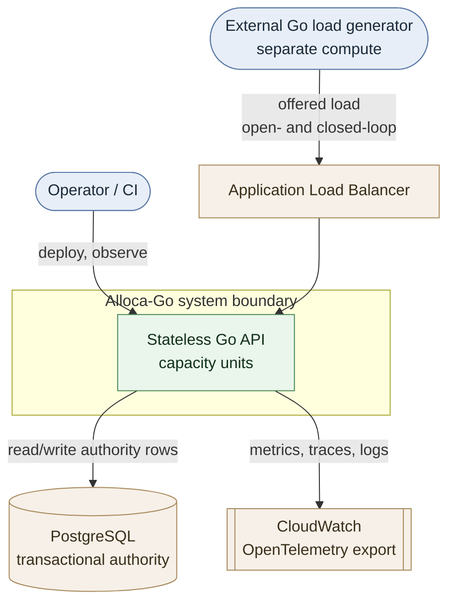
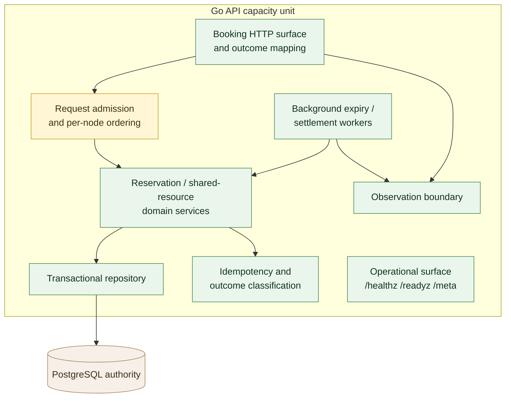
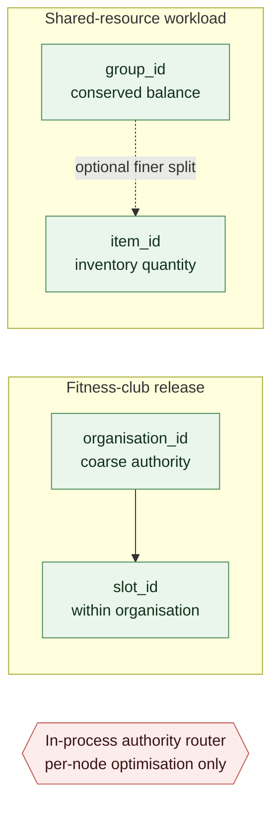

# System context

**Status:** Living — current through AG-M1
**Scope:** the system boundary, its actors and external dependencies, the internal
module layout of the modular monolith, and the authority boundaries that make
horizontal scaling safe.

This document is descriptive of the *target* shape, with each region's current status
recorded against it. AG-M0 shipped the operational skeleton and AG-M1 the transactional
core and the surfaces over it (see [`../../README.md`](../../README.md) and the roadmap
[`../planning/alloca-go-roadmap.md`](../planning/alloca-go-roadmap.md)); each later
milestone fills in one more region of the diagrams below.

All diagrams are Mermaid so they render on GitHub and are reviewable as text —
there is no binary asset to sweep before public release.

---

## 1. System context

Who and what sits around Alloca-Go.

**Actors**
- **External Go load generator** — drives synthetic workloads; runs on compute
  separate from the service for any published capacity claim (roadmap AG-M2).
- **Operator / CI** — deploys, observes, and validates the service.

**External systems**
- **PostgreSQL** — the transactional source of truth and cross-node serialization
  authority. It is also **the measured throughput constraint of the whole system**: on the
  single-instance baseline throughput stops at a limit inside the database while the Go
  service still has substantial compute headroom, so scaling the Go tier alone does not raise
  booking throughput. The
  figure, its conditions and its caveats live in
  [`../measurements/reports/ag-sept-pr2-single-instance-frontier.md`](../measurements/reports/ag-sept-pr2-single-instance-frontier.md) §5.
- **Application Load Balancer** — the network entry point in the AWS slice (AG-M3).
- **CloudWatch** — telemetry sink for OpenTelemetry-compatible metrics and traces.

The two representative workloads (fitness-club synchronized release; shared-resource
contention) are **synthetic engineering models**, not descriptions of any
organisation's systems.

---

## 2. Internal architecture (modular monolith)

Decomposition follows measured evidence, not presentation value — see
[`../decisions/0001-modular-monolith-first.md`](../decisions/0001-modular-monolith-first.md).
The regions below are logical modules within one deployable, not separate services.
Their mapping onto Go packages and the dependency rules that keep the modular
boundary enforceable are specified in
[`project-structure.md`](project-structure.md).

| Region | Status | Milestone |
|---|---|---|
| Operational surface (`/healthz`, `/readyz`, `/meta`) | implemented | AG-M0 |
| Booking HTTP surface and outcome mapping | implemented | AG-M1 |
| Domain services (slot, reservation, booking) | implemented | AG-M1 |
| Domain services (inventory, balance) | planned | AG-M6 |
| Idempotency and outcome classification | implemented | AG-M1 |
| Transactional repository | implemented | AG-M1 |
| Background expiry / settlement workers | implemented | AG-M1 |
| Observation boundary (emission only; no metrics backend) | implemented | AG-M1 |
| Request admission and per-node ordering | planned | AG-M2+ |

Note the direction of the `work --> dom` edge: the expiry worker settles **through the
domain services**, not directly against the repository, so a hold expired by the worker and
one expired by a concurrent request are expired by identical rules. The worker is not what
makes expiry correct — every operation settles the slot it locks — so it needs no leader
election and no exactly-once machinery
([`transaction-semantics.md`](transaction-semantics.md) §2.1).

The `/meta` endpoint already exposes the runtime provenance (Go version, observed
`GOMAXPROCS`, revision) that every capacity result must carry (roadmap §4.4).

---

## 3. Authority boundaries

The roadmap's first thesis is **correct authority before distribution**: every
scarce or conserved resource must have exactly one write authority. Horizontal
scaling is safe only when independent authorities can be routed and processed
independently; adding API nodes never removes the serialization limit of a single
hot authority.

**Candidate authority / shard keys**
- Fitness-club release: `organisation_id`, then `slot_id` within the organisation.
- Shared-resource workload: `group_id`, then possibly `item_id`; a group-wide
  conserved balance may remain a group-level authority.

**Critical boundary (do not blur):** the in-process authority router is a per-node
ordering, batching, or admission optimisation. It is **not** a cross-fleet
serialization mechanism. A serialized command lane or actor-like authority becomes
a *cross-node* authority only after a routing tier guarantees that all requests for
the same key converge on one owner. Until then, PostgreSQL remains the only
cross-node serialization authority.

Whether a coarser authority (e.g. `organisation_id` alone) is operationally simpler
and sufficient, or whether finer partitioning materially improves useful throughput
without compromising invariants, is a question AG-M4/AG-M5 measure — not something
this document asserts.

---

## 4. Scope boundary

**Built (AG-M0):** the system/architecture/authority diagrams above; the operational
skeleton; the measurement contract
([`measurement-contract.md`](measurement-contract.md)); the modular-monolith decision
record.

**Built (AG-M1):** the correct transactional core — slot capacity, hold/confirm/cancel,
domain-local idempotency, the user-schedule non-overlap invariant, and PostgreSQL as the
transactional authority ([`transaction-semantics.md`](transaction-semantics.md)) — plus the
booking HTTP surface ([`api-surface.md`](api-surface.md)), background expiry, and the
observation boundary ([`observability.md`](observability.md)).

**Explicitly not yet built:** the load system and local frontier (AG-M2), the AWS slice
(AG-M3), and any capacity or cost measurement (AG-M4+). Shared-resource inventory and
balances are AG-M6.

AG-M1 makes **no performance claim**. It builds the emission path for telemetry but
aggregates nothing: no number in this repository is a measured Alloca-Go capacity result
until a milestone produces it under the measurement contract.
