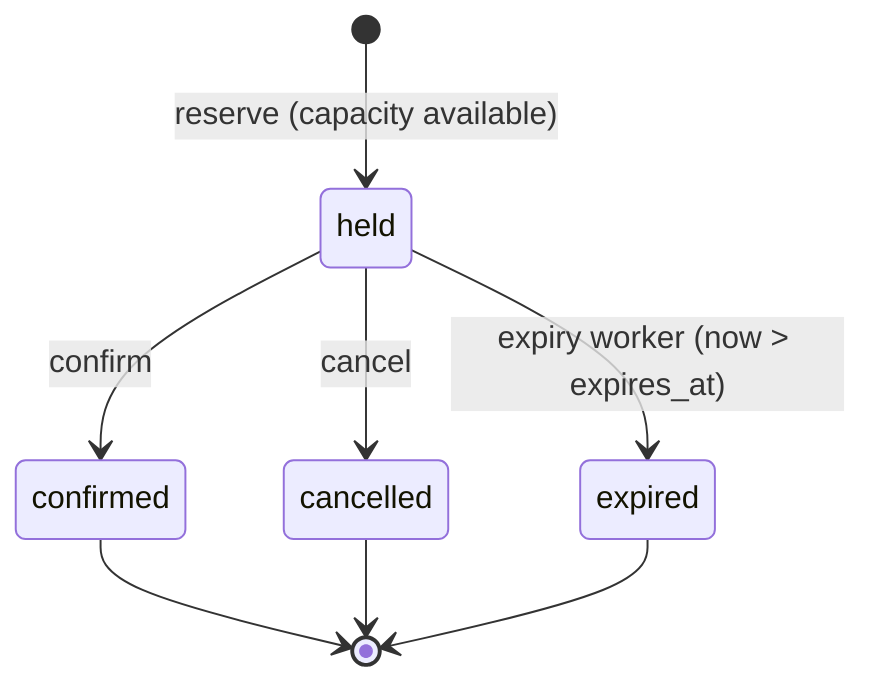
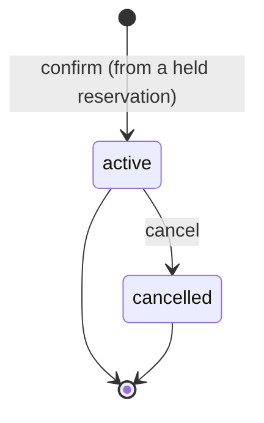

# Transaction semantics

**Status:** AG-M1 draft — **normative for the AG-M1 transactional core**
**Scope:** the booking domain model, its state machines, the aggregate lock
strategy, the mapping from domain events and failures to the outcome taxonomy, and
idempotent-replay behaviour. This is the design contract that
`internal/domain`, `internal/service`, `internal/idempotency`, and the
`internal/postgres` adapter implement.

**Governs / governed by:**

- [`measurement-contract.md`](measurement-contract.md) — the **outcome taxonomy (§4)**
  and **timeout budget (§8/§8.1)** are the authority; this document maps the booking
  domain onto them and must not contradict them.
- [`project-structure.md`](project-structure.md) — the domain owns its interfaces;
  `postgres` implements them (§4).
- [`../planning/ag-m1-implementation-plan.md`](../planning/ag-m1-implementation-plan.md)
  — the PR split; this document is the normative form of that plan's §3 design spine.

This document decides **semantics**, not implementation. Column types, SQL, and pool
wiring belong to the `postgres` adapter (PR3) and ADR-0002. Every numeric deadline
referenced here is `[HYPOTHESIS]` per the measurement contract; the *ordering* and
*classification* are normative.

---

## 1. Domain model

Three entities. Single-unit holds (implementation-plan §3.1): a reservation holds
exactly **one** unit of a slot's capacity; capacity is an integer count. Quantities
and conserved balances are AG-M6 and are deliberately absent here.

| Entity | Role | Identity |
|---|---|---|
| **Slot** | The scarce resource and its **write authority** (the aggregate root). Holds `capacity` and a lifecycle status. | server-assigned `slot_id` |
| **Reservation** | A temporary, expiring hold on one unit of a slot. | server-assigned `reservation_id` |
| **Booking** | The durable confirmed commitment created when a reservation is confirmed. | server-assigned `booking_id` |

- **Slot** — `{ slot_id, capacity, status ∈ {open, closed} }`. `capacity` is fixed at
  creation for AG-M1. `closed` administratively refuses *new* reservations; it does
  not cancel existing holds or bookings. Richer lifecycle (timed open/release
  windows) is AG-M5.
- **Reservation** — `{ reservation_id, slot_id, state, created_at, expires_at,
  idempotency_key }`. State machine in §3. Exactly one unit.
- **Booking** — `{ booking_id, reservation_id, slot_id, state, created_at }`. Created
  only by confirming a held reservation.

Identifiers are server-generated (the domain's `IDGen` port); the client never
supplies a `reservation_id`/`booking_id`, only an **idempotency key** per mutating
request (§5).

### 1.1 Capacity accounting (normative)

A slot's consumed capacity is **derived from rows**, never from a denormalised
counter:

```text
consumed(slot) = |{ reservations : slot_id = S, state = held }|
               + |{ bookings     : slot_id = S, state = active }|
```

**Capacity invariant:** `consumed(slot) ≤ slot.capacity`, checked inside every
capacity-increasing operation while holding the slot lock (§2).

Deriving counts from rows means there is **no counter that can drift from the rows**,
so the roadmap gate "reserved and confirmed counts remain consistent with reservation
and booking rows" holds *by construction*. A denormalised counter is a possible AG-M2
throughput optimisation — but only with its own evidence and a reconciliation check;
it is **out of scope for AG-M1**.

---

## 2. Aggregate lock strategy (normative)

The slot is the aggregate root and the single write authority for its capacity
(roadmap thesis 3.1). Every operation that reads-then-changes a slot's consumed
capacity — `reserve`, `confirm`, `cancel`, `expire` — executes inside one database
transaction that **first takes a row lock on the slot**:

```text
BEGIN
  SELECT ... FROM slots WHERE slot_id = $1 FOR UPDATE   -- the per-slot mutex
  -- read held/booking rows, evaluate the invariant, mutate
COMMIT
```

- The slot row is the **serialization point** even when its own columns do not
  change: two transactions targeting the same slot cannot both hold its `FOR UPDATE`
  lock, so they serialize. This makes each slot a single-writer authority *within
  PostgreSQL*.
- Operations on **different** slots never contend on this lock — the basis for the
  dispersed-authority horizontal scaling AG-M2/AG-M4 measure. (An in-process router
  is a per-node optimisation only; PostgreSQL remains the cross-node authority —
  [`system-context.md`](system-context.md) §3.)
- Every operation that resolves a `reservation_id`/`booking_id` first resolves its
  `slot_id` and locks **that** slot, so duplicates and races on the same logical
  target always converge on the same lock.

The lock is held only for the duration of the transaction, which is bounded by the
`lock_timeout`/`statement_timeout`/txn budget of measurement-contract §8 (§6 below).

---

## 3. State machines (normative)

### 3.1 Reservation



- `held` is the only non-terminal state. `confirmed`, `cancelled`, `expired` are
  terminal for the reservation.
- `confirm`, `cancel`, and `expire` are valid **only from `held`**. Applied to a
  terminal reservation they perform no mutation and yield `business_refusal` (§4) —
  unless the request is an idempotent replay of the key that produced the terminal
  state (§5), which returns the originally recorded outcome.
- A held reservation consumes one unit of capacity until it leaves `held`.

### 3.2 Booking



- A booking is created **only** by `confirm`, atomically with the reservation's
  `held → confirmed` transition, under the slot lock.
- An `active` booking consumes one unit of capacity until cancelled.

### 3.3 Cancellation across both entities

`cancel(reservation_id)` releases whichever unit is live for that reservation:

- reservation is `held` → `held → cancelled`; the held unit is released.
- reservation is `confirmed` → its booking `active → cancelled`; the confirmed unit
  is released. (The reservation stays `confirmed`; the booking records the
  cancellation.)
- nothing live to release (already `cancelled`/`expired`, or booking already
  `cancelled`) → `business_refusal`.

---

## 4. Operations and outcome mapping (normative)

Outcomes follow measurement-contract §4 exactly: a **terminal outcome** plus an
**orthogonal `replay` flag**. `replay=true` returns the *originally recorded* terminal
outcome and never re-runs the mutation (§5). The table below is the authoritative
form of the implementation-plan §3.3 indicative table.

| Operation | Precondition met → | Terminal outcome | Counts toward |
|---|---|---|---|
| **Reserve**(slot_id, key) | capacity available on an `open` slot | `admitted_success` | goodput |
| | slot `open` but `consumed == capacity` | `business_refusal` (sold out) | reported separately |
| | slot `closed` | `business_refusal` | reported separately |
| **Confirm**(reservation_id, key) | reservation is `held` (and not past expiry) | `admitted_success` | goodput |
| | reservation is `expired`/`cancelled`/`confirmed` | `business_refusal` (lost race / dead hold) | reported separately |
| **Cancel**(reservation_id, key) | a live held unit or active booking exists | `admitted_success` | goodput |
| | nothing live to release | `business_refusal` | reported separately |

Failure and timeout outcomes apply to **any** operation and derive from §6:

| Condition | Terminal outcome |
|---|---|
| Lock wait exceeds `lock_timeout` | `timeout_db` |
| Statement exceeds `statement_timeout` | `timeout_db` |
| DB-pool acquisition exceeds its cap | `timeout_server` *(AG-M2 may reclassify to `retry_after` under admission)* |
| Server request context deadline exceeded | `timeout_server` |
| Client disconnects / cancels the request | `timeout_client` |
| Commit acknowledgement lost or ambiguous | `unknown_replayable` (must be replay-safe, §5) |
| Unexpected fault (bug, non-retryable error) | `internal_failure` |
| Any prior key replayed | *recorded outcome* with `replay=true` |

`retry_after`, `admission_rejected`, `queue_position` (admission tier) and
`timeout_lb` (AWS load balancer) are defined in the contract but **not produced by
AG-M1** — they arrive with AG-M2 admission and AG-M3 respectively.

---

## 5. Idempotency (normative)

Idempotency is **domain-local**: the idempotency record is owned with the mutation,
not by a shared service (project-structure §8; AG-M0 review obligation).

### 5.1 Record and scope

Each mutating request carries a client-supplied **idempotency key**. The domain keeps
an idempotency record:

```text
{ key, request_hash, terminal_outcome, result_ref, created_at }
```

- **Scope:** a key identifies one logical mutation. The record has a **unique
  constraint on `key`**, so a key can back at most one mutation.
- **`request_hash`** is a hash over the semantically significant request fields
  (operation kind, target id, parameters). It detects a key being **reused for a
  different request**.
- **`result_ref`** is enough to reconstruct the original response (e.g. the created
  `reservation_id`/`booking_id`).

### 5.2 Same-transaction rule

The idempotency record is written **in the same transaction as the mutation it
describes**, under the same slot lock. Therefore the mutation and its record commit or
abort together: **one key ⇒ at most one logical mutation** — the roadmap gate holds
atomically, with no window where a mutation exists without its record or vice versa.

### 5.3 Resolution algorithm

Within the operation's transaction, after locking the slot:

1. Look up the record by `key`.
2. **Found, `request_hash` matches** → **replay**: return the recorded
   `terminal_outcome` with `replay=true`. No mutation runs.
3. **Found, `request_hash` differs** → **idempotency conflict**: reject at the
   validation boundary (§8). This is *not* a domain terminal outcome and *not* the
   recorded outcome — a key must not be silently repurposed.
4. **Not found** → perform the operation (§4), write the record with the resulting
   terminal outcome, and commit.

Because duplicates carry the same key and therefore resolve to the same slot, step 1
runs under the same `FOR UPDATE` lock as the mutation, so two concurrent duplicates
serialize: the first commits the record; the second observes it and replays. The
unique constraint on `key` is the backstop if two inserts still race — the loser
re-reads the record and replays.

### 5.4 Lost responses and unknown outcomes

- **Replay after a lost response:** if the transaction committed but the response
  never reached the client, replaying the same key finds the record and returns the
  original outcome (`replay=true`). Gate satisfied.
- **`unknown_replayable`:** when commit acknowledgement is lost, replaying the *same*
  key is always safe — either the record exists (the mutation committed → replay it)
  or it does not (the mutation never committed → perform it fresh). Exactly one
  logical mutation results. A timeout or unknown outcome must **never** be retried
  with a *new* key (latency-timeouts-and-retries §4).

---

## 6. Deadline and timeout semantics (normative ordering)

The §8 budget is realised on the mutation path as the nested chain
`lock_timeout < statement_timeout ≤ txn/ctx budget < server deadline < client
deadline`. AG-M1 wires the inner layers so the **innermost responsible layer times
out first** and returns an explicit classified outcome:

- The server request context carries the **server deadline**; exceeding it →
  `timeout_server`.
- The transaction runs within the **txn/ctx budget**; the DB session sets
  **`lock_timeout`** and **`statement_timeout`** (PR3), so a lock wait or long
  statement fails as a Postgres timeout → `timeout_db`, before the outer context.
- Client disconnect cancels the request context → `timeout_client`.
- Pool acquisition is bounded by its cap **outside** the transaction budget; for
  AG-M1 an over-budget acquisition is `timeout_server` (see §4 note).

This is the mechanism by which "timed-out and unknown-outcome transactions are
accounted for explicitly": each layer's expiry has a distinct, recorded outcome
rather than a generic outer timeout. The concrete `lock_timeout`/`statement_timeout`
session wiring is a PR3 responsibility; this section fixes what each expiry **means**.

---

## 7. Concurrency and race resolution (normative)

All same-slot operations serialize on the slot's `FOR UPDATE` lock (§2), so every
race has exactly one winner determined by commit order.

- **cancel vs confirm** on one held reservation: both lock the slot; the first commits
  and defines the reservation's terminal transition; the second observes it and
  returns `business_refusal` (there is no live unit left in the state it expected).
- **confirm vs expiry** on one held reservation: serialized on the slot lock.
  - expiry commits first → reservation `expired`; a later confirm sees non-`held` →
    `business_refusal`.
  - confirm commits first → reservation `confirmed` + booking `active`; expiry's
    predicate (`state = held AND expires_at < now`) no longer matches, so it does
    nothing. **Expiry therefore cannot release confirmed capacity** — the gate holds
    because confirm and expire are serialized and expiry only ever acts on `held`.
- **concurrent reserves** near capacity: serialized; each re-evaluates
  `consumed(slot)` under the lock, so capacity is **never exceeded** — the last
  reserve that would breach `capacity` gets `business_refusal`.

---

## 8. Validation-boundary rejections (not domain outcomes)

Some rejections happen **before** the mutation path and are **not** members of the
§4 terminal-outcome taxonomy (which classifies admitted mutation attempts). They are
transport-level 4xx rejections, counted as neither goodput nor failure:

- unknown `slot_id`/`reservation_id` (no such target);
- malformed or missing required request fields;
- missing idempotency key on a mutating request;
- **idempotency conflict** — same key, different `request_hash` (§5.3 step 3).

Keeping these distinct prevents inflating either `business_refusal` (a valid *domain*
answer) or `internal_failure` with what are really client input errors. The
`httpapi` adapter (PR4) maps them to appropriate 4xx statuses.

---

## 9. How the AG-M1 correctness gates are satisfied

| Roadmap gate | Mechanism |
|---|---|
| Capacity is never exceeded | Invariant re-checked under the slot `FOR UPDATE` lock on every reserve/confirm (§1.1, §2, §7) |
| Counts consistent with reservation/booking rows | Counts derived from rows, no denormalised counter to drift (§1.1) |
| One idempotency key ⇒ one logical mutation | Record written in the mutation's transaction under a unique-key constraint (§5.2) |
| Replay after a lost response returns the original outcome | Recorded terminal outcome returned with `replay=true` (§5.3–§5.4) |
| Expiry cannot release confirmed capacity | Expiry acts only on `held` rows and serializes with confirm on the slot lock (§3, §7) |
| Cancellation/confirmation races have one valid winner | Serialized on the slot lock; loser gets `business_refusal` (§7) |
| Timed-out / unknown-outcome transactions accounted for explicitly | Per-layer timeout → distinct outcome; unknown → `unknown_replayable`, replay-safe (§4, §6) |

The gates that require *real* concurrent SQL (capacity safety, race winners,
same-transaction idempotency under contention) are **proven in PR3** against
PostgreSQL; the state-machine and resolution logic is proven in PR2 against the
in-memory repository.

---

## 10. Deferred (named milestone)

- Admission outcomes `retry_after` / `admission_rejected` / `queue_position` and the
  admission-cap timeout classification — AG-M2.
- `timeout_lb` and end-to-end deadline-chain validation through the real path —
  AG-M3.
- Denormalised capacity counters (only with a reconciliation check and evidence) —
  AG-M2+.
- Reservation **quantities** and conserved **balances** — AG-M6.
- Timed release windows / richer slot lifecycle — AG-M5.

---

## 11. Evidence and disclosure

No number here is `[MEASURED]`; deadline values are `[HYPOTHESIS]` owned by
measurement-contract §8. All entities and examples are synthetic engineering models,
not descriptions of any organisation's system (see
[`../public-disclosure-policy.md`](../public-disclosure-policy.md)).
