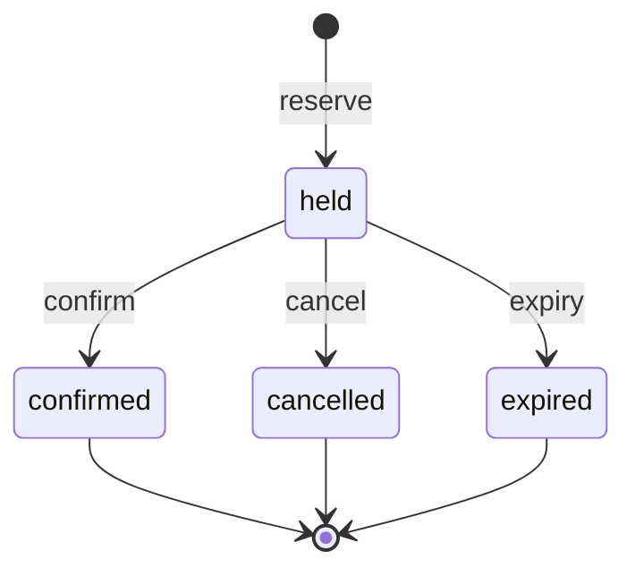
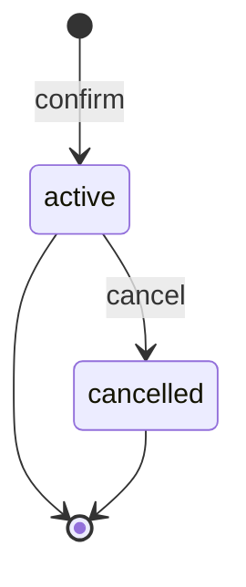

# Transaction semantics

**Status:** AG-M1 draft — **normative for the AG-M1 transactional core**
**Scope:** the booking domain model, its state machines, the aggregate lock
strategy, expiry settlement, the mapping from domain events and failures to the
outcome taxonomy, and idempotent-replay behaviour. This is the design contract that
`internal/domain`, `internal/service`, `internal/idempotency`, and the
`internal/postgres` adapter implement.

**Governs / governed by:**

- [`measurement-contract.md`](measurement-contract.md) — the **outcome taxonomy (§4)**
  and **timeout budget (§8/§8.1)** are the authority; this document maps the booking
  domain onto them and must not contradict them.
- [`project-structure.md`](project-structure.md) — the domain owns its interfaces;
  `postgres` implements them (§4).
- [`../decisions/0002-postgresql-transactional-authority.md`](../decisions/0002-postgresql-transactional-authority.md)
  — records the durable authority and technology choices that implement these
  semantics.
- [`../planning/ag-m1-implementation-plan.md`](../planning/ag-m1-implementation-plan.md)
  — the PR split; this document is the normative form of that plan's §3 design spine.

This document decides **semantics**, not implementation. Column types, SQL, and pool
wiring belong to the `postgres` adapter (PR3). Every numeric deadline referenced here
is `[HYPOTHESIS]` per the measurement contract; the *ordering* and *classification*
are normative.

---

## 1. Domain model

Three entities plus a durable idempotency record. Single-unit holds
(implementation-plan §3.1): a reservation holds exactly **one** unit of a slot's
capacity; capacity is an integer count. Quantities and conserved balances are AG-M6
and are deliberately absent here.

| Entity | Role | Identity |
|---|---|---|
| **Slot** | The scarce resource and its **write authority** (the aggregate root). A time-windowed unit with a capacity. | server-assigned `slot_id` |
| **Reservation** | A temporary, expiring hold on one unit of a slot. | server-assigned `reservation_id` |
| **Booking** | The durable confirmed commitment created when a reservation is confirmed. | server-assigned `booking_id` |
| **Idempotency record** | A durable record of one logical mutation request and its recorded outcome (§5). | scoped key (§5.1) |

### 1.1 Identity dimensions

Every entity and mutation carries two identity dimensions:

- **`organisation_id`** — the coarse authority / routing dimension. Each slot belongs
  to one organisation. AG-M1 does not route on it, but it is the key AG-M5 uses to
  scale independent organisations, and it scopes idempotency (§5.1). Modelling it now
  avoids a later repaint.
- **`user_id`** — the booking participant. It scopes idempotency and is a fairness
  dimension for later milestones.

AG-M1 introduces **no authentication**: identity values are supplied by the caller
(and by the load system in AG-M2). They exist for correct idempotency scoping and for
future routing/fairness, not access control.

### 1.2 Slot

`{ slot_id, organisation_id, resource_id, capacity, release_at, starts_at, ends_at }`.

- `capacity` is a fixed positive integer for AG-M1.
- `resource_id` groups slots that belong to the same underlying resource (e.g. a
  recurring class); it is an attribute for grouping/telemetry, **not** part of the
  authority or the lock.
- A slot is a **time window**. Its lifecycle is derived from authoritative service
  time (§1.5), not from a mutable status flag:

  ```text
  reservable(slot)  ⇔  release_at <= now  AND  now < starts_at
  ```

  Before `release_at` the slot is **not yet released**; at or after `starts_at` it is
  **closed**. Administrative early-close (cancelling a slot) is deferred; AG-M1 derives
  closure purely from time.

### 1.3 Reservation

`{ reservation_id, slot_id, organisation_id, user_id, state, created_at, expires_at }`.
State machine in §3. Exactly one unit. A held reservation is valid only when

```text
created_at < expires_at <= slot.starts_at
```

so a hold is never created already-expired and never outlives the slot start (§1.6).

### 1.4 Booking

`{ booking_id, reservation_id, slot_id, organisation_id, user_id, state, created_at }`.
Created **only** by confirming a held reservation.

### 1.5 Authoritative service time (normative)

Booking decisions use **service-observed time**, never a client-supplied timestamp.
`now` is resolved once at the trusted service boundary (the domain's `Clock` port) and
threaded through the decision path, so competing requests are ordered by service
decision time. A client timestamp may be recorded as a telemetry dimension but must
never decide release eligibility, closure, expiry, confirmation validity, or
cancellation capacity effects. Tests inject `now` through the `Clock` port for
deterministic coverage.

**Provisional in one respect.** *That* `now` is service-observed and resolved once is
settled. *Which* boundary resolves it is not: with multiple API instances, a
service-owned clock reintroduces host skew, and a value resolved before the slot lock
is acquired can be stale by the time the mutation serializes. PR3 is expected to move
resolution to the transaction itself — see
[`../design-notes/authoritative-time-in-a-scaled-service.md`](../design-notes/authoritative-time-in-a-scaled-service.md).
This section remains the normative owner and will be updated there, not forked.

### 1.6 Reservation TTL is service-owned (normative)

Clients do not choose how long a scarce unit is held. The service owns the hold TTL
(a configured duration) and computes:

```text
expires_at = now + reservation_ttl
```

then validates it against the slot window (`now < expires_at <= starts_at`, §1.3). If
the TTL cannot fit before `starts_at`, the reserve is refused as outside the booking
window rather than silently granting a shorter hold.

### 1.7 Capacity accounting (normative)

A slot's consumed capacity is **derived from rows**, never from a denormalised
counter, and always evaluated against **settled** state (§2.1):

```text
consumed(slot) = |{ reservations : slot_id = S, state = held }|   (post-settlement)
               + |{ bookings     : slot_id = S, state = active }|
```

**Capacity invariant:** `consumed(slot) ≤ slot.capacity`, checked inside every
capacity-increasing operation while holding the slot lock (§2). Deriving counts from
rows means there is **no counter that can drift**, so the gate "counts consistent with
rows" holds by construction. A denormalised counter is a possible AG-M2 throughput
optimisation — only with its own reconciliation check and evidence — and is **out of
scope for AG-M1**.

---

## 2. Aggregate lock strategy (normative)

The slot is the aggregate root and the single write authority for its capacity. Every
operation that reads-then-changes a slot's consumed capacity — `reserve`, `confirm`,
`cancel`, `expire` — executes inside one database transaction that **first takes a row
lock on the slot**:

```text
BEGIN
  SELECT ... FROM slots WHERE slot_id = $1 FOR UPDATE   -- the per-slot mutex
  -- settle elapsed holds (§2.1), evaluate preconditions, mutate
COMMIT
```

- The slot row is the **serialization point** even when its own columns do not
  change: two transactions targeting the same slot cannot both hold its `FOR UPDATE`
  lock, so they serialize. Each slot is therefore a single-writer authority *within
  PostgreSQL*.
- Operations on **different** slots never contend on this lock — the basis for the
  dispersed-authority scaling AG-M2/AG-M4 measure. An in-process router is a per-node
  optimisation only; PostgreSQL remains the cross-node authority
  ([`system-context.md`](system-context.md) §3).
- Every operation that resolves a `reservation_id`/`booking_id` first resolves its
  `slot_id` and locks **that** slot, so duplicates and races on the same logical
  target always converge on the same lock.

### 2.1 Expiry settlement (normative)

**Correctness must not depend on the background expiry worker having run.** A client
that crashes or abandons a flow never sends confirm or cancel, so an abandoned hold
would otherwise consume capacity forever.

Within any capacity-changing operation, immediately after acquiring the slot lock and
**before** deriving `consumed(slot)` or evaluating preconditions, the operation
**settles every elapsed hold on that slot**: each reservation with
`state = held AND expires_at <= now` transitions `held → expired`. The requested
operation is then evaluated against the settled state.

- **Boundary:** a hold is elapsed when `now >= expires_at` (equivalently
  `expires_at <= now`). This boundary is used consistently everywhere expiry is
  evaluated.
- The background worker (PR4) performs the **same** transition proactively, so
  abandoned capacity is released promptly and the number of unsettled rows stays
  bounded. It is an optimisation of *when* settlement happens, **not** a correctness
  prerequisite.
- Settling within the lock closes three holes: worker lag can no longer cause an
  artificial sold-out (`reserve` settles first), `confirm` on an elapsed hold refuses
  correctly, and `cancel` cannot succeed on an already-elapsed hold.

Scanning all reservations for a slot on the hot path does **not** scale; bounded
indexed settlement, an expiry queue/time-buckets, and a materialised-counter +
reconciliation ledger are the documented later stages (AG-M2+). AG-M1 uses the simple
settle-under-lock form, which is correct at AG-M1 data volumes.

---

## 3. State machines (normative)

### 3.1 Reservation



The edge labels are the booking operations; each transition's **guard** (release
window, expiry boundary, capacity, slot-open) is specified normatively in §4. Keeping
guards off the diagram avoids restating them — and avoids long edge labels, which
`stateDiagram-v2` does not wrap and renderers clip.

- `held` is the only non-terminal state. `confirmed`, `cancelled`, `expired` are
  terminal.
- `confirm`, `cancel`, and `expire` are valid **only from `held`**. Applied to a
  terminal reservation they perform no mutation and yield `business_refusal` (§4) —
  unless the request is an idempotent replay of the key that produced the terminal
  state (§5), which returns the originally recorded outcome.
- The `expire` transition may be driven by the background worker **or lazily** by any
  lock-holding operation that observes an elapsed hold (§2.1).

### 3.2 Booking



A booking is created **only** by `confirm`, atomically with the reservation's
`held → confirmed` transition, under the slot lock. An `active` booking consumes one
unit until cancelled.

### 3.3 Cancellation across both entities

`cancel(reservation_id)` releases whichever unit is live for that reservation, and is
a **capacity-returning operation only while the slot is open** (`now < starts_at`):

- reservation is `held` → `held → cancelled`; the held unit is released.
- reservation is `confirmed` → its booking `active → cancelled`; the confirmed unit is
  released. (The reservation stays `confirmed`; the booking records the cancellation.)
- nothing live to release (already terminal / booking already cancelled) →
  `business_refusal`.
- at or after `starts_at` → `business_refusal` (slot closed): cancellation no longer
  returns capacity. A later attendance/no-show product could allow a late,
  non-capacity-returning transition, but that is a deliberate future extension, not an
  accidental counter update.

---

## 4. Operations and outcome mapping (normative)

Outcomes follow measurement-contract §4 exactly: a **terminal outcome** plus an
**orthogonal `replay` flag**. `replay=true` returns the *originally recorded* terminal
outcome and never re-runs the mutation (§5). Each `business_refusal` carries a stable
**reason code** so the separate-reporting requirement stays legible.

| Operation | Precondition → | Terminal outcome (reason) |
|---|---|---|
| **Reserve**(slot, org, user, key) | slot released, open, capacity available, TTL fits window | `admitted_success` |
| | `now < release_at` | `business_refusal` (`slot_not_released`) |
| | `now >= starts_at` | `business_refusal` (`slot_closed`) |
| | `consumed == capacity` (post-settlement) | `business_refusal` (`no_capacity`) |
| | computed hold would end after `starts_at` | `business_refusal` (`outside_window`) |
| **Confirm**(reservation, key) | reservation `held`, not elapsed, `now < starts_at` | `admitted_success` |
| | reservation elapsed/`expired`/`cancelled`/`confirmed` | `business_refusal` (`reservation_expired` / `invalid_state`) |
| | `now >= starts_at` | `business_refusal` (`slot_closed`) |
| **Cancel**(reservation, key) | a live held unit or active booking exists, `now < starts_at` | `admitted_success` |
| | nothing live to release | `business_refusal` (`invalid_state`) |
| | `now >= starts_at` | `business_refusal` (`slot_closed`) |
| **Any** | well-formed request whose **target** (§5.1) does not exist — the slot for reserve, the reservation for confirm/cancel | `business_refusal` (`unknown_target`) |
| **Any** | same idempotency key, different `request_hash` | `business_refusal` (`idempotency_conflict`) |

**Fault line (normative).** A *domain refusal* is a valid business "no" to a
well-formed request and is a `business_refusal`. An **internal accounting/invariant
violation** — e.g. a capacity counter going negative, or a code path reaching a state
the invariants forbid — is a **fault**, mapped to `internal_failure`, never a refusal.
"No capacity" is refused *early* as a `business_refusal`; if an internal capacity
assertion ever trips, that is a bug surfaced as `internal_failure`.

Failure and timeout outcomes apply to **any** operation and derive from §6:

| Condition | Terminal outcome |
|---|---|
| Lock wait exceeds `lock_timeout` | `timeout_db` |
| Statement exceeds `statement_timeout` | `timeout_db` |
| DB-pool acquisition exceeds its cap | `timeout_server` *(AG-M2 may reclassify to `retry_after` under admission)* |
| Server request context deadline exceeded | `timeout_server` |
| Client disconnects / cancels the request | `timeout_client` |
| Commit acknowledgement lost or ambiguous | `unknown_replayable` (must be replay-safe, §5) |
| Malformed body / missing required field / missing idempotency key | `invalid_request` (rejected before domain processing, §8) |
| Unexpected fault (bug, invariant violation, non-retryable error) | `internal_failure` |
| Any prior key replayed | *recorded outcome* with `replay=true` |

`retry_after`, `admission_rejected`, `queue_position` (admission tier) and
`timeout_lb` (AWS load balancer) are defined in the contract but **not produced by
AG-M1** — they arrive with AG-M2 admission and AG-M3 respectively.

---

## 5. Idempotency (normative)

Idempotency is **domain-local**: the idempotency record is owned with the mutation,
not by a shared service (project-structure §8; AG-M0 review obligation).

### 5.1 Record and scope

Each mutating request carries a client-supplied **idempotency key**. The key is **not
global** — a client key must not collide across organisations, users, or operations,
or one caller could replay another's result. The scope, and the database unique
constraint, is:

```text
(organisation_id, user_id, operation, idempotency_key)
```

The record holds:

```text
{ organisation_id, user_id, operation, idempotency_key,
  request_hash, terminal_outcome, result_ref, created_at }
```

- **`target_id`** is a generic name for the entity the operation acts on — its
  *target*. It is used only to compute `request_hash` (below); it is not a stored
  field. Its concrete meaning depends on the operation:

  ```text
  reserve  → target_id = slot_id
  confirm  → target_id = reservation_id
  cancel   → target_id = reservation_id
  ```

  The same entity is what an operation resolves and locks (§2), and whose absence
  yields the `unknown_target` refusal (§4, §5.5).
- **`request_hash`** is a hash over a canonical representation of the semantically
  significant request fields — `contract_version, operation, organisation_id, user_id,
  target_id, body` — with stable key ordering and separators. It detects a key reused
  for a *different* request. It **excludes** server-generated values such as `now` and
  the computed `expires_at`, so ordinary retries of the same logical request (processed
  at slightly different service times) hash identically. AG-M1 mutation bodies are
  empty, but `body` stays in the contract so fields can be added later without changing
  the model.
- **`result_ref`** is enough to reconstruct the original response (e.g. the created
  `reservation_id`/`booking_id`).

### 5.2 Same-transaction rule

The idempotency record is written **in the same transaction as the mutation (or
refusal) it describes** — under the slot's `FOR UPDATE` lock when the request targets a
slot (reserve/confirm/cancel), or, when there is no slot to lock (an `unknown_target`
refusal, §5.5), in a transaction guarded only by the record's unique constraint. Record
and outcome therefore commit or abort together: **one scoped key records exactly one
terminal outcome** — the first to commit — with no window where a mutation exists
without its record or vice versa. Every later use of that key either replays the
recorded outcome or, if the request differs, is refused (§5.3).

### 5.3 Resolution algorithm

Within the operation's transaction:

1. Resolve the target and, **if it exists**, lock its slot row (§2) — the slot itself
   for reserve, or the reservation's/booking's slot for confirm/cancel. If the target
   does **not** exist, no slot is locked: the request is an `unknown_target` refusal and
   follows §5.5.
2. Look up the record by scoped key (§5.1).
3. **Found, `request_hash` matches** → **replay**: return the recorded
   `terminal_outcome` with `replay=true`. No mutation runs.
4. **Found, `request_hash` differs** → `business_refusal` (`idempotency_conflict`): a
   key must not be silently repurposed for a different request.
5. **Not found** → settle elapsed holds (§2.1), perform the operation (§4), write the
   record with the resulting terminal outcome, and commit.

Two concurrency cases must be distinguished, because the scoped key
`(organisation_id, user_id, operation, idempotency_key)` does **not** include the
target — `target_id` lives only in `request_hash` (§5.1):

- **Same scoped key, same request** (same target ⇒ same `request_hash`) — the ordinary
  duplicate/retry. Both requests resolve to the **same** slot and serialize on its
  `FOR UPDATE` lock: the first commits its mutation and record, the second finds the
  record under the same lock (step 3) and replays. The slot lock alone orders them.
- **Same scoped key, different request** (different target and/or `request_hash`) — key
  reuse. The two requests **may resolve to different slots and hold different locks**, so
  the slot lock does *not* serialize them and both may attempt work. Here the **unique
  constraint** on the scoped key is the backstop: one insert wins; the loser **rolls
  back its attempted mutation in full**, re-reads the winning record, compares
  `request_hash`, and returns `idempotency_conflict` (hashes differ) or replays (hashes
  match). No second logical mutation survives. (When such requests happen to resolve to
  the *same* slot, the slot lock already orders them and step 4 refuses the loser.)

### 5.4 Lost responses and unknown outcomes

- **Replay after a lost response:** if the transaction committed but the response never
  reached the client, replaying the same key finds the record and returns the original
  outcome (`replay=true`). Gate satisfied.
- **`unknown_replayable`:** when commit acknowledgement is lost, replaying the *same*
  key is always safe — either the record exists (the mutation committed → replay it) or
  it does not (the mutation never committed → perform it fresh). Exactly one logical
  mutation results. A timeout or unknown outcome must **never** be retried with a *new*
  key (latency-timeouts-and-retries §4).

### 5.5 Idempotency for `unknown_target` (no slot to lock)

A well-formed request whose target (§5.1) does not exist is a
`business_refusal` (`unknown_target`, §4). It has **no slot to lock and no capacity to
mutate**, but — like every completed request — it still records its terminal outcome, so
a retry replays it and the key cannot later be silently repurposed for a valid target.
The refusal is recorded in a transaction guarded only by the scoped-key **unique
constraint**:

1. Look up the record by scoped key. **Found, `request_hash` matches** → replay the
   recorded `unknown_target` refusal (`replay=true`); **found, `request_hash` differs** →
   `business_refusal` (`idempotency_conflict`).
2. **Not found** → confirm the target is absent, insert the record with
   `terminal_outcome = business_refusal(unknown_target)`, and commit. If a concurrent
   duplicate races the insert, the unique constraint lets one win; the loser re-reads and
   replays (or returns `idempotency_conflict`).

This keeps the replay contract **total**: every completed request — including a refusal
that never reached a slot — has a recorded, replayable outcome, so experiment totals
reconcile ([`measurement-contract.md`](measurement-contract.md) §4).

---

## 6. Deadline and timeout semantics (normative ordering)

The §8 budget is realised on the mutation path as the nested chain
`lock_timeout < statement_timeout ≤ txn/ctx budget < server deadline < client
deadline`. AG-M1 wires the inner layers so the **innermost responsible layer times out
first** and returns an explicit classified outcome:

- The server request context carries the **server deadline**; exceeding it →
  `timeout_server`.
- The transaction runs within the **txn/ctx budget**; the DB session sets
  **`lock_timeout`** and **`statement_timeout`** (PR3), so a lock wait or long
  statement fails as a PostgreSQL timeout → `timeout_db`, before the outer context.
- Client disconnect cancels the request context → `timeout_client`.
- Pool acquisition is bounded by its cap **outside** the transaction budget; for AG-M1
  an over-budget acquisition is `timeout_server` (see §4 note).

Each layer's expiry has a distinct, recorded outcome rather than a generic outer
timeout. The concrete session wiring is a PR3 responsibility; this section fixes what
each expiry **means**.

---

## 7. Concurrency and race resolution (normative)

All same-slot operations serialize on the slot's `FOR UPDATE` lock (§2), so every race
has exactly one winner determined by commit order.

- **cancel vs confirm** on one held reservation: both lock the slot; the first commits
  and defines the terminal transition; the second observes it and returns
  `business_refusal` (no live unit in the expected state).
- **confirm vs expiry** on one held reservation: serialized on the slot lock.
  - expiry (worker or lazy settlement) commits first → reservation `expired`; a later
    confirm sees non-`held` → `business_refusal` (`reservation_expired`).
  - confirm commits first → reservation `confirmed` + booking `active`; expiry's
    predicate (`state = held AND expires_at <= now`) no longer matches, so it does
    nothing. **Expiry therefore cannot release confirmed capacity** — confirm and
    expire are serialized and expiry only ever acts on `held`.
- **concurrent reserves** near capacity: serialized; each settles then re-evaluates
  `consumed(slot)` under the lock, so capacity is **never exceeded** — the reserve that
  would breach `capacity` gets `business_refusal` (`no_capacity`).

---

## 8. Request classification boundary (normative)

Every completed request carries exactly one measurement-contract §4 terminal outcome,
so totals reconcile. The boundary between the client-error and domain outcomes is
deliberate:

- **`invalid_request`** — a request the service cannot turn into a domain operation at
  all: unparseable body, missing required field, or missing idempotency key. Rejected
  at the transport/validation edge (the `httpapi` adapter, PR4) *before* the mutation
  path. Counted separately (client/transport error), never as goodput or fault, and
  never inflating `business_refusal`.
- **`business_refusal`** — a valid domain answer to a **well-formed** request. This
  includes `unknown_target` (a well-formed request whose target (§5.1) does not
  exist) and `idempotency_conflict` (a well-formed reuse of a key for a
  different payload), each with a specific reason code, alongside the capacity/window
  refusals of §4.
- **`internal_failure`** — an internal invariant/accounting violation (the fault line
  of §4). Never a refusal.

This resolves the earlier draft's error of placing unknown-target and
idempotency-conflict outside the taxonomy: they are well-formed requests with valid
domain answers and are `business_refusal`; only genuinely malformed input is
`invalid_request`.

---

## 9. How the AG-M1 correctness gates are satisfied

| Roadmap gate | Mechanism |
|---|---|
| Capacity is never exceeded | Invariant re-checked under the slot `FOR UPDATE` lock after settlement on every reserve/confirm (§1.7, §2, §7) |
| Counts consistent with reservation/booking rows | Counts derived from settled rows, no denormalised counter to drift (§1.7, §2.1) |
| One idempotency key ⇒ one logical mutation | Scoped-key record written in the mutation's transaction under a unique constraint (§5.1–§5.2) |
| Replay after a lost response returns the original outcome | Recorded terminal outcome returned with `replay=true` (§5.3–§5.4) |
| Expiry cannot release confirmed capacity | Expiry acts only on `held` rows and serializes with confirm on the slot lock (§2.1, §3, §7) |
| Cancellation/confirmation races have one valid winner | Serialized on the slot lock; loser gets `business_refusal` (§7) |
| Timed-out / unknown-outcome transactions accounted for explicitly | Per-layer timeout → distinct outcome; unknown → `unknown_replayable`, replay-safe (§4, §6) |
| Abandoned holds do not permanently consume capacity | Lazy settle-under-lock plus the background worker (§2.1) |

The gates that require *real* concurrent SQL (capacity safety, race winners,
same-transaction idempotency under contention) are **proven in PR3** against
PostgreSQL; the state-machine, settlement, and resolution logic is proven in PR2
against the in-memory repository with a controllable `Clock`.

---

## 10. Deferred (named milestone)

- Admission outcomes `retry_after` / `admission_rejected` / `queue_position` and the
  admission-cap timeout classification — AG-M2.
- `timeout_lb` and end-to-end deadline-chain validation through the real path — AG-M3.
- Scalable expiry settlement beyond settle-under-lock: indexed bounded settlement,
  expiry queue / time-buckets, materialised counters + reconciliation ledger — AG-M2+.
- Denormalised capacity counters (only with a reconciliation check and evidence) —
  AG-M2+.
- Organisation-level routing and fairness that *use* `organisation_id`/`user_id` — AG-M5.
- Administrative early-close / cancellation of a slot; late no-show transitions — later.
- Reservation **quantities** and conserved **balances** — AG-M6.

---

## 11. Evidence and disclosure

No number here is `[MEASURED]`; deadline values are `[HYPOTHESIS]` owned by
measurement-contract §8. All entities and examples are synthetic engineering models,
not descriptions of any organisation's system (see
[`../public-disclosure-policy.md`](../public-disclosure-policy.md)).
