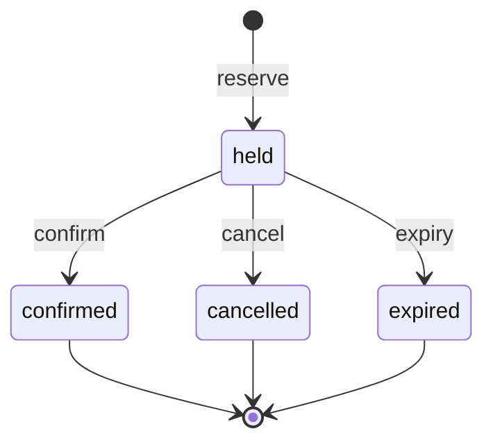
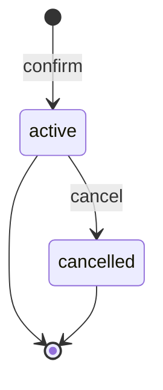

# Transaction semantics

**Status:** **Normative for the AG-M1 transactional core** — AG-M1 merged 2026-07-30
**Scope:** the booking domain model, its state machines, the aggregate lock
strategy, expiry settlement, the mapping from domain events and failures to the
outcome taxonomy, and idempotent-replay behaviour. This is the design contract that
`internal/domain`, `internal/service`, `internal/idempotency`, and the
`internal/postgres` adapter implement.

**Governs / governed by:**

- [`measurement-contract.md`](measurement-contract.md) — the **outcome taxonomy (§4)**
  and **timeout budget (§8/§8.1)** are the authority; this document maps the booking
  domain onto them and must not contradict them.
- [`project-structure.md`](project-structure.md) — the domain owns its interfaces;
  `postgres` implements them (§4).
- [`../decisions/0002-postgresql-transactional-authority.md`](../decisions/0002-postgresql-transactional-authority.md)
  — records the durable authority and technology choices that implement these
  semantics.
- [`../planning/ag-m1-implementation-plan.md`](../planning/ag-m1-implementation-plan.md)
  — the PR split; this document is the normative form of that plan's §3 design spine.

This document decides **semantics**, not implementation. Column types, SQL, and pool
wiring belong to the `postgres` adapter (PR3). Every numeric deadline referenced here
is `[HYPOTHESIS]` per the measurement contract; the *ordering* and *classification*
are normative.

**Two entry points, for readers who do not need all of it:**

- **What the system guarantees, and where each guarantee is decided** —
  [Appendix A: invariant register](#appendix-a--invariant-register). Each invariant has a
  stable `INV-n` identifier that code, tests and later milestones may cite, plus the test
  that would fail if it broke.
- **Why the model has three authorities and not one lock** — the
  [three-authority model](#the-three-authority-model) (§2.2), which is what capacity safety
  alone could not provide.

---

## 1. Domain model

Three booking entities, the user identity they are booked for, and two supporting
relations. Single-unit holds (implementation-plan §3.1): a reservation holds exactly
**one** unit of a slot's capacity; capacity is an integer count. Quantities and conserved
balances are AG-M6 and are deliberately absent here.

| Entity | Role | Identity |
|---|---|---|
| **Slot** | The scarce resource and its **write authority** (the aggregate root). A time-windowed unit with a capacity. | `(slot_organisation_id, slot_id)` — §1.2 |
| **User identity** | Whoever or whatever the booked time belongs to, and the **serialization point for that identity's schedule mutations** (§2.2). Carries no schedule state of its own; the row exists so claim-creating transactions for one identity queue rather than meet inside the exclusion index. Created on the identity's first reserve, never deleted. | `(user_organisation_id, user_id)` — §1.1 |
| **Reservation** | A temporary, expiring hold on one unit of a slot. | server-assigned `reservation_id` |
| **Booking** | The durable confirmed commitment created when a reservation is confirmed. | server-assigned `booking_id` |
| **Schedule claim** | The interval one identity has committed to, and the **authority on schedule validity** (§2.2). One row per live claim; the exclusion constraint on it is what refuses an overlap. | keyed by `reservation_id` — §2.2 |
| **Idempotency record** | A durable record of one logical mutation request and its recorded outcome (§5). | scoped key (§5.1) |

The user identity and the schedule claim are the second and third authorities of the
[three-authority model](#the-three-authority-model) (§2.2); the slot is the first.

### 1.1 Identity dimensions

**Every identity in this schema is a pair scoped to an organisation, and the two pairs
use different organisations (normative):**

```text
(user_organisation_id, user_id)   the user  — where the user's identity is issued
(slot_organisation_id, slot_id)   the slot  — who owns the slot
```

Neither organisation is derivable from the other, so **every stored column names its
role**: `user_organisation_id` or `slot_organisation_id`, never a bare
`organisation_id`. A `reservations` row carries both, and they differ whenever a user
books into another organisation. Conflating them is the mistake that silently stops
protecting a user who books across organisations (§2.2), so the naming is chosen to make
it unreadable rather than merely wrong.

`organisation_id` remains the coarse authority / routing dimension. AG-M1 does not route
on it, but it is the key AG-M5 uses to scale independent organisations, and the user half
of it scopes idempotency (§5.1).

The user pair is globally unique without requiring `user_id` to be. A command issued for
`(org_a, user_1)` against a slot owned by `org_b` is legitimate: the entities it writes
carry `org_a` as `user_organisation_id` and `org_b` as `slot_organisation_id`.
`(org_a, user_1)` and `(org_b, user_1)` are **distinct users** with independent
idempotency scopes and independent schedules.

`Service.Reserve` therefore writes the reservation's `user_organisation_id` from the
command, never from the slot it locked. The user schedule invariant (§2.2) depends on
it: keying a claim by the slot's organisation would silently stop protecting a user who
books across organisations.

AG-M1 introduces **no authentication**: identity values are supplied by the caller
(and by the load system in AG-M2). They exist for correct idempotency scoping and for
future routing/fairness, not access control.

**A `user_id` identifies whoever or whatever the booked time belongs to**, which need not
be a person: a pet whose grooming slot is reserved, or a child booked in by a parent, is
the user, because it is their time the slot consumes. The account that arranges or pays
for a booking is a separate concern AG-M1 does not model. The rule matters for the
schedule invariant (§2.2): a member booking two pets into overlapping slots is legitimate
*because the pets are different users*, and would be wrongly refused if both bookings
carried the member's own `user_id`.

It follows that the invariant protects a *user's* schedule and nothing wider. Alloca
cannot tell that two `user_id`s share an owner, a household, or a real individual —
including `(org_a, user_1)` and `(org_b, user_1)`, which are distinct users with
independent schedules.

### 1.2 Slot

`{ slot_organisation_id, slot_id, resource_id, capacity, release_at, starts_at, ends_at }`.

**A slot's identity is the pair `(slot_organisation_id, slot_id)` (normative).** Slot
identifiers are unique *within* the organisation that owns the slot; nothing makes them
unique across organisations, so `slot_id` alone does not identify a slot.

This is a correctness property, not a modelling preference, because the slot row is the
aggregate lock (§2). Resolving a slot by `slot_id` alone would — as soon as two
organisations minted the same identifier — either serialize two unrelated slots against
each other or take the lock on the wrong organisation's slot and mutate its capacity.
Every read, lock, and foreign key therefore carries both halves.

`slot_organisation_id` is the slot's **owner** — a different dimension from the
`user_organisation_id` on a reservation, booking, or claim (§1.1). They differ whenever a
user books into another organisation, which is why those tables carry both columns.
Collapsing them would make a cross-organisation booking unrepresentable.

Reservation and booking identifiers are, by contrast, server-assigned and globally
unique, so they are single-column keys.

- `capacity` is a fixed positive integer for AG-M1.
- `resource_id` groups slots that belong to the same underlying resource (e.g. a
  recurring class); it is an attribute for grouping/telemetry, **not** part of the
  authority or the lock.
- A slot is a **time window**. Its lifecycle is derived from authoritative service
  time (§1.5), not from a mutable status flag:

  ```text
  reservable(slot)  ⇔  release_at <= now  AND  now < starts_at
  ```

  Before `release_at` the slot is **not yet released**; at or after `starts_at` it is
  **closed**. Administrative early-close (cancelling a slot) is deferred; AG-M1 derives
  closure purely from time.

### 1.3 Reservation

`{ reservation_id, slot_organisation_id, slot_id, user_organisation_id, user_id, state,
created_at, expires_at }` — the slot it holds (§1.2) and whose time is held (§1.1).
State machine in §3. Exactly one unit. A held reservation is valid only when

```text
created_at < expires_at <= slot.starts_at
```

so a hold is never created already-expired and never outlives the slot start (§1.6).

### 1.4 Booking

`{ booking_id, reservation_id, slot_organisation_id, slot_id, user_organisation_id,
user_id, state, created_at }`, with the same two-organisation split as §1.3.
Created **only** by confirming a held reservation.

### 1.5 Authoritative service time (normative)

Booking decisions use **database-observed time**, never a client-supplied timestamp and
never an API host's clock. A client timestamp may be recorded as a telemetry dimension
but must never decide release eligibility, closure, expiry, confirmation validity, or
cancellation capacity effects.

**The rule (INV-9).** Every time-sensitive decision uses an authoritative timestamp from
PostgreSQL, resolved **after the authority wait that precedes it** — never a client
timestamp and never an API host's clock. An attempt resolves its first such instant after
acquiring the slot lock and uses it for everything decided from there: settling elapsed
holds, deciding release and closure, computing and validating `expires_at`, stamping entity
`created_at`, and constructing the idempotency record. Where the attempt goes on to wait for
a further authority, the instant is re-resolved after that wait and the later value
supersedes the earlier one for every decision made from then on (see "Every authority wait"
below).

Two properties make this the right instant, and both are load-bearing:

- **Post-lock, not transaction-start.** A transaction may wait on the slot's
  `FOR UPDATE` until `lock_timeout`. During that wait a hold can elapse or the slot can
  cross `starts_at`. A timestamp resolved before the wait is stale exactly when it
  matters, so `transaction_timestamp()`/`now()` — which return transaction-start time —
  are **not** acceptable sources.
- **One clock, not one per API node.** PostgreSQL is already the cross-node
  serialization authority, so making it the wall-clock source removes API-host skew
  from the decision without introducing a second distributed authority.

**Every authority wait, not only the first.** The rule is about *waits*, not about the
slot lock specifically. Where an operation waits on a further authority, the instant is
re-resolved after that wait too, and the later value supersedes the earlier one for every
decision made from then on. `reserve` has two such later waits — the user identity lock
and the schedule claim acquisition (§2.2) — and in each case the instant comes back from
the acquisition itself. There is deliberately no general "refresh the time" call: it
would make re-resolution available to code that never waited for anything, which is how
a stale-by-design value creeps back in.

**Port shape.** Authoritative time belongs to the transaction port: `Tx.LockSlot`
establishes and memoises the attempt's timestamp, and `Tx.Now` returns only that
memoised value — calling it first is a programming error (`ErrTimeNotEstablished`),
not an invitation to obtain pre-lock time. A repository that passed `now` *into* its
transaction closure would have to resolve it before the closure could lock, structurally
encoding the wrong decision point, so it is deliberately not offered. The one path with
no slot to lock — recording an `unknown_target` refusal (§5.5) — resolves its timestamp
through an explicit `Tx.ResolveTimeWithoutSlot`, so a no-slot attempt has to declare
itself rather than inherit a value.

**Per attempt, not per request.** A re-run after the §5.3 insert-race backstop is a new
transaction and resolves a new timestamp; only the committed attempt's value becomes
durable. A consequence worth naming: `expires_at = now + ttl` is measured from the
post-lock decision point, so lock-wait time never erodes a granted hold — but near
`starts_at` a long wait can make the full TTL no longer fit, turning a reserve into an
`outside_window` refusal. Lock-wait duration therefore affects the outcome mix and not
only latency, which AG-M2 must account for when reading release-wave results.

**Coherent, not monotonic.** A PostgreSQL host clock correction can still move decision
timestamps backwards. Ordering therefore comes from the slot lock and persisted state,
never from comparing timestamps, and the state machine stays irreversible: an `expired`
reservation must never become live again because wall time moved. If an explicit order
is ever needed, add a version or sequence rather than promoting a wall-clock assumption
to an invariant.

Failure to resolve authoritative time is a **fault**, never a refusal: an underlying
lock or statement expiry maps to the applicable `timeout_*` outcome (§6), and any other
resolution failure to `internal_failure`.

Deterministic tests inject time through the in-memory adapter, which implements the same
lock-establishes-time contract; there is no service-level clock to disagree with the
database.

> Decided in PR3 and proven by integration test — see
> [`../design-notes/authoritative-time-in-a-scaled-service.md`](../design-notes/authoritative-time-in-a-scaled-service.md),
> which is the historical rationale for this section and is superseded by it.

### 1.6 Reservation TTL is service-owned (normative)

Clients do not choose how long a scarce unit is held. The service owns the hold TTL
(a configured duration) and computes:

```text
expires_at = now + reservation_ttl
```

then validates it against the slot window (`now < expires_at <= starts_at`, §1.3). If
the TTL cannot fit before `starts_at`, the reserve is refused as outside the booking
window rather than silently granting a shorter hold.

### 1.7 Capacity accounting (normative)

A slot's consumed capacity is **derived from rows**, never from a denormalised
counter, and always evaluated against **settled** state (§2.1):

```text
consumed(slot) = |{ reservations : (slot_organisation_id, slot_id) = S, state = held }|
               + |{ bookings     : (slot_organisation_id, slot_id) = S, state = active }|
                                                                     (post-settlement)
```

**Capacity invariant (INV-1):** `consumed(slot) ≤ slot.capacity`, checked inside every
capacity-increasing operation while holding the slot lock (§2). Deriving counts from
rows means there is **no counter that can drift** (INV-2), so the gate "counts consistent
with rows" holds by construction. A denormalised counter is a possible AG-M2 throughput
optimisation — only with its own reconciliation check and evidence — and is **out of
scope for AG-M1**.

---

## 2. Aggregate lock strategy (normative)

The slot is the aggregate root and the single write authority for its capacity. Every
operation that reads-then-changes a slot's consumed capacity — `reserve`, `confirm`,
`cancel`, `expire` — executes inside one database transaction that **first takes a row
lock on the slot**:

```text
BEGIN
  SELECT ... FROM slots
   WHERE slot_organisation_id = $1 AND slot_id = $2 FOR UPDATE   -- the per-slot mutex
  -- settle elapsed holds (§2.1), evaluate preconditions, mutate
COMMIT
```

- The slot row is the **serialization point** even when its own columns do not
  change: two transactions targeting the same slot cannot both hold its `FOR UPDATE`
  lock, so they serialize. Each slot is therefore a single-writer authority *within
  PostgreSQL*.
- Operations on **different** slots never contend on this lock — the basis for the
  dispersed-authority scaling AG-M2/AG-M4 measure. An in-process router is a per-node
  optimisation only; PostgreSQL remains the cross-node authority
  ([`system-context.md`](system-context.md) §3).
- Every operation that resolves a `reservation_id`/`booking_id` first resolves its
  **`(slot_organisation_id, slot_id)` pair** and locks **that** slot, so duplicates and
  races on the same logical target always converge on the same lock. Resolving only the
  identifier would not name a slot (§1.2), and the row's `user_organisation_id` cannot
  supply the other half — it is the user's, not the slot's.

### 2.1 Expiry settlement (normative)

**Correctness must not depend on the background expiry worker having run.** A client
that crashes or abandons a flow never sends confirm or cancel, so an abandoned hold
would otherwise consume capacity forever.

Within any capacity-changing operation, immediately after acquiring the slot lock and
**before** deriving `consumed(slot)` or evaluating preconditions, the operation
**settles every elapsed hold on that slot**: each reservation with
`state = held AND expires_at <= now` transitions `held → expired`. The requested
operation is then evaluated against the settled state.

- **Boundary:** a hold is elapsed when `now >= expires_at` (equivalently
  `expires_at <= now`). This boundary is used consistently everywhere expiry is
  evaluated.
- The background worker performs the **same** transition proactively, so abandoned
  capacity is released promptly and the number of unsettled rows stays bounded. It is an
  optimisation of *when* settlement happens, **not** a correctness prerequisite. It enters
  through `Service.SettleSlot`, which runs this same settlement under the same slot lock
  against the same authoritative post-lock instant — so a hold expired by the worker and
  one expired by a concurrent request are expired by identical rules. Being an
  optimisation rather than an authority is why it needs no leader election and no
  exactly-once machinery: two workers would be wasteful, never wrong.
- Settling within the lock closes three holes: worker lag can no longer cause an
  artificial sold-out (`reserve` settles first), `confirm` on an elapsed hold refuses
  correctly, and `cancel` cannot succeed on an already-elapsed hold.

Scanning all reservations for a slot on the hot path does **not** scale; bounded
indexed settlement, an expiry queue/time-buckets, and a materialised-counter +
reconciliation ledger are the documented later stages (AG-M2+). AG-M1 uses the simple
settle-under-lock form, which is correct at AG-M1 data volumes.

### 2.2 User schedule authority (normative)

The slot lock proves capacity safety, but it cannot protect one identity booking two
overlapping slots: those transactions lock **different** slot rows and never contend
(design note:
[`../design-notes/user-schedule-non-overlap.md`](../design-notes/user-schedule-non-overlap.md)).
A second authority is therefore required:

> For one user `(user_organisation_id, user_id)`, no two active booking claims may
> overlap in time.

Intervals are **half-open**, `[starts_at, ends_at)`, so `10:00–11:00` and `11:00–12:00`
are adjacent, not overlapping.

**Authority.** Active claims live in their own relation, `user_time_claims`, one row per
logical claim, keyed by `reservation_id`. Non-overlap is enforced by a PostgreSQL
exclusion constraint over `(user_organisation_id =, user_id =, claim_range &&)`, which
requires the `btree_gist` extension. The constraint is the correctness mechanism: a
service-level pre-check may produce a clearer message but can always lose to a
concurrent commit.

A claim's `user_organisation_id` is the **user's** (§1.1), never the slot's, so a user is
protected across every organisation they book into.

**Identity serialization (normative).** The constraint decides *validity*; it must not be
the mechanism that serializes the hot path. PostgreSQL enforces an exclusion constraint
by inserting the index tuple first and then scanning for conflicts, so N concurrent
overlapping inserts for one user can each find another's uncommitted tuple and each wait
for its owner — a deadlock cycle the server breaks by aborting victims with `40P01`,
turning valid requests into faults. Claim-creating operations (in AG-M1, `reserve`)
therefore first take `FOR UPDATE` on the user's row in `user_identities` — created on the
identity's first reserve, never deleted — so one user's claim creation runs one
transaction at a time and never meets itself inside the GiST index.

<a id="the-three-authority-model"></a>

**The three-authority model.** Three relations divide the model cleanly, each answering
exactly one question and none able to answer another's:

```text
slot row            owns capacity                  §2      INV-1
user identity row   serializes schedule mutation   §2.2    INV-10
claim relation      proves schedule validity       §2.2    INV-4
```

This is the name used throughout the project for that division, and it is recorded here
because the division is the design, not an implementation detail of it. It is what the
deadlock taught: treating the claim relation as though it were *also* the serialization
point — one authority both ordering writers and validating them — is precisely what left
concurrent overlapping inserts waiting on each other's index tuples.

A writer that skips the identity lock loses liveness at worst — it can wait, or deadlock
and fault — never correctness: the exclusion constraint remains the authority for
whatever still races past the serialization.

**Lifecycle.** One claim exists per logical booking, from hold through confirmation:

| Operation | Effect |
|---|---|
| `reserve` (success) | insert claim; `expires_at` = the hold's expiry |
| `confirm` (success) | update the claim, `expires_at → NULL`; **never** insert a second row |
| `cancel` (reservation or booking) | delete the claim |
| expiry settlement | **leaves the claim alone** — see claim settlement below |

Keying on `reservation_id` and updating on confirm makes "a booking self-conflicts with
the hold it came from" unrepresentable rather than merely untested.

**Claim settlement.** As with §2.1, **correctness must not depend on the expiry worker
having run.** After taking the slot and identity locks and before evaluating
preconditions, `reserve` settles the *requesting identity's* elapsed claims:

```sql
DELETE FROM user_time_claims
 WHERE user_organisation_id = $1 AND user_id = $2
   AND expires_at IS NOT NULL AND expires_at <= $3   -- authoritative tx time
```

This is the user-scoped analogue of slot-scoped settlement, and it is why the constraint
never needs a moving wall-clock predicate — which PostgreSQL could not index anyway.
Confirmed claims have `expires_at IS NULL` and are removed only by cancellation.

**It is the only path that removes an elapsed claim (normative).** Slot-scoped expiry
deliberately does not, so no transaction ever locks a claim row belonging to a user other
than the one it is acting for. The multi-row delete itself runs only under the identity
lock, so two transactions settling the same user's claims are serialized before either
touches a row and cannot deadlock on acquisition order. When slot-scoped expiry also
deleted claims, each transaction locked *its own* slot's claim first and then asked for
the other's — a cycle, which PostgreSQL breaks by aborting one, turning a valid reserve
into a fault.

The cost is that `user_time_claims` holds claims whose holds have elapsed until their owner
reserves again. That is harmless for correctness: an elapsed claim can only block the user
who owns it, and their next reserve settles it before any conflict is decided. The relation
therefore holds *live claims plus a user's own not-yet-settled ones*, never a claim that can
wrongly refuse anybody.

The wait is not bounded, though — an identity that never reserves again leaves its row
indefinitely, since nothing else is entitled to remove it. Correctness is unaffected; the
accumulation is recorded as
[`../planning/tech-debts.md`](../planning/tech-debts.md) **DEBT-1**, with the conditions
under which it stops being acceptable.

**Post-acquisition time (normative).** The identity lock and the claim acquisition are
the attempt's later authority waits, and each resolves the instant after its own wait
(§1.5). The identity lock is taken before settlement and preconditions, so everything
downstream is simply decided against its instant. The claim insert can still wait — on
an uncommitted claim mutation from a path that holds no identity lock, cancellation
being the AG-M1 case — and if that transaction rolls back the insert then succeeds,
after a wait bounded only by `lock_timeout`. Every decision made before it is stale by
that much, which is exactly the staleness §1.5 exists to prevent.

So a successful claim insert yields the authoritative instant *after* its wait, and the
operation re-evaluates the slot window and recomputes the hold's TTL in full against it.
If the slot closed, or the recomputed TTL would now end after `starts_at`, the request is
refused and the provisional claim is removed — it must not outlive the decision that
created it. The claim's `expires_at` is then written from the same instant, so the claim
and the hold agree on when the hold lapses.

The instant is returned by the claim acquisition rather than through a general
"re-resolve time" method: time may be re-resolved only where an authority was actually
waited for, and keeping that at the call site stops it becoming something any code can
reach for.

**Lock order (INV-10).** Every path uses one order:

```text
slot authority  →  user identity  →  claims
```

No operation, worker, or administrative path may touch `user_time_claims` before its
slot lock, and none may acquire a slot or identity lock *after* touching
`user_time_claims`. Under that discipline the shape is cycle-free: two concurrent
reserves for one identity on different slots take different slot locks and then queue on
the identity row, and the paths that touch claims without the identity lock — cancel and
confirm — acquire nothing further afterwards, so a claim-relation wait behind them is a
wait with an exit, not a cycle. (An earlier revision claimed the claim relation itself
could not produce a cycle; concurrent exclusion-constraint inserts disproved that — see
the identity serialization block above.)

**Outcome.** A schedule conflict is a business refusal, not a fault:
`business_refusal` + `Reason = schedule_conflict` (§4). It is distinct from
`no_capacity` — the slot may still have capacity — and distinct from `timeout_db`,
which is what a wait exceeding `lock_timeout`/`statement_timeout` maps to.

---

## 3. State machines (normative)

### 3.1 Reservation



The edge labels are the booking operations; each transition's **guard** (release
window, expiry boundary, capacity, slot-open) is specified normatively in §4. Keeping
guards off the diagram avoids restating them — and avoids long edge labels, which
`stateDiagram-v2` does not wrap and renderers clip.

- `held` is the only non-terminal state. `confirmed`, `cancelled`, `expired` are
  terminal.
- `confirm`, `cancel`, and `expire` are valid **only from `held`**. Applied to a
  terminal reservation they perform no mutation and yield `business_refusal` (§4) —
  unless the request is an idempotent replay of the key that produced the terminal
  state (§5), which returns the originally recorded outcome.
- The `expire` transition may be driven by the background worker **or lazily** by any
  lock-holding operation that observes an elapsed hold (§2.1).

### 3.2 Booking



A booking is created **only** by `confirm`, atomically with the reservation's
`held → confirmed` transition, under the slot lock. An `active` booking consumes one
unit until cancelled.

### 3.3 Cancellation across both entities

`cancel(reservation_id)` releases whichever unit is live for that reservation, and is
a **capacity-returning operation only while the slot is open** (`now < starts_at`):

- reservation is `held` → `held → cancelled`; the held unit is released.
- reservation is `confirmed` → its booking `active → cancelled`; the confirmed unit is
  released. (The reservation stays `confirmed`; the booking records the cancellation.)
- nothing live to release (already terminal / booking already cancelled) →
  `business_refusal`.
- at or after `starts_at` → `business_refusal` (slot closed): cancellation no longer
  returns capacity. A later attendance/no-show product could allow a late,
  non-capacity-returning transition, but that is a deliberate future extension, not an
  accidental counter update.

---

## 4. Operations and outcome mapping (normative)

Outcomes follow measurement-contract §4 exactly: a **terminal outcome** plus an
**orthogonal `replay` flag**. `replay=true` returns the *originally recorded* terminal
outcome and never re-runs the mutation (§5). Each `business_refusal` carries a stable
**reason code** so the separate-reporting requirement stays legible.

| Operation | Precondition → | Terminal outcome (reason) |
|---|---|---|
| **Reserve**(slot, org, user, key) | slot released, open, capacity available, TTL fits window | `admitted_success` |
| | `now < release_at` | `business_refusal` (`slot_not_released`) |
| | `now >= starts_at` | `business_refusal` (`slot_closed`) |
| | `consumed == capacity` (post-settlement) | `business_refusal` (`no_capacity`) |
| | computed hold would end after `starts_at` | `business_refusal` (`outside_window`) |
| | the identity already holds an active claim overlapping `[starts_at, ends_at)` (post claim-settlement, §2.2) | `business_refusal` (`schedule_conflict`) |
| **Confirm**(reservation, key) | reservation `held`, not elapsed, `now < starts_at` | `admitted_success` |
| | reservation elapsed/`expired`/`cancelled`/`confirmed` | `business_refusal` (`reservation_expired` / `invalid_state`) |
| | `now >= starts_at` | `business_refusal` (`slot_closed`) |
| **Cancel**(reservation, key) | a live held unit or active booking exists, `now < starts_at` | `admitted_success` |
| | nothing live to release | `business_refusal` (`invalid_state`) |
| | `now >= starts_at` | `business_refusal` (`slot_closed`) |
| **Any** | well-formed request whose **target** (§5.1) does not exist — the slot for reserve, the reservation for confirm/cancel | `business_refusal` (`unknown_target`) |
| **Any** | same idempotency key, different `request_hash` | `business_refusal` (`idempotency_conflict`) |

**Fault line (normative).** A *domain refusal* is a valid business "no" to a
well-formed request and is a `business_refusal`. An **internal accounting/invariant
violation** — e.g. a capacity counter going negative, or a code path reaching a state
the invariants forbid — is a **fault**, mapped to `internal_failure`, never a refusal.
"No capacity" is refused *early* as a `business_refusal`; if an internal capacity
assertion ever trips, that is a bug surfaced as `internal_failure`.

Failure and timeout outcomes apply to **any** operation and derive from §6:

| Condition | Terminal outcome |
|---|---|
| Lock wait exceeds `lock_timeout` | `timeout_db` |
| Statement exceeds `statement_timeout` | `timeout_db` |
| DB-pool acquisition exceeds its cap | `timeout_server` *(AG-M2 may reclassify to `retry_after` under admission)* |
| Server request context deadline exceeded | `timeout_server` |
| Client disconnects / cancels the request | `timeout_client` |
| Commit acknowledgement lost or ambiguous | `unknown_replayable` (must be replay-safe, §5) |
| Malformed body / missing required field / missing idempotency key | `invalid_request` (rejected before domain processing, §8) |
| Unexpected fault (bug, invariant violation, non-retryable error) | `internal_failure` |
| Any prior key replayed | *recorded outcome* with `replay=true` |

`retry_after`, `admission_rejected`, `queue_position` (admission tier) and
`timeout_lb` (AWS load balancer) are defined in the contract but **not produced by
AG-M1** — they arrive with AG-M2 admission and AG-M3 respectively.

---

## 5. Idempotency (normative)

Idempotency is **domain-local**: the idempotency record is owned with the mutation,
not by a shared service (project-structure §8; AG-M0 review obligation).

### 5.1 Record and scope

Each mutating request carries a client-supplied **idempotency key**. The key is **not
global** — a client key must not collide across organisations, users, or operations,
or one caller could replay another's result. The scope, and the database unique
constraint, is:

```text
(user_organisation_id, user_id, operation, idempotency_key)
```

The record holds:

```text
{ user_organisation_id, user_id, operation, idempotency_key,
  request_hash, terminal_outcome, result_ref, created_at }
```

- **`target_id`** is a generic name for the entity the operation acts on — its
  *target*. It is used only to compute `request_hash` (below); it is not a stored
  field. Its concrete meaning depends on the operation:

  ```text
  reserve  → target_id = (slot_organisation_id, slot_id), encoded unambiguously
  confirm  → target_id = reservation_id
  cancel   → target_id = reservation_id
  ```

  The same entity is what an operation resolves and locks (§2), and whose absence
  yields the `unknown_target` refusal (§4, §5.5).
- **`request_hash`** is a hash over a canonical representation of the semantically
  significant request fields — `contract_version, operation, user_organisation_id, user_id,
  target_id, body` — with stable key ordering and separators. It detects a key reused
  for a *different* request. For reserve, `target_id` must encode **both** halves of the
  slot's identity unambiguously (length-prefixed, not delimiter-joined: organisation and
  slot identifiers are arbitrary caller-supplied strings, so any separator could occur
  inside one of them). Hashing `slot_id` alone would let a request for one
  organisation's slot hash identically to a request for another's.
  **`contract_version` is `v2`**: v1 hashed the bare `slot_id`, so a v1 hash for the
  same logical request will not match a v2 one — which is intended, because under v1 the
  target was ambiguous. It **excludes** server-generated values such as `now` and
  the computed `expires_at`, so ordinary retries of the same logical request (processed
  at slightly different service times) hash identically. AG-M1 mutation bodies are
  empty, but `body` stays in the contract so fields can be added later without changing
  the model.
- **`result_ref`** is enough to reconstruct the original response (e.g. the created
  `reservation_id`/`booking_id`).

### 5.2 Same-transaction rule

The idempotency record is written **in the same transaction as the mutation (or
refusal) it describes** — under the slot's `FOR UPDATE` lock when the request targets a
slot (reserve/confirm/cancel), or, when there is no slot to lock (an `unknown_target`
refusal, §5.5), in a transaction guarded only by the record's unique constraint. Record
and outcome therefore commit or abort together: **one scoped key records exactly one
terminal outcome** (INV-5) — the first to commit — with no window where a mutation exists
without its record or vice versa. Every later use of that key either replays the
recorded outcome or, if the request differs, is refused (§5.3).

### 5.3 Resolution algorithm

Within the operation's transaction:

1. Resolve the target and, **if it exists**, lock its slot row (§2) — the slot itself
   for reserve, or the reservation's/booking's slot for confirm/cancel. If the target
   does **not** exist, no slot is locked: the request is an `unknown_target` refusal and
   follows §5.5.
2. Look up the record by scoped key (§5.1).
3. **Found, `request_hash` matches** → **replay**: return the recorded
   `terminal_outcome` with `replay=true`. No mutation runs.
4. **Found, `request_hash` differs** → `business_refusal` (`idempotency_conflict`): a
   key must not be silently repurposed for a different request.
5. **Not found** → settle elapsed holds (§2.1), perform the operation (§4), write the
   record with the resulting terminal outcome, and commit.

Two concurrency cases must be distinguished, because the scoped key
`(user_organisation_id, user_id, operation, idempotency_key)` does **not** include the
target — `target_id` lives only in `request_hash` (§5.1):

- **Same scoped key, same request** (same target ⇒ same `request_hash`) — the ordinary
  duplicate/retry. Both requests resolve to the **same** slot and serialize on its
  `FOR UPDATE` lock: the first commits its mutation and record, the second finds the
  record under the same lock (step 3) and replays. The slot lock alone orders them.
- **Same scoped key, different request** (different target and/or `request_hash`) — key
  reuse. The two requests **may resolve to different slots and hold different locks**, so
  the slot lock does *not* serialize them and both may attempt work. Here the **unique
  constraint** on the scoped key is the backstop: one insert wins; the loser **rolls
  back its attempted mutation in full**, re-reads the winning record, compares
  `request_hash`, and returns `idempotency_conflict` (hashes differ) or replays (hashes
  match). No second logical mutation survives. (When such requests happen to resolve to
  the *same* slot, the slot lock already orders them and step 4 refuses the loser.)

### 5.4 Lost responses and unknown outcomes

- **Replay after a lost response:** if the transaction committed but the response never
  reached the client, replaying the same key finds the record and returns the original
  outcome (`replay=true`). Gate satisfied.
- **`unknown_replayable`:** when commit acknowledgement is lost, replaying the *same*
  key is always safe — either the record exists (the mutation committed → replay it) or
  it does not (the mutation never committed → perform it fresh). Exactly one logical
  mutation results. A timeout or unknown outcome must **never** be retried with a *new*
  key (latency-timeouts-and-retries §4).

### 5.5 Idempotency for `unknown_target` (no slot to lock)

A well-formed request whose target (§5.1) does not exist is a
`business_refusal` (`unknown_target`, §4). It has **no slot to lock and no capacity to
mutate**, but — like every well-formed mutation request that reaches the domain path — it
still records its terminal outcome, so a retry replays it and the key cannot later be
silently repurposed for a valid target.
The refusal is recorded in a transaction guarded only by the scoped-key **unique
constraint**:

1. Look up the record by scoped key. **Found, `request_hash` matches** → replay the
   recorded `unknown_target` refusal (`replay=true`); **found, `request_hash` differs** →
   `business_refusal` (`idempotency_conflict`).
2. **Not found** → confirm the target is absent, insert the record with
   `terminal_outcome = business_refusal(unknown_target)`, and commit. If a concurrent
   duplicate races the insert, the unique constraint lets one win; the loser re-reads and
   replays (or returns `idempotency_conflict`).

This keeps the replay contract **total**: every completed request — including a refusal
that never reached a slot — has a recorded, replayable outcome, so experiment totals
reconcile ([`measurement-contract.md`](measurement-contract.md) §4).

---

## 6. Deadline and timeout semantics (normative ordering)

The §8 budget is realised on the mutation path as the nested chain
`lock_timeout < statement_timeout ≤ txn/ctx budget < server deadline < client
deadline`. AG-M1 wires the inner layers so the **innermost responsible layer times out
first** and returns an explicit classified outcome:

- The server request context carries the **server deadline**; exceeding it →
  `timeout_server`.
- The transaction runs within the **txn/ctx budget**; the DB session sets
  **`lock_timeout`** and **`statement_timeout`** (PR3), so a lock wait or long
  statement fails as a PostgreSQL timeout → `timeout_db`, before the outer context.
- Client disconnect cancels the request context → `timeout_client`.
- Pool acquisition is bounded by its cap **outside** the transaction budget; for AG-M1
  an over-budget acquisition is `timeout_server` (see §4 note).
- `statement_timeout` covers **`COMMIT`** like any other statement, so a commit that
  outruns it is `timeout_db` — a *definite* failure to commit, not an ambiguous one
  (§5.4): the server answered, so nothing was applied.
- **Cleanup is bounded too.** A transaction's rollback runs on a context detached from
  the caller's cancellation — a transaction abandoned because the caller went away
  still has to be closed — but on its own bound, not none. Detached *and* unbounded, a
  rollback that cannot reach PostgreSQL would pin its connection indefinitely and,
  repeated, drain the pool: a single database stall escalated into a service-wide
  outage, which is the failure this whole ordering exists to prevent.

Each layer's expiry has a distinct, recorded outcome rather than a generic outer
timeout. The concrete session wiring is a PR3 responsibility; this section fixes what
each expiry **means**.

---

## 7. Concurrency and race resolution (normative)

All same-slot operations serialize on the slot's `FOR UPDATE` lock (§2), so no operation
ever decides from state a concurrent transaction has not yet committed, and every committed
state is reachable by some valid commit-ordered sequence of transitions. Where two
operations compete for the **same unit** or attempt **incompatible transitions** on the same
entity, exactly one wins and the other observes the committed result — the cases below.
Operations that are not in competition may all succeed: concurrent reserves against a slot
with capacity to spare are serialized but not rivals.

- **cancel vs confirm** on one held reservation: both lock the slot, and the order decides
  which of two valid sequences occurs.
  - cancel commits first → the reservation is `cancelled`; confirm then finds no `held`
    reservation and returns `business_refusal` (`invalid_state`).
  - confirm commits first → the reservation is `confirmed` and its booking `active`; the
    cancel that follows is **not** refused, because there is now a live unit to release
    (§3.3) — it cancels the booking. Both operations returning `admitted_success` is
    therefore a correct outcome of this race, not a double mutation: it is the ordinary
    confirm-then-cancel sequence, arrived at concurrently.

  What must never happen is a mutation with no valid predecessor, or neither operation
  reaching a terminal answer.
- **confirm vs expiry** on one held reservation: serialized on the slot lock.
  - expiry (worker or lazy settlement) commits first → reservation `expired`; a later
    confirm sees non-`held` → `business_refusal` (`reservation_expired`).
  - confirm commits first → reservation `confirmed` + booking `active`; expiry's
    predicate (`state = held AND expires_at <= now`) no longer matches, so it does
    nothing. **Expiry therefore cannot release confirmed capacity** — confirm and
    expire are serialized and expiry only ever acts on `held`.
- **concurrent reserves** near capacity: serialized; each settles then re-evaluates
  `consumed(slot)` under the lock, so capacity is **never exceeded** — the reserve that
  would breach `capacity` gets `business_refusal` (`no_capacity`).

---

## 8. Request classification boundary (normative)

Every completed request carries exactly one measurement-contract §4 terminal outcome,
so totals reconcile. The boundary between the client-error and domain outcomes is
deliberate:

- **`invalid_request`** — a request the service cannot turn into a domain operation at
  all: unparseable body, missing required field, or missing idempotency key. Rejected
  at the transport/validation edge (the `httpapi` adapter, PR5) *before* the mutation
  path. Counted separately (client/transport error), never as goodput or fault, and
  never inflating `business_refusal`.
- **`business_refusal`** — a valid domain answer to a **well-formed** request. This
  includes `unknown_target` (a well-formed request whose target (§5.1) does not
  exist) and `idempotency_conflict` (a well-formed reuse of a key for a
  different payload), each with a specific reason code, alongside the capacity/window
  refusals of §4.
- **`internal_failure`** — an internal invariant/accounting violation (the fault line
  of §4). Never a refusal.

This resolves the earlier draft's error of placing unknown-target and
idempotency-conflict outside the taxonomy: they are well-formed requests with valid
domain answers and are `business_refusal`; only genuinely malformed input is
`invalid_request`.

---

## 9. How the AG-M1 correctness gates are satisfied

| Roadmap gate | Mechanism |
|---|---|
| Capacity is never exceeded | Invariant re-checked under the slot `FOR UPDATE` lock after settlement on every reserve/confirm (§1.7, §2, §7) |
| Counts consistent with reservation/booking rows | Counts derived from settled rows, no denormalised counter to drift (§1.7, §2.1) |
| One idempotency key ⇒ one logical mutation | Scoped-key record written in the mutation's transaction under a unique constraint (§5.1–§5.2) |
| Replay after a lost response returns the original outcome | Recorded terminal outcome returned with `replay=true` (§5.3–§5.4) |
| Expiry cannot release confirmed capacity | Expiry acts only on `held` rows and serializes with confirm on the slot lock (§2.1, §3, §7) |
| Cancellation/confirmation races have one valid winner | Serialized on the slot lock; the order decides which valid sequence occurs, and an incompatible transition gets `business_refusal` (§7) |
| One identity cannot hold two overlapping active claims | Claim inserted under the identity lock; the exclusion constraint on `user_time_claims` is the check, and refuses an overlap as `schedule_conflict` (§2.2) |
| Two organisations may own same-named slots without sharing capacity or a lock | Slot identity is the pair `(slot_organisation_id, slot_id)`; every read, lock and foreign key carries both halves (§1.2) |
| Timed-out / unknown-outcome transactions accounted for explicitly | Per-layer timeout → distinct outcome; unknown → `unknown_replayable`, replay-safe (§4, §6) |
| Abandoned holds do not permanently consume capacity | Lazy settle-under-lock plus the background worker (§2.1) |

The gates that require *real* concurrent SQL (capacity safety, race outcomes,
same-transaction idempotency under contention) are **proven in PR3** against
PostgreSQL; the state-machine, settlement, and resolution logic is proven in PR2
against the in-memory repository with a controllable `Clock`. The two identity gates —
the schedule invariant and composite slot identity — arrive with **PR4**, which is where
`user_identities`, `user_time_claims` and the exclusion constraint land, and where the
negative controls for both live. The abandoned-holds gate is completed by **PR5**'s expiry
worker, which returns capacity nobody is asking for; the settle-under-lock half of it is
PR2/PR3.

Per-invariant evidence, including what is *not* directly proven, is in
[Appendix A](#appendix-a--invariant-register).

---

## 10. Deferred (named milestone)

- Admission outcomes `retry_after` / `admission_rejected` / `queue_position` and the
  admission-cap timeout classification — AG-M2.
- `timeout_lb` and end-to-end deadline-chain validation through the real path — AG-M3.
- Scalable expiry settlement beyond settle-under-lock: indexed bounded settlement,
  expiry queue / time-buckets, materialised counters + reconciliation ledger — AG-M2+.
- Denormalised capacity counters (only with a reconciliation check and evidence) —
  AG-M2+.
- Organisation-level routing and fairness that *use* the organisation dimension — AG-M5.
- Administrative early-close / cancellation of a slot; late no-show transitions — later.
- Reservation **quantities** and conserved **balances** — AG-M6.

---

## 11. Evidence and disclosure

No number here is `[MEASURED]`; deadline values are `[HYPOTHESIS]` owned by
measurement-contract §8. All entities and examples are synthetic engineering models,
not descriptions of any organisation's system (see
[`../public-disclosure-policy.md`](../public-disclosure-policy.md)).

---

## Appendix A — Invariant register

**What this is.** One row per property the AG-M1 transactional core guarantees, with the
section that *decides* it and the test that would fail if it broke. The register **indexes;
it does not define** — where this table and a section disagree, the section wins, and the
table is the bug.

**Identifiers are permanent.** `INV-n` is a stable handle for code comments, test names,
review discussion and later milestones. Numbers are never reused or renumbered; a retired
invariant is struck through with the milestone that retired it, and new ones append.

**The evidence column is deliberately unflattering.** It names the test that fails when the
property is removed — not a test that merely exercises the area. Where a property holds by
construction, or is not directly proven, the table says so. An honest gap is more useful
than a reassuring citation, and AG-M2 will read this column when deciding what its
measurements may assume.

### Capacity and accounting

| ID | Invariant | Decided in | Evidence / status |
|---|---|---|---|
| **INV-1** | `consumed(slot) ≤ slot.capacity` at every committed state | §1.7, §2 | `postgres/concurrency_test.go` — `TestCapacityNeverExceededUnderConcurrentReserves`; `service/service_test.go` — `TestCapacityInvariantUnderRandomOperations` |
| **INV-2** | Consumed capacity is derived from rows; no denormalised counter exists to drift | §1.7 | By construction — no counter exists. Reconciled against rows by `Repo.SlotCounts` in the concurrency suite |
| **INV-3** | A held reservation satisfies `created_at < expires_at ≤ slot.starts_at` | §1.3, §1.6 | `postgres/time_test.go` — `TestTTLNoLongerFittingAfterLockWaitRefuses`, `TestTTLMeasuredFromDecisionPointNotArrival`; `service/service_test.go` — `TestReserveTTLOutsideWindow` |
| **INV-4** | One identity never holds two active claims covering the same instant, on any slots | §2.2 | `postgres/schedule_test.go` — `TestConcurrentOverlappingReservesForOneIdentityYieldOneSuccess`, with negative control `TestNegativeControlDroppingTheConstraintAdmitsOverlap` |
| **INV-8** | Expiry acts only on `held` rows, so it can never release confirmed capacity | §2.1, §3, §7 | `postgres/concurrency_test.go` — `TestExpiryCannotReleaseConfirmedCapacity`; `postgres/settle_test.go` — `TestSettleSlotLeavesConfirmedBookingsAlone` |
| **INV-14** | Cancellation returns capacity only while the slot is open (`now < starts_at`) | §3.3 | `service/service_test.go` — `TestCancelAfterStartIsSlotClosed`, `TestCancelHeldReleasesCapacity`, `TestCancelConfirmedReleasesCapacity` |

### Identity and authority

| ID | Invariant | Decided in | Evidence / status |
|---|---|---|---|
| **INV-9** | Every time-sensitive decision uses an authoritative PostgreSQL instant resolved *after the authority wait that precedes it*; a later wait supersedes the earlier instant. Never a client or API-host clock | §1.5, §2.2 | Slot-lock wait: `postgres/time_test.go` — `TestDecisionTimestampResolvedAfterLockWait`, `TestNowBeforeLockSlotIsAnError`, `TestHoldExpiringDuringLockWaitIsSettled`. Later waits: `postgres/schedule_test.go` — `TestIdentityLockWaitRevalidatesTheSlotWindow`, `TestIdentityLockWaitRecomputesTheHoldTTL`, `TestClaimWaitRevalidatesTheSlotWindow`, `TestClaimWaitRecomputesTheHoldTTL`. Negative control in the design note: substituting `transaction_timestamp()` fails all five slot-lock time tests |
| **INV-10** | Lock order is slot → user identity → claims; nothing acquires a slot or identity lock *after* touching `user_time_claims` | §2.2 | `postgres/schedule_test.go` — `TestConcurrentSettlementOfOneUserDoesNotDeadlock`. The violating order's deadlock is recorded as design-note control 7, deliberately not kept as a permanent test: per-run deadlock occurrence is probabilistic |
| **INV-11** | Only user-scoped claim settlement removes an elapsed claim; slot-scoped expiry never does | §2.2 | `postgres/settle_test.go` — `TestSettleSlotReturnsCapacityAndLeavesClaimsAlone`; `postgres/schedule_test.go` — `TestNegativeControlElapsedClaimSurvivesUntilSettled` |
| **INV-12** | A slot's identity is `(slot_organisation_id, slot_id)`; same-named slots in different organisations share neither capacity nor a lock | §1.2 | `postgres/slot_identity_test.go` — `TestSlotIdentityIsScopedToItsOwningOrganisation`, `TestReservationResolvesToItsOwnSlotNotASameNamedOne` |
| **INV-13** | A claim is keyed by the *caller's* organisation, never the slot's, so a user is protected across every organisation they book into | §1.1, §2.2 | `postgres/schedule_test.go` — `TestScheduleIdentityIsTheCallersOrganisationNotTheSlots`; `postgres/slot_identity_test.go` — `TestScheduleInvariantHoldsAcrossSameNamedSlotsInDifferentOrganisations` |

### Idempotency and outcome

| ID | Invariant | Decided in | Evidence / status |
|---|---|---|---|
| **INV-5** | One scoped key records exactly one terminal outcome, written in the mutation's own transaction | §5.1, §5.2 | `postgres/concurrency_test.go` — `TestConcurrentDuplicateKeyProducesOneMutation`, `TestConcurrentKeyReuseAcrossSlotsYieldsOneMutation` |
| **INV-6** | A replay returns the *originally recorded* outcome and never re-runs the mutation | §5.3, §5.4 | `postgres/idempotency_test.go` — `TestReplayReturnsRecordedOutcome`, `TestRefusalIsRecordedAndReplayed` |
| **INV-7** | Every **well-formed mutation request that reaches the domain path and commits a definite terminal outcome** has that outcome recorded and replayable — including `unknown_target`, which never reaches a slot. Deliberately excluded: `invalid_request` (rejected at the transport edge, and may carry no idempotency key to scope a record by), faults, and `unknown_replayable` (whose commit state is by definition uncertain — §5.4) | §5.5, §8 | `postgres/idempotency_test.go` — `TestUnknownTargetIsRecordedAndReplayable`, `TestConfirmUnknownReservationIsUnknownTarget`, `TestFailedTransactionPersistsNothing` |
| **INV-15** | A key reused for a different request is refused, never silently repurposed | §5.3 | `postgres/idempotency_test.go` — `TestKeyReusedForDifferentTargetConflicts`; `postgres/migrate_test.go` — `TestIdempotencyScopeIsTheTableIdentity` |
| **INV-16** | A schedule conflict is a `business_refusal`, never a fault | §2.2, §4 | `postgres/schedule_test.go` — `TestScheduleConflictIsARefusalNotAFault` |
| **INV-17** | An internal invariant violation is `internal_failure`, never a `business_refusal` (the fault line) | §4, §8 | `service/service_test.go` — `TestCommitInvariantGuard` |

### State machine

| ID | Invariant | Decided in | Evidence / status |
|---|---|---|---|
| **INV-18** | `held` is the only non-terminal reservation state; terminal states are irreversible | §3.1 | `domain/reservation_test.go` — `TestReservationStateTerminal`; `service/service_test.go` — `TestConfirmAlreadyCancelledIsInvalidState`, `TestCancelTwiceIsInvalidState` |
| **INV-19** | A booking is created only by confirming a held reservation, atomically with that transition | §3.2 | `service/service_test.go` — `TestConfirmSuccessKeepsCapacityConsumed`, `TestConfirmExpiredHold` |
| **INV-20** | Same-slot operations serialize, so no operation decides from uncommitted state and every committed state is reachable by a valid commit-ordered sequence of transitions. Where two operations compete for the same unit or attempt incompatible transitions, exactly one wins — but non-competing operations may all succeed (confirm-then-cancel is a valid sequence, not a double mutation; so are concurrent reserves against spare capacity) | §7 | `postgres/concurrency_test.go` — `TestConfirmCancelRaceHasOneWinner` (which explicitly admits the confirm-then-cancel both-succeed case); `postgres/schedule_test.go` — `TestReserveRacingCancellationHasOneCommittedOutcome` |

### Not directly proven

Recorded so the gap is visible rather than assumed. Neither is a known defect; both are
properties no current test discriminates.

| ID | Property | Decided in | Status |
|---|---|---|---|
| **INV-21** | An ambiguous commit yields `unknown_replayable`, and replaying the same key produces exactly one logical mutation | §5.4, §6 | The classification is unit-tested as a mapping (`postgres/classify_test.go` — `TestClassifyCommitTimeoutSQLSTATEs`), but **no test kills a connection mid-`COMMIT`**. Flagged since PR3; carried into AG-M2 |
| **INV-22** | Decision timestamps are coherent but not monotonic: a backwards host-clock correction never revives a terminal state | §1.5 | Proven against the in-memory double only. A PostgreSQL host clock cannot be stepped from a test, so the real adapter is unproven here |
