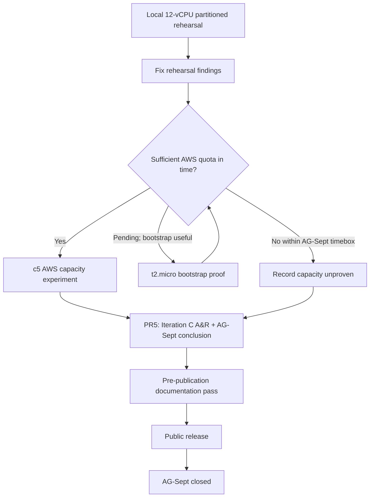

# AG-Sept — milestone plan

**Status:** Living — the current AG-Sept schedule
**Delivery window:** August 2026
**Predecessor:** AG-M1 — correct transactional core and end-to-end service path
**Supersedes:** [`ag-sept-plan-v0.4.md`](ag-sept-plan-v0.4.md) (31 July 2026), retained as an
archived snapshot because PR1 and PR2 were planned and reported under it.

## What this document owns

**Schedule only:** priority, budget, sequence, work-unit/PR split, contingency, descope order,
deliverable status, and the scheduling history that explains how the order was reached.

Everything durable lives elsewhere, and this plan links rather than restates it:

| Question | Owner |
|---|---|
| What worthwhile outcome is AG-Sept pursuing, and what problem is open now? | [`../requirements/ag-sept.md`](../requirements/ag-sept.md) |
| What must be true of any acceptable resolution? | [`../requirements/system-requirements.md`](../requirements/system-requirements.md) (`REQ-*`) |
| What workload semantics stay stable while topology changes? | [`../test/workload-catalog.md`](../test/workload-catalog.md) |
| What is the durable system shape? | [`../design/horizontal-scaling.md`](../design/horizontal-scaling.md), [`../design/horizontal-database-authority.md`](../design/horizontal-database-authority.md), [`../design/deployment-architecture.md`](../design/deployment-architecture.md) |
| What transactional properties must hold? | [`../design/transaction-semantics.md`](../design/transaction-semantics.md) (`INV-*`) |
| How will the claims be proved or falsified? | [`../test/validation-plan/ag-sept-validation-plan.md`](../test/validation-plan/ag-sept-validation-plan.md) (`VAL-*`) |
| What makes a run's numbers admissible? | [`../design/measurement-contract.md`](../design/measurement-contract.md) |
| How is the system run and operated? | [`../operations/`](../operations/) |
| What did the experiments establish? | [`../measurements/`](../measurements/) |
| How was the work actually built? | [`../development/implementation/`](../development/implementation/) |

**This plan is not a normative reference for code, tests, requirements, or design.** It is
expected to change; a citation into it should be for a scheduling or historical fact and should
say so ([`../development/engineering-process.md`](../development/engineering-process.md) §6.1).

Sizes, matrices, durations, and replica counts proposed here are `[HYPOTHESIS]` under
`measurement-contract.md` §2 unless identified as a fixed planning budget or are fixed by the
owning validation/design document.

## 1. Where the milestone is

AG-Sept's governing goal, its iteration history, and the currently open problem are owned by
[`../requirements/ag-sept.md`](../requirements/ag-sept.md). In summary:

- **Iteration A — identify the first scaling frontier.** Resolved. PR2 established PostgreSQL as
  the limiting subsystem while the Go service retained substantial compute headroom.
- **Iteration B — compose independent writable database authorities.** Resolved by the Analyse &
  Review in PR #17. The Phase 1 authority model is established as a correctness/composition result,
  not a capacity multiplier.
- **Iteration C — independently provisioned shard-group capacity.** Requirements, Design, and
  Validation fix the target experiment: reusable `WL-MUT-DISP-4`, organisations A/B/C/D,
  1/2/4 shard groups, one service + one PostgreSQL authority per group, equivalent AWS EC2
  capacity-unit hosts, and a separate generator host. The **Tier 1 target** is numeric
  saturation-selected `G1/G2/G4` and derived `E2/E4`; Tier 2 remains the bounded operating-point
  fallback only when the complete measurement environment exists but a proven measurement-system
  limit prevents Tier 1. **AWS quota is an external provisioning dependency, not an Iteration C
  exit gate:** if it prevents the complete G4 environment from existing within the milestone
  timebox, `VAL-SCALE-5` and aggregate capacity scaling are reported explicitly unproven and PR5
  closes the milestone without inventing substitute capacity evidence.

The decision order has now reached Schedule:

```text
Iteration B evidence -> Analyse & Review -> Iteration C Problem
                                           |
                                           v
                         Requirements -> Design -> Validation plan -> Schedule
```

| Workstream | Work unit | Status |
|---|---|---|
| Measurement substrate and load harness | PR1 | merged `71914a4` |
| Single-instance frontier | PR2 | merged `0d40de4` |
| Placement, booking policy, confirm/cancel ownership | PR3a | merged `aa1e3a5` |
| Multi-authority harness — topology, routing, certification, verifier | PR3b | merged `57f501d` |
| Multi-authority correctness and failure-isolation evidence | PR3c | merged #16 |
| Iteration B Analyse & Review | review step, PR #17 | merged; Iteration B closed and Iteration C Problem selected |
| Iteration C planning | PR #18 | complete in #18; closes Requirements → Design → Validation → Schedule |
| Iteration C local rehearsal + conditional AWS bootstrap | PR4a | in progress |
| Iteration C AWS 1/2/4 capacity evidence | PR4b | conditional on sufficient AWS quota within the milestone timebox |
| Iteration C A&R and AG-Sept conclusion | PR5 | not started; follows the strongest PR4 evidence actually achieved |

Validation status is owned by the validation plan's own status table, not duplicated here.

## 2. Time budget

The development allocation is a planning constraint. **Half a day is the unit**, here and in the
implementation records: nothing is estimated well enough to distinguish 0.3 from 0.4, and finer
granularity is false precision that invites its own overrun (Nancy's call, 2026-08-05).

| Workstream | Work unit | Allocated | Spent | Left | Status |
|---|---|---:|---:|---:|---|
| Measurement harness and load generator | PR1 | 2.0 | 2.0 | 0.0 | merged |
| Single-instance frontier, with the diagnostic time-series minimum | PR2 | 2.5 | 2.5 | 0.0 | merged |
| Placement, booking policy, and confirm/cancel ownership | PR3a | 1.0 | 1.0 | 0.0 | merged; originally 3.0, with 2.0 returned to contingency |
| Multi-authority harness | PR3b | 2.5 | 2.5 | 0.0 | merged |
| Multi-authority correctness and failure-isolation evidence | PR3c | 1.5 | 1.5 | 0.0 | merged; originally 2.0, with 0.5 returned to contingency |
| Iteration C planning | PR #18 | 0.5 | 0.5 | 0.0 | complete; hard planning cap met |
| Iteration C local rehearsal + conditional AWS bootstrap | PR4a | 1.5 | 0.0 | 1.5 | in progress |
| Iteration C AWS 1/2/4 capacity evidence | PR4b | 2.5 | 0.0 | 2.5 | conditional on sufficient AWS quota |
| Iteration C A&R and AG-Sept conclusion | PR5 | 1.5 | 0.0 | 1.5 | not started |
| **Allocated development budget** | | **15.5** | **10.0** | **5.5** | |
| Contingency | | **4.0** | **1.0** | **3.0** | 1.0 drawn by §2.1.1 |
| **Total milestone budget** | | **19.5** | **11.0** | **8.5** | |

**The numeric columns are the accounting source of truth:** `Allocated = Spent + Left` on every
row. Completed work that returned unused allocation is shown at its current allocation; **Status**
keeps the historical context, not the accounting.

The former 4.5-day uncommitted Iteration C envelope remains scheduled as **0.5 planning + 1.5
capacity-environment work + up to 2.5 AWS evidence/report**. PR4b's allocation is a ceiling, not a
reason to wait indefinitely for an external quota decision. If quota blocks the complete AWS
measurement environment within the milestone timebox, the unexecuted capacity work is not replaced
by a weaker local capacity claim; PR5 records the strongest established evidence and the explicit
unproven result.

A further **2–3 days** are reserved beyond the development budget for rerunning decisive
experiments, validating negative controls, reviewing measurements and interpretations, correcting
documentation, polishing diagrams, checking public-disclosure suitability, and preparing the
repository for external readers. **Iteration B's Analyse & Review (#17) spent 0.5 day from this
reserve, leaving 1.5–2.5 days.**

PR5's Iteration C A&R and milestone-conclusion work is funded by PR5's existing **1.5 development
days**, not as another draw on that reserve. The remaining reserve stays available for decisive
reruns, review depth beyond the scheduled closeout work, and the final pre-publication pass.

The time budget is a constraint, not an estimate to be expanded whenever a tool introduces
incidental complexity.

### 2.1 How the contingency is spent

**Completed work returns unused allocation to contingency rather than to scope.** PR3a came in at
1.0 against 3.0 and returned 2.0; PR3c came in at 1.5 against 2.0 and returned 0.5 (§2.1.2). The
figures recorded are conservative under the half-day rule rather than attempts to account for
hours precisely.

The gain is **not** an invitation to widen Iteration C. Contingency is held for reruns, an
investigation that does not resolve on the first attempt, or another hard problem established by
evidence.

**Every PR is funded at what its scope costs.** No PR carries a deliberate shortfall, and no
Iteration C work unit depends on contingency to be reachable.

**Contingency is not scope.** It is drawn on before §5's descope order. After PR3c's 0.5-day return,
contingency is **4.0 total**: **1.0 is drawn** (§2.1.1) and **3.0 remains**.

Unspent contingency is not a licence to expand a PR. It returns to the reserve.

### 2.1.1 The documentation and methodology expansion draws on contingency

**Nancy's decision, 2026-08-10:** the document-ownership and engineering-process expansion carried
by PR #15 is charged to **AG-Sept contingency**.

**Drawn: 1.0 day** under the half-day accounting rule.

### 2.1.2 PR3c returns its unused half day

**Nancy's decision, 2026-08-11:** PR3c is charged at **1.5 days actual** against its former 2.0-day
allocation. The 0.5-day difference returned to contingency rather than being carried into Analyse
& Review or silently charged to the next work unit.

The milestone total stays **19.5 days**; the return changes allocation, not the total budget.

### 2.2 Review depth is the throughput control

**Review is not free. Nancy's decision, 2026-08-12:** Iteration B's Analyse & Review in PR #17 is
charged at **0.5 day** against the separate 2–3 day review/rerun/interpretation reserve. That leaves
**1.5–2.5 days** in that reserve.

For the final Iteration C, A&R is deliberately combined with PR5 rather than scheduled as a separate
review work unit. This is a milestone-closeout exception, not a change to the normal engineering
loop: PR5 still produces the Analyse & Review outcome required by
[`../development/engineering-process.md`](../development/engineering-process.md) §1.4.1, but also
uses that outcome to make the AG-Sept goal and architecture conclusion in the same work unit.

Review depth is Nancy's to set. Less detailed review moves more responsibility onto implementation
verification; it does not make the correctness/evidence gates optional.

### 2.3 Iteration C planning is intentionally bounded, not a general precedent

**Nancy's decision, 2026-08-12:** PR #18 has a **0.5-day hard cap** and closes within that
active-work budget.

That cap is justified by this iteration's state, not by a belief that Requirements/Design/
Validation should generally be rushed. PR2 already exposed the mutation frontier, Iteration B
already established the authority architecture, and PR #17 already selected a narrow Problem. The
remaining planning work is primarily to place known decisions in their correct semantic owners and
derive the minimum environment that makes the comparison legitimate.

A future Problem with genuine unresolved uncertainty should receive the investigation its
uncertainty requires. **Process depth follows uncertainty; this bounded decision-recording exercise
is specific to Iteration C.**

## 3. PR sequence

Each entry states what the work unit delivers and the gate that ends it. Technical meaning stays in
the linked requirements, design, workload catalogue, and validation plan.

### PR1 — Measurement substrate and load harness — merged

2.0 days. Metrics recorder, telemetry-overhead measurement, reset and seed tooling, external
generator, run manifest, persisted-state verifier, response-validation control, operator
documentation.

Record: [`ag-sept-pr1.md`](../development/implementation/ag-sept-pr1.md).

### PR2 — Single-instance frontier — merged

2.5 days. Prometheus retention path, diagnostic panels, one-instance sweeps for controlled
workloads, telemetry comparison, generator-bottleneck control, frontier report.

Record: [`ag-sept-pr2.md`](../development/implementation/ag-sept-pr2.md). Report:
[`ag-sept-pr2-single-instance-frontier.md`](../measurements/reports/ag-sept-pr2-single-instance-frontier.md).
Result: PostgreSQL, not `alloca-go`, sets the measured mutation frontier.

### PR3a — Placement, booking policy, and confirm/cancel ownership — merged

**Actual 1.0 day.** Delivers the versioned placement map, shard-affine service units, placement
enforcement, Phase 1 booking policy, confirm/cancel ownership, and supporting contracts/tests.

### PR3b — Multi-authority harness — merged

**Actual 2.5 days.** Delivers the two-authority topology, per-authority migration, placement-aware
generator, topology/provenance certification, and authority-aware verifier.

### PR3c — Multi-authority correctness and failure isolation — merged #16

**Actual 1.5 days.** Delivers retained Phase 1 correctness, refusal, routing, reconciliation and
failure-isolation evidence. It deliberately makes no capacity multiplier claim from the shared
workstation.

### Iteration B Analyse & Review — PR #17 — merged

**Actual 0.5 day from the separate review reserve.** Closes Iteration B, repairs the VAL-COR-4
same-key replay evidence gap found during review, and selects the Iteration C Problem.

### Iteration C planning — PR #18 — 0.5 day

**Actual 0.5 day. Docs-only.** Requirements → Design → Validation plan → Schedule for the Problem
selected by #17.

It records:

- `WL-MUT-DISP-4` as the reusable four-organisation A/B/C/D mutation workload;
- numeric scale efficiency as an output rather than a threshold;
- the shard-group capacity-unit model and like-for-like resource-envelope requirement;
- the derived environment decision: minimal AWS EC2, not EKS/RDS/Kubernetes;
- the fixed 1/2/4 placement matrix;
- the concrete PR4a/PR4b schedule below;
- the public README update reflecting the broader project North Star and current proven state.

**Gate:** all planning owners agree without introducing implementation, deployment config, scripts,
measurements, or capacity results. Review fixes only material contradictions/gaps; settled design
choices are not reopened merely because more alternatives exist.

### PR4a — Local capacity-environment rehearsal + conditional AWS bootstrap — 1.5 days

PR4a now begins with a **mandatory local rehearsal** before any AWS capacity attempt. The workstation
exposes a 12-vCPU Docker/WSL envelope that mirrors the planned quota shape: four non-overlapping
2-vCPU shard-group CPU sets plus a separate 4-vCPU generator/monitoring CPU set. `G1`, `G2`, and
`G4` use the same placement/workload/fixture semantics as the AWS experiment; unused shard-group CPU
sets stay idle rather than being borrowed by smaller topologies.

The rehearsal proves the experiment machinery and exposes defects cheaply: topology selection,
placement, fixed fixtures, workload semantics, manifest/deployment provenance, reconciliation,
resource capture, generator isolation, and the operator-facing Makefile path. It is **diagnostic and
rehearsal evidence, not independently provisioned capacity evidence**: the groups still share one
physical workstation, WSL VM/kernel, storage path, and other host resources, so local `G1/G2/G4`
numbers cannot discharge `VAL-SCALE-5` or be substituted into AWS `E2/E4`.

After local findings are fixed:

- if the AWS quota request is still pending and an AWS-specific bootstrap proof would buy useful
  confidence, one `t2.micro` may exercise AMI/user-data/Docker/image/placement/monitoring/chrony/
  security-group/smoke mechanics; it is burstable, 1-vCPU **bootstrap-only** infrastructure and
  never a measured capacity unit;
- if sufficient non-burstable quota is already available, skip that optional bootstrap and move
  directly to the planned `c5` environment;
- PR4a retains the dated cost estimate, spend ceiling, teardown path, and enough deployment support
  that the complete AWS G4 environment can be launched when quota permits.

**Gate:** the local 1/2/4 rehearsal is runnable and its discovered defects are fixed or explicitly
bounded; the dedicated `WL-MUT-DISP-4` generator preserves the same request-pair semantics and fixed
per-organisation fixture populations under every placement; provenance/reconciliation/resource
capture work is exercised far enough locally to make AWS a deployment step rather than first-use
debugging. AWS bootstrap is conditional and AWS capacity readiness is **not** required to close
PR4a when quota is the blocker.

### PR4b — AWS 1/2/4 shard-group capacity evidence — up to 2.5 days, quota-conditional

PR4b runs only if sufficient AWS quota is available within the AG-Sept timebox to provision the
complete independently provisioned environment required by validation-plan §4.6: equivalent
non-burstable capacity-unit hosts plus separate generator compute for the G1/G2/G4 family.

When that environment exists, PR4b attempts **Tier 1 first**: saturation-establishing ladders,
selected and repeated `G1/G2/G4` points, and derived `E2/E4`. If the complete environment exists but
a proven generator or other measurement-system limit prevents Tier 1, the validation plan's Tier 2
common-`L` result may be retained, with aggregate capacity and `VAL-SCALE-5` explicitly unproven.

If quota prevents the complete G4 environment from being provisioned within the milestone timebox,
**do not manufacture Tier 2 from the local rehearsal or an incomplete AWS topology.** Record the
quota/provisioning limitation, report `VAL-SCALE-5` and aggregate capacity scaling as unproven, and
proceed to PR5. Successful AWS capacity measurement is therefore a stronger desired Iteration C
result, **not an exit gate for Iteration C**.

Every quoted AWS point still requires correctness/reconciliation, generator/resource controls,
per-authority data-volume/working-set evidence, limiting-resource analysis, workload/resource
envelope, and measurement-contract provenance. There is no efficiency pass threshold.

**Explicit non-goal — capacity/resource economics.** The roadmap records this as a worthwhile
future exploration dimension, but Iteration C does **not** select it. Experiment-cost controls bound
cash spend only; PR4b does not grow cost/hour, cost-per-million, instance-shopping, or economic
optimisation analysis.

**Gate:** either (a) the strongest admissible AWS Tier-1/Tier-2 evidence permitted by the complete
measurement environment is retained under validation-plan §4.6, or (b) the external quota blocker
is retained and the capacity validation is explicitly unproven. In both cases the result is bounded
to what was actually established and PR5 can perform the Iteration C A&R.

PR5 follows the strongest PR4 evidence actually achieved and combines Iteration C Analyse & Review
with the AG-Sept milestone conclusion. There is no separate Iteration C A&R work unit.

### PR5 — Iteration C Analyse & Review + AG-Sept conclusion

**Budget:** 1.5 development days, following PR4.

PR5 consumes the retained Iteration C evidence and closes both the final iteration and the AG-Sept
milestone. It records the Analyse & Review outcome required by `engineering-process.md` §1.4.1 in
the governing Goal/Problem record, then assembles the evidence-backed architecture conclusion.

It delivers:

- the **Iteration C Problem verdict** — sufficiently resolved, unresolved, or refined — with the
  retained evidence that supports it;
- the **durable learning** propagated into requirements, design, validation, ADRs, or explicitly
  recorded as requiring no change;
- the **AG-Sept Goal progress/verdict**, stating what the milestone established and what remains
  unproven or deferred;
- an evidence-backed architecture conclusion, comparison tables/diagrams, service-boundary
  decision, limitations, and reproduction entry points;
- explicit deferred-work and roadmap candidates where useful, without silently promoting them into
  requirements or scheduled work;
- the loop decision **`END` for AG-Sept**, either because the Goal is sufficiently achieved for the
  agreed scope or because the maintainer makes an explicit milestone goal/scope closure decision
  under `engineering-process.md` §1.4.

Because this work closes AG-Sept, **PR5 does not choose or schedule the next Alloca Problem.** If
Alloca continues after the milestone, a separate kickoff starts from current evidence, the roadmap,
and current priorities to choose the next Goal and Problem before beginning a new engineering
iteration.

**Gate:** the Iteration C A&R outcome is durable, the AG-Sept goal/scope verdict is explicit, every
architecture claim is traceable to retained evidence, limitations and unproven areas are named, no
new implementation stage is invented, and the AG-Sept engineering loop is closed before
publication work begins.

The Iteration C closeout path is:



## 4. Manifest and reconciliation staging

The rules are `measurement-contract.md` §11–§13. PR3b established multi-authority topology/image
identity; PR4a rehearses the same declaration/provenance/reconciliation machinery locally before
AWS and prepares the AWS deployment path; PR4b, when quota permits it, records the exact AWS 1/2/4
placement and resource envelope for each capacity run.

Reconciliation: PR1 established the single-authority self-check; PR3b extended it to multiple
authorities; PR3c exercised it against deliberate failure; PR4a rehearses it across the local 1/2/4
topology family; PR4b applies it to every quoted AWS Tier-1 or Tier-2 point when that experiment can
run.

**Quotability target:** local rehearsal can exercise the provenance machinery but cannot promote
shared-workstation scale numbers into independently provisioned capacity evidence. A sound AWS run
must still validate at the measurement contract's `publishable` provenance level and independently
satisfy §5 response-validation, generator-headroom, negative-control, reconciliation, and other
evidence gates before a project-level capacity claim is admissible.

## 5. Priority and descope

### 5.1 P0 — required

For Iteration C the non-descopable path is now conditional on the external environment rather than
on a successful quota request:

- `WL-MUT-DISP-4` topology-independent request semantics and fixed per-organisation fixtures;
- the **local 12-vCPU 1/2/4 rehearsal**, using non-overlapping shard-group CPU sets and separate
  generator/monitoring CPUs, with findings fixed or explicitly bounded;
- correctness/reconciliation and the provenance/resource-capture machinery needed for a later AWS
  run;
- **when sufficient AWS quota is available within the milestone timebox:** the complete equivalent
  non-burstable G1/G2/G4 environment, Tier 1 first, and Tier 2 only under validation-plan §4.6 after
  that complete environment exists;
- **when sufficient quota is not available:** retain the provisioning limitation and explicitly
  report `VAL-SCALE-5` and aggregate capacity scaling unproven; do not substitute local or partial
  AWS evidence;
- limiting-resource interpretation and retained evidence at the strongest level actually achieved.

The older service-replica VAL-SCALE-1/2 path is not Iteration C scope.

### 5.2 P1 — strongly desirable

Only after the P0 Iteration C result is secure: a deliberately constrained resource control
(VAL-NEG-5) if it materially strengthens the limiting-resource diagnosis; polished charts beyond
the minimum needed to communicate the result; extra diagnostic reruns requested by A&R.

Capacity/resource economics is **not** P1 for Iteration C; it remains an unscheduled roadmap
direction unless a future post-AG-Sept kickoff selects it as part of a new Goal or Problem.

### 5.3 P2 — only after decisive evidence

Transactional outbox implementation; independently deployed consumer; autoscaling; additional
fault injection; distributed tracing; richer dashboards; service-replica scaling without evidence
that service compute has become the relevant frontier.

### 5.4 Out of scope for AG-Sept

Cross-authority booking and any distributed commit/saga protocol; splitting one organisation
across writable authorities; online rebalancing or dual-write migration; multi-region writes;
EKS; RDS; Kubernetes; a service mesh; autoscaling; a broker solely to claim event-driven
architecture; complete production authentication/authorization; eliminating hot-authority
serialization; and reproducing a full commercial workload.

**Narrow AWS exception:** EC2 remains the bounded Iteration C mechanism for independently
provisioned capacity evidence when quota permits it. The local rehearsal is an implementation and
diagnostic step, not a replacement environment for the design claim.

### 5.5 Descope order

If time slips, remove work in this order:

1. optional resource-limit control beyond the evidence already needed for diagnosis;
2. chart/dashboard polish beyond the diagnostic minimum;
3. extra confirmation/rerun work beyond the retained confirmation required by the selected evidence
   path, unless A&R needs it to resolve material variation;
4. PR5 presentation/chart polish beyond what the milestone conclusion requires.

**Do not descope:** stable `WL-MUT-DISP-4` semantics and fixtures, the local 1/2/4 rehearsal,
response validation, reconciliation, provenance/resource-capture checks, or honest evidence
labelling. When the complete AWS environment exists, do not descope the selected Tier-1/Tier-2 rule.
When quota prevents that environment from existing, the required outcome is the explicit
`VAL-SCALE-5`-unproven conclusion rather than waiting indefinitely or substituting an incomparable
measurement.

Contingency is drawn before weakening any mandatory evidence gate.

## 6. Scheduling history

### 6.1 Why database-authority scaling came first

Nancy's call, 2026-08-05: scaling design and implementation take priority over capacity
measurement, and database-authority scaling comes before service-replica scaling because PR2 found
PostgreSQL to be the first mutation frontier.

### 6.2 What changed from v0.4

v0.4 planned one service baseline, stateless replicas against one PostgreSQL authority, then a
conditional AWS deployment. PR2's measured result changed the order:

1. horizontal database authority became primary work ahead of replicas;
2. the original AWS path was withdrawn and its budget moved to the authority work;
3. Iteration B established the authority architecture and PR #17 selected capacity composition as
   the next Problem;
4. Iteration C Requirements/Design then derived that the fixed workstation cannot prove the
   selected independently provisioned capacity claim, which justified a much smaller AWS EC2 path;
5. PR4a later added a bounded local resource-partitioned rehearsal so the complete topology and
   measurement machinery can be debugged before metered AWS work;
6. AWS capacity evidence remains the stronger target but is conditional on the external quota
   needed to instantiate the complete environment; quota failure is recorded as an unproven result,
   not made into an Iteration C exit blocker.

### 6.3 The original AWS path remains withdrawn; Iteration C adds only minimal EC2

The v0.4 AWS plan — ECR/EKS/RDS/load-balancing path plus separate EC2 generator and its larger
matrix — remains withdrawn. Iteration C does **not** restore it.

The intended evidence path remains:

```text
REQ-SCALE-4 independent growing envelopes
        -> shared workstation cannot prove them
        -> local partitioning rehearses the machinery only
        -> AWS EC2 supplies independent compute when quota permits
        -> one host per shard group + one separate generator host
```

No EKS, RDS, managed-database, service-mesh, or cloud-production conclusion follows from this
choice. If AWS capacity points are measured, their baseline and scale-out points all come from the
same AWS environment; workstation `G1` is never mixed with AWS `G2/G4`.

### 6.4 The PR2 deferral register

- **Overload question:** remains outside AG-Sept; it deserves its own future Problem rather than
  being absorbed into Iteration C.
- **Instrumentation:** the old PostgreSQL/node-exporter choices are no longer schedule owners. The
  durable obligation is VAL-NEG-7 for any claimed independently provisioned capacity result; PR4a
  also exercises enough resource capture locally to make missing evidence visible before AWS.
- **Evidence hygiene:** per-run retained evidence required by the strongest executed PR4 path is in
  scope; unrelated PR2 re-runs/histogram work remains deferred.

## 7. Final deliverables

The public-ready milestone should leave:

1. a runnable containerized service;
2. a reproducible external load generator with placement-aware routing;
3. a stable reusable workload catalogue;
4. aggregated service/runtime/resource evidence sufficient for the claims made;
5. the single-instance frontier report;
6. the multi-authority correctness/failure-isolation report;
7. the Iteration C local 1/2/4 rehearsal record and, when quota permits, the AWS shard-group scaling
   report carrying Tier-1 capacity efficiency or the bounded Tier-2 operating-point result; when
   quota does not permit the complete AWS environment, an explicit `VAL-SCALE-5`-unproven result;
8. current and intended architecture diagrams;
9. authority and bottleneck analysis across the scaling axes actually measured, with unmeasured
   axes named explicitly;
10. the PR5 **Iteration C A&R + AG-Sept conclusion**, including the Problem verdict, Goal verdict,
    evidence-backed architecture conclusion, service-boundary decision, limitations, and deferred
    work;
11. a concise public repository summary;
12. explicit limitations, evidence labels, and negative-control results;
13. a bounded **pre-publication documentation pass** across `docs/`, reviewed from an external
    reader's perspective and applying the diagram convention in [`../README.md`](../README.md):
    improve first-read comprehension where diagrams materially help; reduce unnecessary density or
    duplication without weakening precision; verify navigation, semantic ownership, terminology,
    and document status; and remove stale planning or implementation language where it obscures the
    public story.

## 8. Completion gate

AG-Sept's schedule is complete when the deliverables of §7 exist and every P0 item is validated or
explicitly recorded as unproven.

Before PR5 can close Iteration C and judge the AG-Sept Goal:

- `WL-MUT-DISP-4` runs reproducibly from clean fixtures with topology-independent same-organisation
  request pairs and fixed per-organisation populations reused across the local 1/2/4 topology family;
- the local 12-vCPU partitioned rehearsal has exercised the G1/G2/G4 machinery with non-overlapping
  shard-group CPU sets and a separately isolated generator/monitoring CPU set, and its material
  findings are fixed or explicitly bounded;
- if sufficient AWS quota becomes available within the milestone timebox, the complete AWS 1/2/4
  environment is reproducible with equivalent non-burstable capacity-unit hosts and separate
  generator compute, and the strongest Tier-1/Tier-2 evidence the environment supports is retained;
- if quota prevents that complete environment from existing, the external limitation is retained,
  no local or partial-AWS result is promoted into the missing capacity evidence, and
  `VAL-SCALE-5` plus aggregate capacity scaling are explicitly recorded as unproven;
- response validation, reconciliation, provenance and applicable resource controls are demonstrated
  for every result actually quoted;
- outcomes and persisted state reconcile on every participating authority for quoted runs;
- measured facts, calculations, interpretation, and limitations are separated;
- architecture reflects evidence rather than desired presentation;
- the repository remains suitable for public review under the disclosure policy.

**Successful AWS capacity measurement is not an Iteration C exit gate.** The exit gate is an honest,
reviewable outcome at the strongest evidence level the available environment permits: AWS Tier 1 or
Tier 2 when the complete environment exists, or an explicit unproven capacity result when the
external quota prevents that environment from being provisioned.

PR5 then records the required Analyse & Review outcome and closes the **AG-Sept** engineering loop.
It does not start the next Alloca iteration. Any continuation after AG-Sept begins with a separate
kickoff that chooses the next Goal and Problem from the evidence, roadmap, and priorities current at
that time.

**After PR5 and before the repository is made public**, complete §7's pre-publication documentation
pass. This is a public-readiness gate, not a new technical iteration: it improves how the settled
AG-Sept work is understood without changing requirements, evidence, or semantic ownership. Some
improvements may land naturally during PR5, especially architecture conclusions and diagrams, but
the repo-wide external-reader pass happens after PR5 so it polishes the final technical story once.
The pass is complete when the durable docs are navigable and internally consistent for an external
reader, diagrams have been added where they materially improve first-read comprehension under
`docs/README.md`, and stale or unnecessarily dense prose has been cleaned without rewriting the
historical or evidential record.

A finished schedule is an input to Analyse & Review, not a substitute for it; in this final
iteration, PR5 is the work unit that performs that Analyse & Review and closes the milestone.
