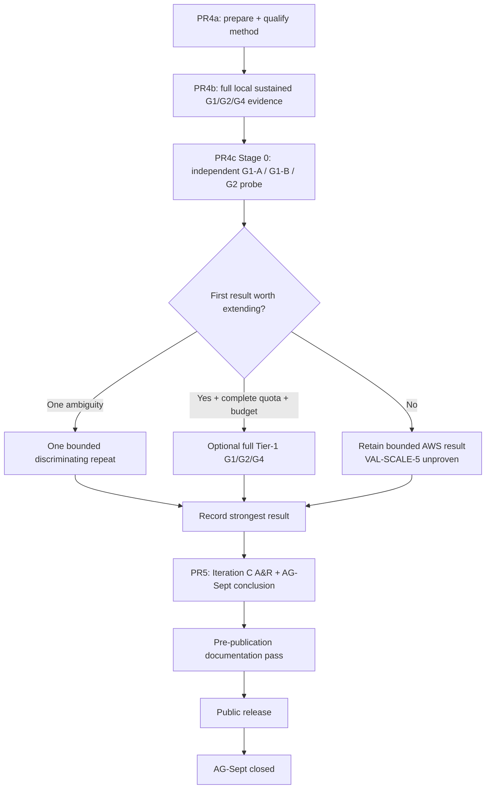

# AG-Sept — milestone plan

**Status:** Living — the current AG-Sept schedule
**Delivery window:** August 2026
**Predecessor:** AG-M1 — correct transactional core and end-to-end service path
**Supersedes:** [`ag-sept-plan-v0.4.md`](ag-sept-plan-v0.4.md) (31 July 2026), retained as an
archived snapshot because PR1 and PR2 were planned and reported under it.

## What this document owns

**Schedule only:** priority, budget, sequence, work-unit/PR split, contingency, descope order,
deliverable status, and the scheduling history that explains how the order was reached.

Everything durable lives elsewhere, and this plan links rather than restates it:

| Question | Owner |
|---|---|
| What worthwhile outcome is AG-Sept pursuing, and what problem is open now? | [`../requirements/ag-sept.md`](../requirements/ag-sept.md) |
| What must be true of any acceptable resolution? | [`../requirements/system-requirements.md`](../requirements/system-requirements.md) (`REQ-*`) |
| What workload semantics stay stable while topology changes? | [`../test/workload-catalog.md`](../test/workload-catalog.md) |
| What is the durable system shape? | [`../design/horizontal-scaling.md`](../design/horizontal-scaling.md), [`../design/horizontal-database-authority.md`](../design/horizontal-database-authority.md), [`../design/deployment-architecture.md`](../design/deployment-architecture.md) |
| What transactional properties must hold? | [`../design/transaction-semantics.md`](../design/transaction-semantics.md) (`INV-*`) |
| How will the claims be proved or falsified? | [`../test/validation-plan/ag-sept-validation-plan.md`](../test/validation-plan/ag-sept-validation-plan.md) (`VAL-*`) |
| What makes a run's numbers admissible? | [`../design/measurement-contract.md`](../design/measurement-contract.md) |
| How is the system run and operated? | [`../operations/`](../operations/) |
| What did the experiments establish? | [`../measurements/`](../measurements/) |
| How was the work actually built? | [`../development/implementation/`](../development/implementation/) |

**This plan is not a normative reference for code, tests, requirements, or design.** It is
expected to change; a citation into it should be for a scheduling or historical fact and should
say so ([`../development/engineering-process.md`](../development/engineering-process.md) §6.1).

Sizes, matrices, durations, and replica counts proposed here are `[HYPOTHESIS]` under
`measurement-contract.md` §2 unless identified as a fixed planning budget or are fixed by the
owning validation/design document.

## 1. Where the milestone is

AG-Sept's governing goal, its iteration history, and the currently open problem are owned by
[`../requirements/ag-sept.md`](../requirements/ag-sept.md). In summary:

- **Iteration A — identify the first scaling frontier.** Resolved. PR2 established PostgreSQL as
  the limiting subsystem while the Go service retained substantial compute headroom.
- **Iteration B — compose independent writable database authorities.** Resolved by the Analyse &
  Review in PR #17. The Phase 1 authority model is established as a correctness/composition result,
  not a capacity multiplier.
- **Iteration C — shard-group capacity, with independent provisioning as the strongest evidence
  layer.** The Problem and requirements are unchanged. PR4a qualified the method; PR4b ran the
  complete sustained G1/G2/G4 experiment on the scheduler-partitioned workstation; PR4c now starts
  with a **small independent-unit AWS probe** before deciding whether the complete G1/G2/G4 Tier-1
  campaign is worth its quota and time. The Stage-0 probe uses G1-A, G1-B and G2(A+B) on the same two
  independently provisioned serving units plus separate generator compute. It is diagnostic only.
  **Only a later complete PR4c Tier-1 run can discharge `VAL-SCALE-5` and derive independently
  provisioned `E2_aws`/`E4_aws`; Stage 0 cannot.**

  **PR4b executed on 2026-08-19 and did not derive `E2_local`/`E4_local`.** `G4_local` resolved;
  `G1` and `G2` did not, and `G1_local` is the denominator of both efficiencies. The evidence
  localises the limit to the shared write path rather than to `alloca-go` — without proving the
  mechanism, since the killing test was not run — so the local tier could not produce the
  efficiency figures originally intended. `VAL-SCALE-6` is executed but not discharged. That
  empirically justifies the independent-resource requirement while also warning that independent
  provisioning need not eliminate per-unit variance. The probe-first PR4c shape is the resulting
  scheduling decision.

The decision order has now reached Schedule:

```text
Iteration B evidence -> Analyse & Review -> Iteration C Problem
                                           |
                                           v
                         Requirements -> Design -> Validation plan -> Schedule
```

| Workstream | Work unit | Status |
|---|---|---|
| Measurement substrate and load harness | PR1 | merged `71914a4` |
| Single-instance frontier | PR2 | merged `0d40de4` |
| Placement, booking policy, confirm/cancel ownership | PR3a | merged `aa1e3a5` |
| Multi-authority harness — topology, routing, certification, verifier | PR3b | merged `57f501d` |
| Multi-authority correctness and failure-isolation evidence | PR3c | merged #16 |
| Iteration B Analyse & Review | review step, PR #17 | merged; Iteration B closed and Iteration C Problem selected |
| Iteration C planning | PR #18 | complete in #18; closes Requirements → Design → Validation → Schedule |
| Iteration C experiment preparation and measurement qualification | PR4a | merged #19; no canonical scaling result |
| Iteration C local sustained capacity and scale characterisation | PR4b | merged #20; gate met on the "explicitly unresolved" branch. `G4_local` resolved, `G1`/`G2` unresolved, efficiencies withheld, `VAL-SCALE-6` **not discharged** |
| Iteration C independently provisioned AWS verification | PR4c | **planning opened 2026-08-19; Stage 0 is the bounded G1-A/G1-B/G2 probe under the current quota. Metered execution still requires the explicit budget decision in §2.1.4; full G1/G2/G4 remains probe- and quota-conditional** |
| Iteration C A&R and AG-Sept conclusion | PR5 | not started; follows PR4b and whatever bounded PR4c evidence is actually executed in time |

Validation status is owned by the validation plan's own status table, not duplicated here.

## 2. Time budget

The development allocation is a planning constraint. **Half a day is the unit**, here and in the
implementation records: nothing is estimated well enough to distinguish 0.3 from 0.4, and finer
granularity is false precision that invites its own overrun (Nancy's call, 2026-08-05).

| Workstream | Work unit | Allocated | Spent | Left | Status |
|---|---|---:|---:|---:|---|
| Measurement harness and load generator | PR1 | 2.0 | 2.0 | 0.0 | merged |
| Single-instance frontier, with the diagnostic time-series minimum | PR2 | 2.5 | 2.5 | 0.0 | merged |
| Placement, booking policy, and confirm/cancel ownership | PR3a | 1.0 | 1.0 | 0.0 | merged; originally 3.0, with 2.0 returned to contingency |
| Multi-authority harness | PR3b | 2.5 | 2.5 | 0.0 | merged |
| Multi-authority correctness and failure-isolation evidence | PR3c | 1.5 | 1.5 | 0.0 | merged; originally 2.0, with 0.5 returned to contingency |
| Iteration C planning | PR #18 | 0.5 | 0.5 | 0.0 | complete; hard planning cap met |
| Iteration C method preparation and measurement qualification | PR4a | 4.0 | 4.0 | 0.0 | complete; consumed the whole former PR4a/PR4b envelope (§2.1.3) |
| Iteration C local sustained capacity characterisation | PR4b | 1.0 | 1.0 | 0.0 | complete; funded by the 1.0-day contingency draw (§2.1.3). Gate met on the "explicitly unresolved" branch; no further draw |
| Iteration C independent verification | PR4c | **0.0** | **0.0** | **0.0** | Stage-0 planning opened; AWS execution remains unfunded until §2.1.4's explicit allocation is accepted. Focused plan recommends 1.0 day |
| Iteration C A&R and AG-Sept conclusion | PR5 | 1.5 | 0.0 | 1.5 | not started |
| **Allocated development budget** | | **16.5** | **15.0** | **1.5** | |
| Contingency | | **3.0** | **1.0** | **2.0** | 1.0 drawn by §2.1.1; 1.0 reallocated to PR4b by §2.1.3 |
| **Total milestone budget** | | **19.5** | **16.0** | **3.5** | |

**The numeric columns are the accounting source of truth:** `Allocated = Spent + Left` on every
row. Completed work that returned unused allocation is shown at its current allocation; **Status**
keeps the historical context, not the accounting.

**PR4c planning has started, but the budget row has deliberately not moved.** Nancy's 2026-08-19
instruction opened the probe-first planning work; it did not choose an amount from contingency. The
focused PR4c plan recommends **1.0 day** because the measured cells are short but first-time AWS
bootstrap, remote-harness adaptation, evidence retention and teardown are not plausibly a half-day
scope. Metered execution begins only after the maintainer accepts an allocation and this table is
updated. A later complete Tier-1 campaign would require its **own** post-probe budget decision.

**A contingency draw that funds a work unit is a transfer, not a second entry.** PR4b's day appears
once, as that row's allocation, and the contingency pool falls by the same day — which is why the
milestone total is still 19.5. The alternative, leaving the day in contingency *and* showing it
against PR4b, would count it twice and break `Allocated = Spent + Left`. §2.1.1's draw is recorded
differently because it funded work that has no work-unit row at all, so it is visible only as
contingency spend.

If the complete G4 AWS environment never becomes available inside the milestone timebox, nothing in
the mandatory local path waits for it. PR4b already produced the strongest local result; PR4c Stage
0 may still contribute bounded independent-node evidence, and PR5 records `VAL-SCALE-5` explicitly
unproven unless the complete Tier-1 validation actually runs.

A further **2–3 days** are reserved beyond the development budget for rerunning decisive
experiments, validating negative controls, reviewing measurements and interpretations, correcting
documentation, polishing diagrams, checking public-disclosure suitability, and preparing the
repository for external readers. **Iteration B's Analyse & Review (#17) spent 0.5 day from this
reserve, leaving 1.5–2.5 days.**

PR5's Iteration C A&R and milestone-conclusion work is funded by PR5's existing **1.5 development
days**, not as another draw on that reserve. The remaining reserve stays available for decisive
reruns, review depth beyond the scheduled closeout work, and the final pre-publication pass.

The time budget is a constraint, not an estimate to be expanded whenever a tool introduces
incidental complexity.

### 2.1 How the contingency is spent

**Completed work returns unused allocation to contingency rather than to scope.** PR3a came in at
1.0 against 3.0 and returned 2.0; PR3c came in at 1.5 against 2.0 (§2.1.2). The figures recorded are
conservative under the half-day rule rather than attempts to account for hours precisely.

The gain is **not** an invitation to widen Iteration C. Contingency is held for reruns, an
investigation that does not resolve on the first attempt, or another hard problem established by
evidence.

**Every PR is funded at what its scope costs.** No PR carries a deliberate shortfall.

PR4b was the first mandatory work unit that depended on contingency to be reachable. It is now
complete. The remaining 2.0 days are available for bounded evidence-driven follow-up, including
PR4c only after an explicit transfer, and are not silently consumed merely because a branch exists.

**Contingency is not scope.** It is drawn on before §5's descope order. After PR3c's 0.5-day return
and PR4b's 1.0-day reallocation, contingency is **3.0 total**: **1.0 is drawn** (§2.1.1) and
**2.0 remains**.

Unspent contingency is not a licence to expand a PR. It returns to the reserve.

### 2.1.1 The documentation and methodology expansion draws on contingency

**Nancy's decision, 2026-08-10:** the document-ownership and engineering-process expansion carried
by PR #15 is charged to **AG-Sept contingency**.

**Drawn: 1.0 day** under the half-day accounting rule.

### 2.1.2 PR3c returns its unused half day

**Nancy's decision, 2026-08-11:** PR3c is charged at **1.5 days actual** against its former 2.0-day
allocation. The 0.5-day difference returned to contingency rather than being carried into Analyse
& Review or silently charged to the next work unit.

The milestone total stays **19.5 days**; the return changes allocation, not the total budget.

### 2.1.3 PR4a is charged at 4.0 days, and PR4b draws 1.0 from contingency

**Nancy's decision, 2026-08-18:** PR4a is charged at **4.0 days actual**, consuming the whole
former PR4a/PR4b shared envelope. **PR4b is allocated 1.0 day, drawn from contingency.** PR4c was
left unbudgeted at that point.

PR4a absorbed the envelope because the re-baseline moved work into it rather than because it
overran its own scope: independent per-group demand streams, the explicit conditioning contract and
its accounting, the frozen pool policy and the evidence behind it, derived fixture sizing, the
600 s retained-run shape, and the single host-executable entry point — none of which existed when
the 4.0 days were split between preparation and execution.

**The draw is a transfer.** Contingency falls from 4.0 to 3.0 and PR4b's day appears once, as that
row's allocation, so the milestone total stays **19.5 days** exactly as PR3c's return did. It is
recorded differently from §2.1.1, whose day funded work that has no work-unit row and is therefore
visible only as contingency spend.

**What it cost in slack.** 2.0 days of contingency remain after PR4b. PR4b's budget was deliberately
bounded: new methodology work or another diagnostic investigation was a stop/re-plan signal rather
than an automatic second draw. PR4b followed that rule and closed once the local shared-write-path
limit was established strongly enough to withhold the unsupported efficiencies.

### 2.1.4 PR4c starts probe-first; the execution allocation remains explicit

**Nancy's decision, 2026-08-19:** start PR4c planning now, but start the AWS evidence with the
smallest useful independent-node experiment rather than the full retained capacity matrix. Under
the current quota the planned first shape is two equivalent serving units plus separate generator
compute, measuring G1-A, G1-B and then G2(A+B). The first result decides whether further AWS work is
worth doing.

This decision changes the **sequence**, not the budget arithmetic. No amount was specified when the
planning branch was opened. [`ag-sept-pr4c.md`](ag-sept-pr4c.md) recommends **1.0 day from the
remaining contingency** for Stage 0, including first-time AWS bootstrap, minimal harness adaptation,
three short probes, evidence/reporting and teardown. That recommendation must be accepted explicitly
before metered execution, at which point the table above and contingency balance move together.

A full Tier-1 G1/G2/G4 attempt is not included in that recommendation. If Stage 0 says `PROCEED`,
quota, experiment shape and budget are reconsidered from the evidence then available.

### 2.2 Review depth is the throughput control

**Review is not free. Nancy's decision, 2026-08-12:** Iteration B's Analyse & Review in PR #17 is
charged at **0.5 day** against the separate 2–3 day review/rerun/interpretation reserve. That leaves
**1.5–2.5 days** in that reserve.

For the final Iteration C, A&R is deliberately combined with PR5 rather than scheduled as a separate
review work unit. This is a milestone-closeout exception, not a change to the normal engineering
loop: PR5 still produces the Analyse & Review outcome required by
[`../development/engineering-process.md`](../development/engineering-process.md) §1.4.1, but also
uses that outcome to make the AG-Sept goal and architecture conclusion in the same work unit.

Review depth is Nancy's to set. Less detailed review moves more responsibility onto implementation
verification; it does not make the correctness/evidence gates optional.

### 2.3 Iteration C planning is intentionally bounded, not a general precedent

**Nancy's decision, 2026-08-12:** PR #18 has a **0.5-day hard cap** and closes within that
active-work budget.

That cap is justified by this iteration's state, not by a belief that Requirements/Design/
Validation should generally be rushed. PR2 already exposed the mutation frontier, Iteration B
already established the authority architecture, and PR #17 already selected a narrow Problem. The
remaining planning work is primarily to place known decisions in their correct semantic owners and
derive the minimum environment that makes the comparison legitimate.

A future Problem with genuine unresolved uncertainty should receive the investigation its
uncertainty requires. **Process depth follows uncertainty; this bounded decision-recording exercise
is specific to Iteration C.**

### 2.4 PR4a and PR4b shared the PR4 envelope after local qualification expanded

**Nancy's decision, 2026-08-14:** retire the original fixed 1.5-day / 2.5-day PR4a/PR4b split while
keeping the combined **4.0-day PR4 allocation unchanged**.

**Superseded by §2.1.3 (2026-08-18)**, which charged the whole 4.0 days to PR4a and funded PR4b
separately from contingency. The reasoning below is why the split was retired and remains accurate
as history; the shared envelope it created no longer exists.

The evidence changed the expected value of the two work units. The 16-vCPU WSL/Docker setup proved
to be a useful, repeatable and unmetered place to exercise the real G1/G2/G4 machinery, while AWS
quota approval was slower than the schedule assumed. More importantly, the PR4 implementation
record exposed materially different local performance regimes under nominally similar cells.
Carrying that unresolved ambiguity into AWS would spend metered time before the measurement
procedure itself was qualified.

That decision expanded PR4a from machinery rehearsal to measurement qualification. It remains part
of the scheduling history; §2.5 records the later evidence-driven re-cut after the root cause was
demonstrated and the workstation's usefulness became clearer.

### 2.5 PR4 is re-cut as preparation → local evidence → probe-first independent verification

**Nancy's decisions, 2026-08-18 and 2026-08-19:** the PR boundary follows purpose rather than
environment, and independent verification is staged by evidence rather than by the original full
matrix.

Two facts changed the earlier schedule. First, the workstation exposed enough CPU to exercise the
complete G1/G2/G4 topology and was unmetered, so limiting it to a rehearsal would have thrown away
useful controlled evidence. Second, the new AWS account's default Standard On-Demand quota could
not instantiate the intended complete environment, so making AWS the mandatory evidence-producing
work unit coupled progress to an external account-maturity constraint.

PR4b then added a third fact: the local G1 denominator varied materially because the shard groups
still shared the host write path. That both justified independent provisioning and warned against
assuming that a cloud capacity unit would be variance-free.

The current boundary is therefore:

```text
PR4a — prepare and qualify the experiment
PR4b — execute and analyse the full sustained experiment locally
PR4c Stage 0 — probe two independent AWS units separately and together
PR4c later stage — only if justified, attempt fuller retained independent verification
```

PR4a qualified the reusable measurement method and run primitives. PR4b applied them locally and
closed on the honest unresolved branch. PR4c Stage 0 keeps the qualified workload/accounting model
but deliberately relaxes **claim depth**, not integrity: three short diagnostic cells answer whether
the independent environment is promising enough for more expensive measurement. They do not enter
`E2_aws`, `E4_aws` or `VAL-SCALE-5`.

This does **not** weaken the Iteration C Problem or `REQ-SCALE-4`. Local scheduler partitioning and
independent provisioning remain different evidence classes. The complete G1/G2/G4 Tier-1 method
remains the only way this milestone can discharge `VAL-SCALE-5`; Stage 0 exists to decide whether
pursuing it is rational.

Mandatory PR4a and PR4b remain funded as completed work. PR4c Stage 0 carries no implicit allocation
until §2.1.4 is accepted; any later Tier-1 expansion is a separate budget decision.

## 3. PR sequence

Each entry states what the work unit delivers and the gate that ends it. Technical meaning stays in
the linked requirements, design, workload catalogue, measurement contract, and validation plan.

### PR1 — Measurement substrate and load harness — merged

2.0 days. Metrics recorder, telemetry-overhead measurement, reset and seed tooling, external
generator, run manifest, persisted-state verifier, response-validation control, operator
documentation.

Record: [`ag-sept-pr1.md`](../development/implementation/ag-sept-pr1.md).

### PR2 — Single-instance frontier — merged

2.5 days. Prometheus retention path, diagnostic panels, one-instance sweeps for controlled
workloads, telemetry comparison, generator-bottleneck control, frontier report.

Record: [`ag-sept-pr2.md`](../development/implementation/ag-sept-pr2.md). Report:
[`ag-sept-pr2-single-instance-frontier.md`](../measurements/reports/ag-sept-pr2-single-instance-frontier.md).
Result: PostgreSQL, not `alloca-go`, sets the measured mutation frontier.

### PR3a — Placement, booking policy, and confirm/cancel ownership — merged

**Actual 1.0 day.** Delivers the versioned placement map, shard-affine service units, placement
enforcement, Phase 1 booking policy, confirm/cancel ownership, and supporting contracts/tests.

### PR3b — Multi-authority harness — merged

**Actual 2.5 days.** Delivers the two-authority topology, per-authority migration, placement-aware
generator, topology/provenance certification, and authority-aware verifier.

### PR3c — Multi-authority correctness and failure isolation — merged #16

**Actual 1.5 days.** Delivers retained Phase 1 correctness, refusal, routing, reconciliation and
failure-isolation evidence. It deliberately makes no capacity multiplier claim from the shared
workstation.

### Iteration B Analyse & Review — PR #17 — merged

**Actual 0.5 day from the separate review reserve.** Closes Iteration B, repairs the VAL-COR-4
same-key replay evidence gap found during review, and selects the Iteration C Problem.

### Iteration C planning — PR #18 — 0.5 day

**Actual 0.5 day. Docs-only.** Requirements → Design → Validation plan → Schedule for the Problem
selected by #17.

It records `WL-MUT-DISP-4`, the shard-group capacity-unit model, numeric efficiency as an output
rather than a threshold, the fixed 1/2/4 placement family, and the stronger independent-resource
envelope requirement. Later PR4 evidence has refined **how** the experiment is scheduled without
weakening those owners.

### PR4a — Iteration C experiment preparation and measurement qualification — merged #19

PR4a answered one question: **can the experiment be trusted?** It produced no canonical G1/G2/G4
capacity result.

It delivered the reusable method and run primitives needed before the evidence-producing comparison:

- independent **`workers_per_group`** streams with per-group sequence/accounting and the
  discriminating `VAL-NEG-8` control;
- explicit state-based conditioning, retained conditioning population, measured-start baseline and
  state-preserving service/pool recycle;
- the bounded pool sensitivity and frozen `pool_max_conns=8` policy;
- fixture-sizing/headroom machinery;
- the canonical 600 s run primitive, retained 60 s slices, observability and reconciliation;
- the host evidence needed to diagnose CPU/memory/storage behaviour;
- removal of the benchmark-induced cached-plan regime from the measured start state.

AWS-specific execution was deliberately removed from its exit gate once the local environment
proved useful enough to qualify the method without spending quota.

### PR4b — Local sustained capacity and scale characterisation — merged #20

PR4b answered: **what does the qualified experiment show on the scheduler-partitioned workstation?**
It was the mandatory evidence-producing PR4 work unit, with a **1.0-day bounded experiment-execution
budget** from §2.1.3.

It drove adaptive reconnaissance, fixed the common 12/16 S/H bracket, derived one final fixture and
retained the full S/H + confirm-S/confirm-H 600 s comparison across G1/G2/G4.

**Gate met 2026-08-19 on the "explicitly unresolved" branch, at the allocated 1.0 day and with no
further contingency draw.** All twelve retained runs were driven and reconciled. `G4_local` resolved
at 3493.9/s; `G1` and `G2` did not, so `G1_local`, `G2_local`, `E2_local` and `E4_local` are
withheld. Four identical G1 runs then measured 25.1% spread and refuted run position as the
explanation. Goodput covaries with delivered write bandwidth at broadly stable mutations/MiB, which
localises the limiting variation to the shared write path without proving the deeper VHDX mechanism.
Nothing was promoted into `VAL-SCALE-5`, and `VAL-LOAD-1` was not attempted because the closed-loop
result it depends on was not secured.

### PR4c — Probe-first independently provisioned AWS verification

PR4c now answers two questions **in sequence**, not one large question up front.

#### Stage 0 — what do two genuinely independent units look like?

Use the current small quota for the first independent-node evidence rather than waiting for the full
G4 allowance. Subject to the explicit budget decision in §2.1.4, provision:

```text
capacity unit A     equivalent serving shape
capacity unit B     equivalent serving shape
generator/monitor   separate compute
```

The target quota fit is 2 + 2 + 1 vCPU if compatible instance families are available. Drive the
three-cell probe defined by
[`ag-sept-pr4c-aws-probe.md`](../test/validation-plan/ag-sept-pr4c-aws-probe.md):

```text
G1-A
G1-B
G2-A+B
```

at one common 120 s `workers_per_group=12` probe level, with the qualified conditioning,
reconciliation, provenance and resource evidence retained. Report raw rates, the A/B unit
difference and `R2_probe = g2_AB / (g1_A + g1_B)`.

**The boundary is load-bearing:** these are diagnostic observations, not `G1_aws`, `G2_aws` or
`E2_aws`; Stage 0 cannot discharge `VAL-SCALE-5` and Tier 2 does not apply. Its exit gate is a first-
result decision: `PROCEED`, `BOUNDED REPEAT`, or `STOP / DEFER`.

Design: [`../design/independent-capacity-probe.md`](../design/independent-capacity-probe.md). Focused
execution plan: [`ag-sept-pr4c.md`](ag-sept-pr4c.md).

#### Later stage — only if Stage 0 earns it

If Stage 0 gives an intelligible independent-resource result, use that evidence to decide the next
smallest useful experiment. A full Tier-1 attempt remains conditional on sufficient quota for the
complete equivalent G1/G2/G4 family, generator headroom, and a **new explicit budget decision**.

If it runs, Tier 1 applies the governing validation plan's retained 600 s method and may derive
`E2_aws`/`E4_aws` and discharge `VAL-SCALE-5`. Tier 2 remains available only when the **complete G4
environment exists** but a demonstrated residual measurement-system limit prevents Tier 1; quota
preventing G4 is not a Tier-2 trigger.

A materially different AWS result is evidence to analyse, not a reason to rewrite PR4b. Local and
AWS points are never mixed in one efficiency formula.

**Gate:** Stage 0 retains the strongest honest three-cell diagnostic the current quota supports and
records the explicit next decision. Any later Tier-1/Tier-2 work has its own gate and cannot start by
scope inertia.

### PR5 — Iteration C Analyse & Review + AG-Sept conclusion

**Budget:** 1.5 development days, following mandatory PR4b and any bounded PR4c evidence actually
executed in time.

PR5 consumes the strongest retained Iteration C evidence and closes both the final iteration and
the AG-Sept milestone. It records the Analyse & Review outcome required by
`engineering-process.md` §1.4.1 in the governing Goal/Problem record, then assembles the
evidence-backed architecture conclusion.

It delivers:

- the **Iteration C Problem verdict** — sufficiently resolved, unresolved, or refined — with the
  retained evidence that supports it;
- the **durable learning** propagated into requirements, design, validation, ADRs, or explicitly
  recorded as requiring no change;
- the **AG-Sept Goal progress/verdict**, stating what the milestone established and what remains
  unproven or deferred;
- an evidence-backed architecture conclusion, comparison tables/diagrams, service-boundary
  decision, limitations, and reproduction entry points;
- explicit deferred-work and roadmap candidates where useful, without silently promoting them into
  requirements or scheduled work;
- the loop decision **`END` for AG-Sept**, either because the Goal is sufficiently achieved for the
  agreed scope or because the maintainer makes an explicit milestone goal/scope closure decision
  under `engineering-process.md` §1.4.

Because this work closes AG-Sept, **PR5 does not choose or schedule the next Alloca Problem.** If
Alloca continues after the milestone, a separate kickoff starts from current evidence, the roadmap,
and current priorities to choose the next Goal and Problem before beginning a new engineering
iteration.

**Gate:** the Iteration C A&R outcome is durable, the AG-Sept goal/scope verdict is explicit, every
architecture claim is traceable to retained evidence, limitations and unproven areas are named, no
new implementation stage is invented, and the AG-Sept engineering loop is closed before
publication work begins.

The Iteration C closeout path is:



## 4. Manifest and reconciliation staging

The rules are `measurement-contract.md` §11–§13. PR3b established multi-authority topology/image
identity. PR4a extended the harness so conditioning, `workers_per_group`, per-group demand identity,
measured-start baselines, fixed pool policy and the 600 s retained run shape are explicit and
auditable. PR4b applied that machinery to every quoted local G1/G2/G4 point.

PR4c Stage 0 reuses the same population/accounting/provenance semantics on remote independent hosts,
but its 120 s cells are intentionally **diagnostic**, not capacity points. It additionally records
the per-unit EC2/storage resource envelope and generator separation needed to interpret independence.
If a later full Tier-1 experiment runs, it returns to the canonical retained 600 s method rather
than promoting the probe cells.

Reconciliation: PR1 established the single-authority self-check; PR3b extended it to multiple
authorities; PR3c exercised it against deliberate failure. PR4a added the conditioning/measurement/
resolution population boundary; PR4b exercised it on the full local sustained result; PR4c reuses
it for every interpreted AWS cell.

**Quotability target:** provenance level and validation meaning remain separate. A Stage-0 run may
carry complete capacity-grade provenance while still being diagnostic by experiment purpose. No
external project-level capacity claim follows until the governing validation/evidence gates for that
claim are satisfied.

## 5. Priority and descope

### 5.1 P0 — required

For Iteration C the mandatory path remains independent of AWS quota:

- stable `WL-MUT-DISP-4` request semantics and fixed per-organisation fixture populations;
- PR4a's qualified method and reusable primitives: independent `workers_per_group`, `VAL-NEG-8`,
  explicit conditioning and measured-start accounting, fixed pool policy, fixture-sizing/headroom
  mechanism, qualified 600 s run shape, and generator/resource/reconciliation controls;
- PR4b's **full local G1/G2/G4 sustained capacity/scale characterisation**, delivered 2026-08-19 on
  the explicit unresolved branch: `G4_local` resolved, `G1`/`G2` did not, and unsupported
  efficiencies were withheld;
- correctness/reconciliation and provenance/resource evidence required for every quoted result;
- `VAL-SCALE-5` explicitly unproven unless the complete independent Tier-1 family actually runs.

PR4c Stage 0 is now selected as a bounded evidence opportunity, but successful AWS capacity
measurement remains outside the P0 completion gate. The older service-replica VAL-SCALE-1/2 path is
not Iteration C scope.

### 5.2 P1 — strongly desirable

Only after the P0 local result is secure:

- the **PR4c Stage-0 independent-unit probe**, once explicitly funded, because PR4b directly
  established the shared-resource limitation it discriminates;
- `VAL-LOAD-1` bounded open-loop characterisation only after a secure closed-loop result exists in
  the environment being characterised;
- a deliberately constrained resource control (`VAL-NEG-5`) if it materially strengthens a
  limiting-resource diagnosis;
- polished charts beyond the minimum needed to communicate the result;
- extra diagnostic reruns requested by A&R.

Capacity/resource economics is **not** P1 for Iteration C; it remains an unscheduled roadmap
direction unless a future post-AG-Sept kickoff selects it as part of a new Goal or Problem.

### 5.3 P2 — only after decisive evidence

Transactional outbox implementation; independently deployed consumer; autoscaling; additional
fault injection; distributed tracing; richer dashboards; service-replica scaling without evidence
that service compute has become the relevant frontier.

### 5.4 Out of scope for AG-Sept

Cross-authority booking and any distributed commit/saga protocol; splitting one organisation
across writable authorities; online rebalancing or dual-write migration; multi-region writes;
EKS; RDS; Kubernetes; a service mesh; autoscaling; a broker solely to claim event-driven
architecture; complete production authentication/authorization; eliminating hot-authority
serialization; and reproducing a full commercial workload.

**Narrow AWS exception:** EC2 remains the selected bounded mechanism for PR4c independent-resource
evidence. Stage 0 uses only two serving units plus separate measurement compute; a later full
G1/G2/G4 attempt remains conditional on probe evidence, quota and a new budget decision. No cloud-
production conclusion follows from either.

### 5.5 Descope order

If time slips, remove work in this order:

1. **all PR4c depth beyond the three Stage-0 cells** — including a full Tier-1 matrix — unless the
   first result makes one bounded repeat decisive for A&R;
2. optional open-loop depth or the whole `VAL-LOAD-1` round when no secure closed-loop result exists;
3. optional resource-limit control beyond the evidence already needed for diagnosis;
4. chart/dashboard polish beyond the diagnostic minimum;
5. extra confirmation/rerun work beyond what the active validation method requires, unless A&R
   needs it to resolve material variation;
6. PR5 presentation/chart polish beyond what the milestone conclusion requires.

**Do not descope:** stable `WL-MUT-DISP-4` semantics/fixtures; PR4a measurement qualification;
independent per-group demand; explicit conditioning/accounting; the fixed pool policy; PR4b's full
local evidence; response validation; reconciliation; provenance/resource capture; or honest evidence
labelling. If PR4c Stage 0 is funded and driven, do not weaken its separation/resource/evidence gates
to fit time; stop before a cell rather than reinterpret a compromised one.

Contingency is drawn before weakening any mandatory evidence gate.

## 6. Scheduling history

### 6.1 Why database-authority scaling came first

Nancy's call, 2026-08-05: scaling design and implementation take priority over capacity
measurement, and database-authority scaling comes before service-replica scaling because PR2 found
PostgreSQL to be the first mutation frontier.

### 6.2 What changed from v0.4

v0.4 planned one service baseline, stateless replicas against one PostgreSQL authority, then a
conditional AWS deployment. PR2's measured result changed the order:

1. horizontal database authority became primary work ahead of replicas;
2. the original AWS path was withdrawn and its budget moved to the authority work;
3. Iteration B established the authority architecture and PR #17 selected capacity composition as
   the next Problem;
4. Iteration C Requirements/Design derived that the fixed workstation cannot prove the selected
   independently provisioned capacity claim, which justified a much smaller AWS EC2 path;
5. PR4a added a bounded local resource-partitioned rehearsal so the topology and measurement
   machinery could be debugged before metered work;
6. that rehearsal proved unusually valuable, exposed and ultimately root-caused a benchmark-induced
   cached-plan regime, while the workstation itself proved large enough to exercise the full
   topology family;
7. AWS quota was declined on the new account, making AWS a weaker immediate execution environment
   than the unmetered workstation even though it remains the stronger **evidence class** for
   independent resource envelopes;
8. on 2026-08-18 the work was therefore re-cut by purpose: PR4a qualifies, PR4b measures locally,
   and PR4c independently verifies only if useful;
9. PR4b then measured the local shared-write-path limitation directly enough to withhold the
   efficiencies, while its identical G1 control showed that independent provisioning should not be
   assumed variance-free. On 2026-08-19 PR4c was therefore opened **probe-first**: use the current
   quota for G1-A/G1-B/G2, inspect the first result, then decide whether a larger campaign is worth
   buying.

### 6.3 The original AWS path remains withdrawn; PR4c is only bounded verification

The v0.4 AWS plan — ECR/EKS/RDS/load-balancing path plus separate EC2 generator and its larger
matrix — remains withdrawn. PR4c does **not** restore it.

The evidence path is now:

```text
qualified method
    -> full local scheduler-partitioned characterisation
    -> three-cell independent-unit AWS probe
    -> only if justified, fuller independent G1/G2/G4 verification
    -> never mix local and AWS points in one efficiency calculation
```

No EKS, RDS, managed-database, service-mesh, or cloud-production conclusion follows. The Stage-0
probe has its own diagnostic ratio and is never promoted into a canonical capacity efficiency.

### 6.4 The PR2 deferral register

- **Overload question:** broad overload mechanism work remains outside AG-Sept; `VAL-LOAD-1` is a
  bounded characterisation attached to an already-secured capacity result, not a new
  admission-control design problem.
- **Instrumentation:** the old PostgreSQL/node-exporter choices are no longer schedule owners. The
  durable obligations are the evidence needed to identify/bound each quoted result's frontier and
  `VAL-NEG-7` for any independently provisioned claim.
- **Evidence hygiene:** per-run retained evidence required by the strongest executed PR4 path is in
  scope; unrelated PR2 re-runs/histogram work remains deferred.

## 7. Final deliverables

The public-ready milestone should leave:

1. a runnable containerized service;
2. a reproducible external load generator with placement-aware routing and independent per-group
   demand streams;
3. a stable reusable workload catalogue;
4. aggregated service/runtime/resource evidence sufficient for the claims made;
5. the single-instance frontier report;
6. the multi-authority correctness/failure-isolation report;
7. the PR4a measurement-qualification record and PR4b local sustained result — delivered with
   `G4_local` established and `E2_local`/`E4_local` withheld — plus any PR4c evidence actually
   executed: at minimum the Stage-0 diagnostic if funded, and only if a later complete Tier-1 run
   occurs, independently provisioned `E2_aws`/`E4_aws`; otherwise `VAL-SCALE-5` stays explicit;
8. current and intended architecture diagrams;
9. authority and bottleneck analysis across the scaling axes actually measured, with unmeasured
   axes named explicitly;
10. the PR5 **Iteration C A&R + AG-Sept conclusion**, including the Problem verdict, Goal verdict,
    evidence-backed architecture conclusion, service-boundary decision, limitations, and deferred
    work;
11. a concise public repository summary;
12. explicit limitations, evidence labels, and negative-control results;
13. a bounded **pre-publication documentation pass** across `docs/`, reviewed from an external
    reader's perspective and applying the diagram convention in [`../README.md`](../README.md):
    improve first-read comprehension where diagrams materially help; reduce unnecessary density or
    duplication without weakening precision; verify navigation, semantic ownership, terminology,
    and document status; and remove stale planning or implementation language where it obscures the
    public story.

## 8. Completion gate

AG-Sept's schedule is complete when the deliverables of §7 exist and every P0 item is validated or
explicitly recorded as unproven.

Before PR5 can close Iteration C and judge the AG-Sept Goal:

- PR4a has qualified the reusable method and run primitives defined by the validation plan;
- PR4b has executed the full local G1/G2/G4 S/H + confirmation method and retained the explicit
  unresolved `VAL-SCALE-6` verdict without manufacturing `E2_local`/`E4_local`;
- if PR4c Stage 0 is funded and executed, its G1-A/G1-B/G2 cells are retained as **diagnostic**
  independent-resource evidence with the first-result decision explicit and no promotion into
  `G1_aws`/`E2_aws`;
- if PR4c later escalates to full Tier 1, the complete independent environment is reproducible with
  equivalent capacity-unit hosts and separate generator compute, and the canonical retained method
  supports the `VAL-SCALE-5` claim;
- if the complete G4 environment remains unavailable or the probe does not justify escalation,
  `VAL-SCALE-5` is explicitly unproven and no local or partial-AWS result substitutes for it;
- response validation, conditioning-aware reconciliation, provenance and applicable resource
  controls are demonstrated for every result actually quoted;
- outcomes and persisted state reconcile on every participating authority for interpreted runs;
- measured facts, calculations, interpretation, and limitations are separated;
- architecture reflects evidence rather than desired presentation;
- the repository remains suitable for public review under the disclosure policy.

**Successful AWS capacity measurement is not an Iteration C exit gate.** PR4b's complete local
characterisation remains the mandatory evidence-producing path; PR4c strengthens the independent-
provisioning story only to the level actually supported. The exit gate is an honest, reviewable
result at the strongest evidence level reached, with the stronger requirement left explicitly
unproven when provisioning or measurement prevents its test.

PR5 then records the required Analyse & Review outcome and closes the **AG-Sept** engineering loop.
It does not start the next Alloca iteration. Any continuation after AG-Sept begins with a separate
kickoff that chooses the next Goal and Problem from the evidence, roadmap, and priorities current at
that time.

**After PR5 and before the repository is made public**, complete §7's pre-publication documentation
pass. This is a public-readiness gate, not a new technical iteration: it improves how the settled
AG-Sept work is understood without changing requirements, evidence, or semantic ownership. Some
improvements may land naturally during PR5, especially architecture conclusions and diagrams, but
the repo-wide external-reader pass happens after PR5 so it polishes the final technical story once.
The pass is complete when the durable docs are navigable and internally consistent for an external
reader, diagrams have been added where they materially improve first-read comprehension under
`docs/README.md`, and stale or unnecessarily dense prose has been cleaned without rewriting the
historical or evidential record.

A finished schedule is an input to Analyse & Review, not a substitute for it; in this final
iteration, PR5 is the work unit that performs that Analyse & Review and closes the milestone.
