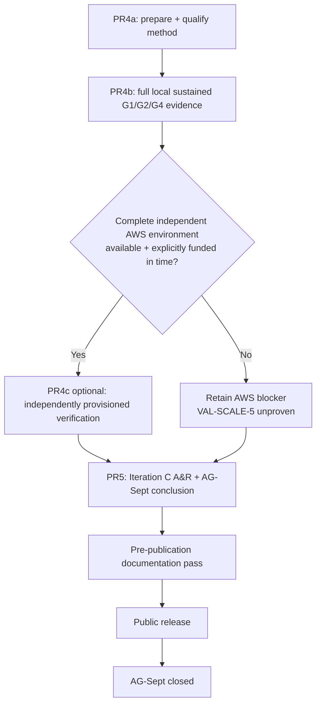

# AG-Sept — milestone plan

**Status:** Living — the current AG-Sept schedule
**Delivery window:** August 2026
**Predecessor:** AG-M1 — correct transactional core and end-to-end service path
**Supersedes:** [`ag-sept-plan-v0.4.md`](ag-sept-plan-v0.4.md) (31 July 2026), retained as an
archived snapshot because PR1 and PR2 were planned and reported under it.

## What this document owns

**Schedule only:** priority, budget, sequence, work-unit/PR split, contingency, descope order,
deliverable status, and the scheduling history that explains how the order was reached.

Everything durable lives elsewhere, and this plan links rather than restates it:

| Question | Owner |
|---|---|
| What worthwhile outcome is AG-Sept pursuing, and what problem is open now? | [`../requirements/ag-sept.md`](../requirements/ag-sept.md) |
| What must be true of any acceptable resolution? | [`../requirements/system-requirements.md`](../requirements/system-requirements.md) (`REQ-*`) |
| What workload semantics stay stable while topology changes? | [`../test/workload-catalog.md`](../test/workload-catalog.md) |
| What is the durable system shape? | [`../design/horizontal-scaling.md`](../design/horizontal-scaling.md), [`../design/horizontal-database-authority.md`](../design/horizontal-database-authority.md), [`../design/deployment-architecture.md`](../design/deployment-architecture.md) |
| What transactional properties must hold? | [`../design/transaction-semantics.md`](../design/transaction-semantics.md) (`INV-*`) |
| How will the claims be proved or falsified? | [`../test/validation-plan/ag-sept-validation-plan.md`](../test/validation-plan/ag-sept-validation-plan.md) (`VAL-*`) |
| What makes a run's numbers admissible? | [`../design/measurement-contract.md`](../design/measurement-contract.md) |
| How is the system run and operated? | [`../operations/`](../operations/) |
| What did the experiments establish? | [`../measurements/`](../measurements/) |
| How was the work actually built? | [`../development/implementation/`](../development/implementation/) |

**This plan is not a normative reference for code, tests, requirements, or design.** It is
expected to change; a citation into it should be for a scheduling or historical fact and should
say so ([`../development/engineering-process.md`](../development/engineering-process.md) §6.1).

Sizes, matrices, durations, and replica counts proposed here are `[HYPOTHESIS]` under
`measurement-contract.md` §2 unless identified as a fixed planning budget or are fixed by the
owning validation/design document.

## 1. Where the milestone is

AG-Sept's governing goal, its iteration history, and the currently open problem are owned by
[`../requirements/ag-sept.md`](../requirements/ag-sept.md). In summary:

- **Iteration A — identify the first scaling frontier.** Resolved. PR2 established PostgreSQL as
  the limiting subsystem while the Go service retained substantial compute headroom.
- **Iteration B — compose independent writable database authorities.** Resolved by the Analyse &
  Review in PR #17. The Phase 1 authority model is established as a correctness/composition result,
  not a capacity multiplier.
- **Iteration C — shard-group capacity, with independent provisioning as the strongest evidence
  layer.** The Problem and requirements are unchanged. The validation method now builds evidence in
  stages: PR4a qualifies the method; PR4b runs the complete sustained G1/G2/G4 experiment on the
  scheduler-partitioned workstation and derives explicitly local `E2_local`/`E4_local`; optional
  PR4c repeats the qualified method on independently provisioned equivalent capacity units when the
  complete environment can actually be provisioned. Only PR4c can discharge `VAL-SCALE-5` and
  derive independently provisioned `E2_aws`/`E4_aws`. If external quota keeps that environment
  unavailable, PR4b remains a completed quantitative local result while `VAL-SCALE-5` is reported
  explicitly unproven.

The decision order has now reached Schedule:

```text
Iteration B evidence -> Analyse & Review -> Iteration C Problem
                                           |
                                           v
                         Requirements -> Design -> Validation plan -> Schedule
```

| Workstream | Work unit | Status |
|---|---|---|
| Measurement substrate and load harness | PR1 | merged `71914a4` |
| Single-instance frontier | PR2 | merged `0d40de4` |
| Placement, booking policy, confirm/cancel ownership | PR3a | merged `aa1e3a5` |
| Multi-authority harness — topology, routing, certification, verifier | PR3b | merged `57f501d` |
| Multi-authority correctness and failure-isolation evidence | PR3c | merged #16 |
| Iteration B Analyse & Review | review step, PR #17 | merged; Iteration B closed and Iteration C Problem selected |
| Iteration C planning | PR #18 | complete in #18; closes Requirements → Design → Validation → Schedule |
| Iteration C experiment preparation and measurement qualification | PR4a | in progress; all mandatory preparation, no canonical scaling result |
| Iteration C local sustained capacity and scale characterisation | PR4b | mandatory next evidence work unit after PR4a |
| Iteration C independently provisioned AWS verification | PR4c | **optional; quota-conditional; not opened/scheduled until complete environment is provisionable** |
| Iteration C A&R and AG-Sept conclusion | PR5 | not started; follows PR4b and optional PR4c if it executes in time |

Validation status is owned by the validation plan's own status table, not duplicated here.

## 2. Time budget

The development allocation is a planning constraint. **Half a day is the unit**, here and in the
implementation records: nothing is estimated well enough to distinguish 0.3 from 0.4, and finer
granularity is false precision that invites its own overrun (Nancy's call, 2026-08-05).

| Workstream | Work unit | Allocated | Spent | Left | Status |
|---|---|---:|---:|---:|---|
| Measurement harness and load generator | PR1 | 2.0 | 2.0 | 0.0 | merged |
| Single-instance frontier, with the diagnostic time-series minimum | PR2 | 2.5 | 2.5 | 0.0 | merged |
| Placement, booking policy, and confirm/cancel ownership | PR3a | 1.0 | 1.0 | 0.0 | merged; originally 3.0, with 2.0 returned to contingency |
| Multi-authority harness | PR3b | 2.5 | 2.5 | 0.0 | merged |
| Multi-authority correctness and failure-isolation evidence | PR3c | 1.5 | 1.5 | 0.0 | merged; originally 2.0, with 0.5 returned to contingency |
| Iteration C planning | PR #18 | 0.5 | 0.5 | 0.0 | complete; hard planning cap met |
| Iteration C method preparation and measurement qualification | PR4a | 4.0 | 4.0 | 0.0 | complete; consumed the whole former PR4a/PR4b envelope (§2.1.3) |
| Iteration C local sustained capacity characterisation | PR4b | 1.0 | 0.0 | 1.0 | funded by a 1.0-day contingency draw (§2.1.3) |
| Iteration C optional independent verification | PR4c | **0.0** | **0.0** | **0.0** | unscheduled and unbudgeted; requires quota + an explicit budget decision before opening |
| Iteration C A&R and AG-Sept conclusion | PR5 | 1.5 | 0.0 | 1.5 | not started |
| **Allocated development budget** | | **16.5** | **14.0** | **2.5** | |
| Contingency | | **3.0** | **1.0** | **2.0** | 1.0 drawn by §2.1.1; 1.0 reallocated to PR4b by §2.1.3 |
| **Total milestone budget** | | **19.5** | **15.0** | **4.5** | |

**The numeric columns are the accounting source of truth:** `Allocated = Spent + Left` on every
row. Completed work that returned unused allocation is shown at its current allocation; **Status**
keeps the historical context, not the accounting.

**PR4a consumed the whole former 4.0-day PR4a/PR4b envelope**, and PR4b is funded by a separate
1.0-day draw on contingency (§2.1.3). Adding the name PR4c still does **not** create an allocation.
PR4c is optional and unscheduled until the complete independently provisioned environment can be
built; if it becomes executable inside AG-Sept, its budget must be chosen explicitly from remaining
contingency, a deliberate reallocation, or the separate rerun/review reserve where appropriate.
Merely receiving quota does not silently spend it.

**A contingency draw that funds a work unit is a transfer, not a second entry.** PR4b's day appears
once, as that row's allocation, and the contingency pool falls by the same day — which is why the
milestone total is still 19.5. The alternative, leaving the day in contingency *and* showing it
against PR4b, would count it twice and break `Allocated = Spent + Left`. §2.1.1's draw is recorded
differently because it funded work that has no work-unit row at all, so it is visible only as
contingency spend.

If quota never arrives inside the milestone timebox, nothing in the 4.0-day mandatory envelope is
left waiting for AWS: PR4b still produces the complete local sustained result, and PR5 records the
strongest established evidence plus `VAL-SCALE-5` explicitly unproven.

A further **2–3 days** are reserved beyond the development budget for rerunning decisive
experiments, validating negative controls, reviewing measurements and interpretations, correcting
documentation, polishing diagrams, checking public-disclosure suitability, and preparing the
repository for external readers. **Iteration B's Analyse & Review (#17) spent 0.5 day from this
reserve, leaving 1.5–2.5 days.**

PR5's Iteration C A&R and milestone-conclusion work is funded by PR5's existing **1.5 development
days**, not as another draw on that reserve. The remaining reserve stays available for decisive
reruns, review depth beyond the scheduled closeout work, and the final pre-publication pass.

The time budget is a constraint, not an estimate to be expanded whenever a tool introduces
incidental complexity.

### 2.1 How the contingency is spent

**Completed work returns unused allocation to contingency rather than to scope.** PR3a came in at
1.0 against 3.0 and returned 2.0; PR3c came in at 1.5 against 2.0 and returned 0.5 (§2.1.2). The
figures recorded are conservative under the half-day rule rather than attempts to account for
hours precisely.

The gain is **not** an invitation to widen Iteration C. Contingency is held for reruns, an
investigation that does not resolve on the first attempt, or another hard problem established by
evidence.

**Every PR is funded at what its scope costs.** No PR carries a deliberate shortfall.

**PR4b is the first mandatory work unit that depends on contingency to be reachable**, which was
not true when this section was written: PR4a consumed the whole shared envelope, so PR4b's day
comes from the reserve (§2.1.3). That is contingency doing its job rather than a shortfall — but it
does mean the remaining 2.0 days are now carrying a mandatory work unit as well as reruns, and §5's
descope order is correspondingly closer.

**Contingency is not scope.** It is drawn on before §5's descope order. After PR3c's 0.5-day return
and PR4b's 1.0-day reallocation, contingency is **3.0 total**: **1.0 is drawn** (§2.1.1) and
**2.0 remains**.

Unspent contingency is not a licence to expand a PR. It returns to the reserve.

### 2.1.1 The documentation and methodology expansion draws on contingency

**Nancy's decision, 2026-08-10:** the document-ownership and engineering-process expansion carried
by PR #15 is charged to **AG-Sept contingency**.

**Drawn: 1.0 day** under the half-day accounting rule.

### 2.1.2 PR3c returns its unused half day

**Nancy's decision, 2026-08-11:** PR3c is charged at **1.5 days actual** against its former 2.0-day
allocation. The 0.5-day difference returned to contingency rather than being carried into Analyse
& Review or silently charged to the next work unit.

The milestone total stays **19.5 days**; the return changes allocation, not the total budget.

### 2.1.3 PR4a is charged at 4.0 days, and PR4b draws 1.0 from contingency

**Nancy's decision, 2026-08-18:** PR4a is charged at **4.0 days actual**, consuming the whole
former PR4a/PR4b shared envelope. **PR4b is allocated 1.0 day, drawn from contingency.** PR4c
remains unbudgeted and its allocation is deferred.

PR4a absorbed the envelope because the re-baseline moved work into it rather than because it
overran its own scope: independent per-group demand streams, the explicit conditioning contract and
its accounting, the frozen pool policy and the evidence behind it, derived fixture sizing, the
600 s retained-run shape, and the single host-executable entry point — none of which existed when
the 4.0 days were split between preparation and execution.

**The draw is a transfer.** Contingency falls from 4.0 to 3.0 and PR4b's day appears once, as that
row's allocation, so the milestone total stays **19.5 days** exactly as PR3c's return did. It is
recorded differently from §2.1.1, whose day funded work that has no work-unit row and is therefore
visible only as contingency spend.

**What it costs in slack.** 2.0 days of contingency remain, and they are now backing a mandatory
work unit as well as reruns and review. PR4b at 1.0 day is a *bounded execution* budget: the method
is qualified and the runs are scripted, so the day covers driving the retained S/H points and their
confirmations, not further method work. Method work reappearing inside PR4b is the signal to stop
and re-plan rather than to draw again.

### 2.2 Review depth is the throughput control

**Review is not free. Nancy's decision, 2026-08-12:** Iteration B's Analyse & Review in PR #17 is
charged at **0.5 day** against the separate 2–3 day review/rerun/interpretation reserve. That leaves
**1.5–2.5 days** in that reserve.

For the final Iteration C, A&R is deliberately combined with PR5 rather than scheduled as a separate
review work unit. This is a milestone-closeout exception, not a change to the normal engineering
loop: PR5 still produces the Analyse & Review outcome required by
[`../development/engineering-process.md`](../development/engineering-process.md) §1.4.1, but also
uses that outcome to make the AG-Sept goal and architecture conclusion in the same work unit.

Review depth is Nancy's to set. Less detailed review moves more responsibility onto implementation
verification; it does not make the correctness/evidence gates optional.

### 2.3 Iteration C planning is intentionally bounded, not a general precedent

**Nancy's decision, 2026-08-12:** PR #18 has a **0.5-day hard cap** and closes within that
active-work budget.

That cap is justified by this iteration's state, not by a belief that Requirements/Design/
Validation should generally be rushed. PR2 already exposed the mutation frontier, Iteration B
already established the authority architecture, and PR #17 already selected a narrow Problem. The
remaining planning work is primarily to place known decisions in their correct semantic owners and
derive the minimum environment that makes the comparison legitimate.

A future Problem with genuine unresolved uncertainty should receive the investigation its
uncertainty requires. **Process depth follows uncertainty; this bounded decision-recording exercise
is specific to Iteration C.**

### 2.4 PR4a and PR4b shared the PR4 envelope after local qualification expanded

**Nancy's decision, 2026-08-14:** retire the original fixed 1.5-day / 2.5-day PR4a/PR4b split while
keeping the combined **4.0-day PR4 allocation unchanged**.

**Superseded by §2.1.3 (2026-08-18)**, which charged the whole 4.0 days to PR4a and funded PR4b
separately from contingency. The reasoning below is why the split was retired and remains accurate
as history; the shared envelope it created no longer exists.

The evidence changed the expected value of the two work units. The 16-vCPU WSL/Docker setup proved
to be a useful, repeatable and unmetered place to exercise the real G1/G2/G4 machinery, while AWS
quota approval was slower than the schedule assumed. More importantly, the PR4 implementation
record exposed materially different local performance regimes under nominally similar cells.
Carrying that unresolved ambiguity into AWS would spend metered time before the measurement
procedure itself was qualified.

That decision expanded PR4a from machinery rehearsal to measurement qualification. It remains part
of the scheduling history; §2.5 records the later evidence-driven re-cut after the root cause was
demonstrated and the workstation's usefulness became clearer.

### 2.5 PR4 is re-cut as preparation → local evidence → optional independent verification

**Nancy's decision, 2026-08-18:** the PR boundary follows purpose rather than environment.

Two facts changed the earlier schedule. First, the workstation exposes enough CPU to exercise the
complete G1/G2/G4 topology and is unmetered, so limiting it to a rehearsal would throw away useful
controlled evidence. Second, the new AWS account's default Standard On-Demand quota cannot
instantiate the intended complete environment and the quota increase was declined, so making AWS
the mandatory evidence-producing work unit couples progress to an external account-maturity
constraint.

The new boundary is:

```text
PR4a — prepare and qualify the experiment
PR4b — execute and analyse the full sustained experiment locally
PR4c — optionally verify on independently provisioned AWS capacity when the environment exists
```

This does **not** weaken the Iteration C Problem or `REQ-SCALE-4`. Local scheduler partitioning and
independent provisioning remain different evidence classes. PR4b is now a first-class quantitative
result about the recorded local environment (`VAL-SCALE-6`); only optional PR4c can discharge
`VAL-SCALE-5`.

Mandatory PR4a and PR4b remain funded: PR4a at the 4.0 days it consumed, PR4b at 1.0 day drawn from
contingency (§2.1.3). PR4c carries no implicit budget. If quota arrives only after AG-Sept closes,
the same independent-provisioning verification can be run later as a separate follow-up; it does
not silently reopen the milestone.

## 3. PR sequence

Each entry states what the work unit delivers and the gate that ends it. Technical meaning stays in
the linked requirements, design, workload catalogue, measurement contract, and validation plan.

### PR1 — Measurement substrate and load harness — merged

2.0 days. Metrics recorder, telemetry-overhead measurement, reset and seed tooling, external
generator, run manifest, persisted-state verifier, response-validation control, operator
documentation.

Record: [`ag-sept-pr1.md`](../development/implementation/ag-sept-pr1.md).

### PR2 — Single-instance frontier — merged

2.5 days. Prometheus retention path, diagnostic panels, one-instance sweeps for controlled
workloads, telemetry comparison, generator-bottleneck control, frontier report.

Record: [`ag-sept-pr2.md`](../development/implementation/ag-sept-pr2.md). Report:
[`ag-sept-pr2-single-instance-frontier.md`](../measurements/reports/ag-sept-pr2-single-instance-frontier.md).
Result: PostgreSQL, not `alloca-go`, sets the measured mutation frontier.

### PR3a — Placement, booking policy, and confirm/cancel ownership — merged

**Actual 1.0 day.** Delivers the versioned placement map, shard-affine service units, placement
enforcement, Phase 1 booking policy, confirm/cancel ownership, and supporting contracts/tests.

### PR3b — Multi-authority harness — merged

**Actual 2.5 days.** Delivers the two-authority topology, per-authority migration, placement-aware
generator, topology/provenance certification, and authority-aware verifier.

### PR3c — Multi-authority correctness and failure isolation — merged #16

**Actual 1.5 days.** Delivers retained Phase 1 correctness, refusal, routing, reconciliation and
failure-isolation evidence. It deliberately makes no capacity multiplier claim from the shared
workstation.

### Iteration B Analyse & Review — PR #17 — merged

**Actual 0.5 day from the separate review reserve.** Closes Iteration B, repairs the VAL-COR-4
same-key replay evidence gap found during review, and selects the Iteration C Problem.

### Iteration C planning — PR #18 — 0.5 day

**Actual 0.5 day. Docs-only.** Requirements → Design → Validation plan → Schedule for the Problem
selected by #17.

It records `WL-MUT-DISP-4`, the shard-group capacity-unit model, numeric efficiency as an output
rather than a threshold, the fixed 1/2/4 placement family, and the stronger independent-resource
envelope requirement. Later PR4 evidence has refined **how** the experiment is scheduled without
weakening those owners.

### PR4a — Iteration C experiment preparation and measurement qualification

PR4a answers one question: **can the experiment be trusted?** It produces no canonical G1/G2/G4
capacity result.

It owns all preparation needed before the expensive sustained measurements:

- replace the shared global closed-loop worker pool with independent
  **`workers_per_group`** streams, including per-group sequence/accounting, aggregate summaries,
  disjoint idempotency-key identity, and the discriminating `VAL-NEG-8` slow-group control;
- implement the explicit conditioning contract from `measurement-contract.md` §5/§12: fixed
  state-based target, retained conditioning population, measured-start baseline, state-preserving
  service/pool recycle, and no reseed between conditioning and measurement;
- run a **bounded G1 pool-sensitivity preflight** against the current shard-group shape: begin with
  the observed pool ceiling 4 versus 8 at the same useful worker pressure; extend to 16 only if the
  8-connection result still moves materially enough that the fixed policy remains ambiguous. This
  is configuration qualification, not a pool × worker optimisation matrix;
- choose and then freeze one pool policy for the G1/G2/G4 comparisons;
- run short **adaptive `workers_per_group` reconnaissance** to locate an approximate saturation
  bracket; 16 is a plausible probe, not an upper bound, and the search may move to 32/64 or downward
  as evidence requires;
- size one fixed per-organisation fixture for conditioning plus the deepest intended retained
  bracket over a 600 s measured interval with safety headroom;
- support the validation plan's retained shape: 600 s selected point `S`, 600 s deciding higher
  point `H`, and independent 600 s confirmations of **both**, each with a fresh
  reset/reseed/conditioning sequence; retain ten 60 s analysis slices per sustained run without
  treating them as independent samples;
- qualify generator headroom and the resource/observability/reconciliation path at the range the
  local experiment intends to quote;
- demonstrate that the cached-plan regime PR4a root-caused is removed from the measured starting
  state by the conditioning + deterministic recycle procedure.

The older short repeated cells remain diagnostic evidence. They are not the retained capacity
method and their old `c16`/`c32` labels keep their historical meaning: total workers, not the new
`workers_per_group` variable.

**AWS-specific execution is no longer a PR4a exit gate.** No `t2.micro` bootstrap, EC2
provisioning/smoke, AWS chrony/security-group proof, metered teardown execution, or AWS-specific
capacity readiness is required. PR4a must leave the method portable; it does not need to deploy the
provider it currently cannot provision.

**Gate:** the complete method is implemented, discriminating controls pass, the fixed pool policy,
conditioning target, retained worker bracket and fixture size are justified, generator/resource
evidence is qualified, and the experiment can enter a 600 s retained run without the known
measurement-fixture planner artefact or cross-group demand coupling.

### PR4b — Local sustained capacity and scale characterisation

PR4b answers: **what does the qualified experiment show on the scheduler-partitioned workstation?**
It is the mandatory evidence-producing PR4 work unit.

Run the full `WL-MUT-DISP-4` G1/G2/G4 method under the declared local partition. For each topology,
use short reconnaissance only as needed to finalize the bracket, then retain:

```text
S          600 s
H          600 s
confirm S  600 s
confirm H  600 s
```

Each sustained run has its own reset/reseed/conditioning sequence. The 60 s slices inside it are
analysis windows, not repeated experiments. Both `S` and the deciding `H` must reproduce; a bad
fixture, generator limitation, unrelated regime or inconsistent higher point leaves the knee
unresolved rather than lowering it by accident.

PR4b derives and reports **`G1_local`, `G2_local`, `G4_local`, `E2_local`, `E4_local`**, the
`workers_per_group` saturation brackets, resource/bottleneck interpretation, per-authority data
trajectory, and the shared-host limitations. This is `VAL-SCALE-6`: a genuine quantitative result
about the explicitly recorded local environment, not merely a rehearsal and not independently
provisioned capacity evidence.

After the closed-loop result is secure, a bounded `VAL-LOAD-1` open-loop comparison is strongly
desirable if the remaining PR4 envelope permits it. Its offered rates are chosen from the measured
closed-loop result; it keeps an explicit max-in-flight bound/deadline/unlaunched-arrival accounting
and never redefines closed-loop capacity.

**Gate:** `VAL-SCALE-6` is established or explicitly unresolved from retained, reconciled evidence;
local scale efficiencies and limiting mechanisms are reported with the shared-workstation and
per-organisation/per-authority co-variables stated; no result is promoted into `VAL-SCALE-5`.

### PR4c — Optional independently provisioned AWS verification

PR4c answers: **does the locally observed scaling behaviour survive genuinely independent resource
envelopes?** It is optional and quota-conditional.

Do **not** open PR4c merely to wait for quota. It becomes schedulable only when the complete
equivalent non-burstable G1/G2/G4 environment plus separate generator compute can actually be
provisioned and an explicit budget decision funds the work.

When it runs, AWS is verification rather than first-use experiment discovery. Apply the qualified
PR4a method and the PR4b-informed worker bracket under equivalent independent capacity units,
retaining the same S/H + confirmations required by validation-plan §4.6. Tier 1 derives
`E2_aws`/`E4_aws` and may discharge `VAL-SCALE-5`; Tier 2 is available only when the complete
environment exists but a demonstrated residual measurement-system limit prevents Tier 1.

Compare local and AWS efficiency where both exist, but never mix points across environments in one
formula. A materially different AWS result is evidence to analyse, not a reason to rewrite the
local run.

If quota remains unavailable, skip PR4c and proceed to PR5 with the AWS denial retained as an
external blocker and `VAL-SCALE-5` explicitly unproven. If quota arrives only after AG-Sept closes,
run the same verification later as a separate follow-up rather than reopening the milestone
silently.

**Gate:** if executed, the strongest admissible independently provisioned Tier-1/Tier-2 evidence is
retained and bounded to what it establishes. If not executed, there is no PR4c gate to wait on.

### PR5 — Iteration C Analyse & Review + AG-Sept conclusion

**Budget:** 1.5 development days, following mandatory PR4b and optional PR4c only if PR4c was
actually scheduled in time.

PR5 consumes the strongest retained Iteration C evidence and closes both the final iteration and
the AG-Sept milestone. It records the Analyse & Review outcome required by
`engineering-process.md` §1.4.1 in the governing Goal/Problem record, then assembles the
evidence-backed architecture conclusion.

It delivers:

- the **Iteration C Problem verdict** — sufficiently resolved, unresolved, or refined — with the
  retained evidence that supports it;
- the **durable learning** propagated into requirements, design, validation, ADRs, or explicitly
  recorded as requiring no change;
- the **AG-Sept Goal progress/verdict**, stating what the milestone established and what remains
  unproven or deferred;
- an evidence-backed architecture conclusion, comparison tables/diagrams, service-boundary
  decision, limitations, and reproduction entry points;
- explicit deferred-work and roadmap candidates where useful, without silently promoting them into
  requirements or scheduled work;
- the loop decision **`END` for AG-Sept**, either because the Goal is sufficiently achieved for the
  agreed scope or because the maintainer makes an explicit milestone goal/scope closure decision
  under `engineering-process.md` §1.4.

Because this work closes AG-Sept, **PR5 does not choose or schedule the next Alloca Problem.** If
Alloca continues after the milestone, a separate kickoff starts from current evidence, the roadmap,
and current priorities to choose the next Goal and Problem before beginning a new engineering
iteration.

**Gate:** the Iteration C A&R outcome is durable, the AG-Sept goal/scope verdict is explicit, every
architecture claim is traceable to retained evidence, limitations and unproven areas are named, no
new implementation stage is invented, and the AG-Sept engineering loop is closed before
publication work begins.

The Iteration C closeout path is:



## 4. Manifest and reconciliation staging

The rules are `measurement-contract.md` §11–§13. PR3b established multi-authority topology/image
identity. PR4a extends the harness so conditioning, `workers_per_group`, per-group demand identity,
measured-start baselines, fixed pool policy and the 600 s retained run shape are explicit and
auditable. PR4b applies that machinery to every quoted local G1/G2/G4 point. Optional PR4c, if it
runs, records the independent resource envelope and applies the same method without changing its
accounting semantics.

Reconciliation: PR1 established the single-authority self-check; PR3b extended it to multiple
authorities; PR3c exercised it against deliberate failure. PR4a adds the conditioning/measurement/
resolution population boundary; PR4b exercises it on the full local sustained result; PR4c reuses
it if independent verification occurs.

**Quotability target:** a local PR4b run can be a valid `capacity`-level result about its explicitly
recorded topology/environment while remaining blocked from `publishable` by co-resident generator
compute and, more importantly for Iteration C, blocked from `VAL-SCALE-5` by the shared-host resource
envelope. Provenance level and validation meaning remain separate. If PR4c runs, its independently
provisioned result must satisfy the appropriate §13 provenance plus §5 evidence gates before an
external project-level capacity claim is admissible.

## 5. Priority and descope

### 5.1 P0 — required

For Iteration C the mandatory path is now independent of AWS quota:

- stable `WL-MUT-DISP-4` request semantics and fixed per-organisation fixture populations;
- PR4a's qualified method: independent `workers_per_group`, `VAL-NEG-8`, explicit conditioning and
  measured-start accounting, fixed pool policy, adaptive bracket reconnaissance, 600 s S/H + both
  confirmations, fixture headroom, generator/resource controls;
- PR4b's **full local G1/G2/G4 sustained capacity/scale characterisation** under the declared
  scheduler partition, with `E2_local`/`E4_local`, limiting-resource analysis and honest shared-host
  limitations;
- correctness/reconciliation and provenance/resource evidence required for every quoted local
  result;
- if PR4c is not executed, the retained AWS provisioning limitation and explicit
  `VAL-SCALE-5`-unproven conclusion.

Optional PR4c is a stronger evidence opportunity, not P0. The older service-replica VAL-SCALE-1/2
path is not Iteration C scope.

### 5.2 P1 — strongly desirable

Only after the P0 local result is secure:

- `VAL-LOAD-1` bounded open-loop characterisation around the measured closed-loop frontier;
- a deliberately constrained resource control (`VAL-NEG-5`) if it materially strengthens the
  limiting-resource diagnosis;
- polished charts beyond the minimum needed to communicate the result;
- extra diagnostic reruns requested by A&R.

Capacity/resource economics is **not** P1 for Iteration C; it remains an unscheduled roadmap
direction unless a future post-AG-Sept kickoff selects it as part of a new Goal or Problem.

### 5.3 P2 — only after decisive evidence

Transactional outbox implementation; independently deployed consumer; autoscaling; additional
fault injection; distributed tracing; richer dashboards; service-replica scaling without evidence
that service compute has become the relevant frontier.

### 5.4 Out of scope for AG-Sept

Cross-authority booking and any distributed commit/saga protocol; splitting one organisation
across writable authorities; online rebalancing or dual-write migration; multi-region writes;
EKS; RDS; Kubernetes; a service mesh; autoscaling; a broker solely to claim event-driven
architecture; complete production authentication/authorization; eliminating hot-authority
serialization; and reproducing a full commercial workload.

**Narrow AWS exception:** EC2 remains the selected bounded mechanism for optional PR4c independent
capacity verification when quota and an explicit budget permit it. AWS deployment machinery is not
P0 PR4a preparation merely because PR4c might later exist.

### 5.5 Descope order

If time slips, remove work in this order:

1. optional PR4b open-loop depth beyond the minimum useful `VAL-LOAD-1` comparison, or the whole
   open-loop round if the closed-loop local result itself is at risk;
2. optional resource-limit control beyond the evidence already needed for diagnosis;
3. chart/dashboard polish beyond the diagnostic minimum;
4. extra confirmation/rerun work beyond the retained S/H confirmations the validation method
   requires, unless A&R needs it to resolve material variation;
5. PR5 presentation/chart polish beyond what the milestone conclusion requires.

**Do not descope:** stable `WL-MUT-DISP-4` semantics/fixtures; PR4a measurement qualification;
independent per-group demand; explicit conditioning/accounting; the fixed pool policy; PR4b's full
local G1/G2/G4 S/H + confirmation evidence; response validation; reconciliation; provenance/resource
capture; or honest evidence labelling. PR4c itself is optional, but if it is scheduled its selected
Tier-1/Tier-2 evidence rule is not weakened to fit time.

Contingency is drawn before weakening any mandatory evidence gate.

## 6. Scheduling history

### 6.1 Why database-authority scaling came first

Nancy's call, 2026-08-05: scaling design and implementation take priority over capacity
measurement, and database-authority scaling comes before service-replica scaling because PR2 found
PostgreSQL to be the first mutation frontier.

### 6.2 What changed from v0.4

v0.4 planned one service baseline, stateless replicas against one PostgreSQL authority, then a
conditional AWS deployment. PR2's measured result changed the order:

1. horizontal database authority became primary work ahead of replicas;
2. the original AWS path was withdrawn and its budget moved to the authority work;
3. Iteration B established the authority architecture and PR #17 selected capacity composition as
   the next Problem;
4. Iteration C Requirements/Design derived that the fixed workstation cannot prove the selected
   independently provisioned capacity claim, which justified a much smaller AWS EC2 path;
5. PR4a added a bounded local resource-partitioned rehearsal so the topology and measurement
   machinery could be debugged before metered work;
6. that rehearsal proved unusually valuable, exposed and ultimately root-caused a benchmark-induced
   cached-plan regime, while the workstation itself proved large enough to exercise the full
   topology family;
7. AWS quota was declined on the new account, making AWS a weaker immediate execution environment
   than the unmetered workstation even though it remains the stronger **evidence class** for
   independent resource envelopes;
8. on 2026-08-18 the work was therefore re-cut by purpose: PR4a qualifies, PR4b measures locally,
   and PR4c independently verifies only if it becomes executable.

### 6.3 The original AWS path remains withdrawn; PR4c is only minimal verification

The v0.4 AWS plan — ECR/EKS/RDS/load-balancing path plus separate EC2 generator and its larger
matrix — remains withdrawn. Optional PR4c does **not** restore it.

The evidence path is now:

```text
qualified method
    -> full local scheduler-partitioned capacity characterisation
    -> optional equivalent independent EC2 capacity-unit verification
    -> never mix local and AWS points in one efficiency calculation
```

No EKS, RDS, managed-database, service-mesh, or cloud-production conclusion follows. If PR4c runs,
its baseline and scale-out points all come from the same independent environment.

### 6.4 The PR2 deferral register

- **Overload question:** broad overload mechanism work remains outside AG-Sept; `VAL-LOAD-1` is a
  bounded characterisation attached to the already-selected capacity experiment, not a new
  admission-control design problem.
- **Instrumentation:** the old PostgreSQL/node-exporter choices are no longer schedule owners. The
  durable obligations are the evidence needed to identify/bound each quoted result's frontier and
  `VAL-NEG-7` for any independently provisioned claim.
- **Evidence hygiene:** per-run retained evidence required by the strongest executed PR4 path is in
  scope; unrelated PR2 re-runs/histogram work remains deferred.

## 7. Final deliverables

The public-ready milestone should leave:

1. a runnable containerized service;
2. a reproducible external load generator with placement-aware routing and independent per-group
   demand streams;
3. a stable reusable workload catalogue;
4. aggregated service/runtime/resource evidence sufficient for the claims made;
5. the single-instance frontier report;
6. the multi-authority correctness/failure-isolation report;
7. the PR4a measurement-qualification record and the PR4b **local sustained G1/G2/G4 capacity/scale
   report** with `E2_local`/`E4_local`; if optional PR4c runs, a separate independently provisioned
   verification result with `E2_aws`/`E4_aws`, otherwise an explicit `VAL-SCALE-5`-unproven result;
8. current and intended architecture diagrams;
9. authority and bottleneck analysis across the scaling axes actually measured, with unmeasured
   axes named explicitly;
10. the PR5 **Iteration C A&R + AG-Sept conclusion**, including the Problem verdict, Goal verdict,
    evidence-backed architecture conclusion, service-boundary decision, limitations, and deferred
    work;
11. a concise public repository summary;
12. explicit limitations, evidence labels, and negative-control results;
13. a bounded **pre-publication documentation pass** across `docs/`, reviewed from an external
    reader's perspective and applying the diagram convention in [`../README.md`](../README.md):
    improve first-read comprehension where diagrams materially help; reduce unnecessary density or
    duplication without weakening precision; verify navigation, semantic ownership, terminology,
    and document status; and remove stale planning or implementation language where it obscures the
    public story.

## 8. Completion gate

AG-Sept's schedule is complete when the deliverables of §7 exist and every P0 item is validated or
explicitly recorded as unproven.

Before PR5 can close Iteration C and judge the AG-Sept Goal:

- PR4a has qualified the method defined by the validation plan: independent `workers_per_group`,
  explicit conditioning with auditable population boundaries, one fixed pool policy, adequate
  fixture/generator/resource headroom, adaptive bracket selection, and the 600 s S/H + confirmation
  machinery without the known benchmark-induced cached-plan regime;
- PR4b has executed the full local G1/G2/G4 sustained method and retained an admissible
  `VAL-SCALE-6` result or an explicit unresolved local verdict, with `E2_local`/`E4_local` reported
  only when the evidence supports them;
- if optional PR4c was scheduled, the complete independent environment is reproducible with
  equivalent non-burstable capacity-unit hosts and separate generator compute, and the strongest
  Tier-1/Tier-2 evidence it supports is retained;
- if PR4c was not scheduled because the complete environment remained unavailable, the AWS quota/
  provisioning limitation is retained, no local or partial-AWS result is promoted into independent
  capacity evidence, and `VAL-SCALE-5` is explicitly unproven;
- response validation, conditioning-aware reconciliation, provenance and applicable resource
  controls are demonstrated for every result actually quoted;
- outcomes and persisted state reconcile on every participating authority for quoted runs;
- measured facts, calculations, interpretation, and limitations are separated;
- architecture reflects evidence rather than desired presentation;
- the repository remains suitable for public review under the disclosure policy.

**Successful AWS capacity measurement is not an Iteration C exit gate.** PR4b's complete local
characterisation is the mandatory evidence-producing path; PR4c is optional strengthening of the
independent-provisioning claim. The exit gate is an honest, reviewable result at the strongest
actually available evidence level, with the stronger requirement left explicitly unproven when
external provisioning prevents its test.

PR5 then records the required Analyse & Review outcome and closes the **AG-Sept** engineering loop.
It does not start the next Alloca iteration. Any continuation after AG-Sept begins with a separate
kickoff that chooses the next Goal and Problem from the evidence, roadmap, and priorities current at
that time.

**After PR5 and before the repository is made public**, complete §7's pre-publication documentation
pass. This is a public-readiness gate, not a new technical iteration: it improves how the settled
AG-Sept work is understood without changing requirements, evidence, or semantic ownership. Some
improvements may land naturally during PR5, especially architecture conclusions and diagrams, but
the repo-wide external-reader pass happens after PR5 so it polishes the final technical story once.
The pass is complete when the durable docs are navigable and internally consistent for an external
reader, diagrams have been added where they materially improve first-read comprehension under
`docs/README.md`, and stale or unnecessarily dense prose has been cleaned without rewriting the
historical or evidential record.

A finished schedule is an input to Analyse & Review, not a substitute for it; in this final
iteration, PR5 is the work unit that performs that Analyse & Review and closes the milestone.
