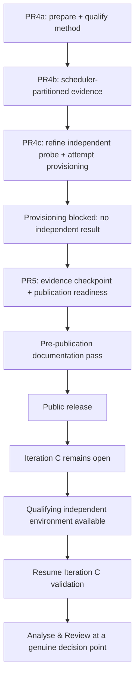

# AG-Sept — milestone plan

**Status:** Living — August publication checkpoint in progress; Iteration C remains open  
**Delivery window:** August 2026 for the public-release checkpoint; Iteration C resumes when its independent-capacity environment is available  
**Predecessor:** AG-M1 — correct transactional core and end-to-end service path  
**Supersedes:** [`../ag-sept-plan-v0.4.md`](../ag-sept-plan-v0.4.md) (31 July 2026), retained as an
archived snapshot because PR1 and PR2 were planned and reported under it.

## What this document owns

**Schedule only:** priority, budget, sequence, work-unit/PR split, contingency, descope order,
deliverable status, and the scheduling history that explains how the order was reached.

Everything durable lives elsewhere, and this plan links rather than restates it:

| Question | Owner |
|---|---|
| What worthwhile outcome is AG-Sept pursuing, and what problem is open now? | [`../../requirements/ag-sept.md`](../../requirements/ag-sept.md) |
| What must be true of any acceptable resolution? | [`../../requirements/system-requirements.md`](../../requirements/system-requirements.md) (`REQ-*`) |
| What workload semantics stay stable while topology changes? | [`../../design/workload-catalog.md`](../../design/workload-catalog.md) |
| What is the durable system shape? | [`../../design/horizontal-scaling.md`](../../design/horizontal-scaling.md), [`../../design/horizontal-database-authority.md`](../../design/horizontal-database-authority.md), [`../../design/deployment-architecture.md`](../../design/deployment-architecture.md) |
| What transactional properties must hold? | [`../../design/transaction-semantics.md`](../../design/transaction-semantics.md) (`INV-*`) |
| How will the claims be proved or falsified? | [`milestone-validation.md`](milestone-validation.md) (`VAL-*`) |
| What makes a run's numbers admissible? | [`../../design/measurement-contract.md`](../../design/measurement-contract.md) |
| How is the system run and operated? | [`../../operations/`](../../operations/) |
| What did the experiments establish? | [`../../measurements/`](../../measurements/) |
| How was the work actually built? | [`../../development/implementation/`](../../development/implementation/) |

**This plan is not a normative reference for code, tests, requirements, or design.** It is
expected to change; a citation into it should be for a scheduling or historical fact and should
say so ([`../../development/engineering-process.md`](../../development/engineering-process.md) §6.3).

Sizes, matrices, durations, and replica counts proposed here are `[HYPOTHESIS]` under
`measurement-contract.md` §2 unless identified as a fixed planning budget or are fixed by the
owning validation/design document.

## 1. Where the milestone is

AG-Sept's governing goal, its iteration history, and the currently open problem are owned by
[`../../requirements/ag-sept.md`](../../requirements/ag-sept.md). In summary:

- **Iteration A — identify the first scaling frontier.** Resolved. PR2 established PostgreSQL as
  the limiting subsystem while the Go service retained substantial compute headroom.
- **Iteration B — compose independent writable database authorities.** Resolved by the Analyse &
  Review in PR #17. The Phase 1 authority model is established as a correctness/composition result,
  not a capacity multiplier.
- **Iteration C — characterise shard-group capacity scaling. OPEN.** PR4a qualified the method;
  PR4b completed the scheduler-partitioned sustained G1/G2/G4 experiment; PR4c refined the
  independently provisioned probe but stopped before measurement because the required AWS
  environment could not be provisioned. The PR4c work unit is closed, but the **Iteration C
  Problem is not**.

The scheduler-partitioned result is retained in
[`../../measurements/reports/ag-sept-pr4-scheduler-partitioned-capacity.md`](../../measurements/reports/ag-sept-pr4-scheduler-partitioned-capacity.md):
`G4_local` resolved at 3493.9/s; `G1` and `G2` did not; `G1_local`, `G2_local`, `E2_local`, and
`E4_local` are withheld; and `VAL-SCALE-6` is executed but not discharged. Four identical G1 runs
measured 25.1% variation. The evidence localises that material local variation to the shared write
path rather than `alloca-go`, without proving the deeper storage mechanism.

No independently provisioned performance cell exists and `VAL-SCALE-5` remains unproven. That is
unfinished validation, not an A&R verdict. **Iteration C resumes when an equivalent independently
provisioned environment can be created.** AWS after quota approval is one way to satisfy that
condition; another provider/environment is acceptable if it satisfies the same design and
validation contracts.

The next scheduled work is PR5: capture the PR4 evidence boundary and prepare the repository for
public release. Public release is a repository-readiness event and does **not** close Iteration C or
produce an `END` decision for the engineering loop.

| Workstream | Work unit | Status |
|---|---|---|
| Measurement substrate and load harness | PR1 | merged `71914a4` |
| Single-instance frontier | PR2 | merged `0d40de4` |
| Placement, booking policy, confirm/cancel ownership | PR3a | merged `aa1e3a5` |
| Multi-authority harness — topology, routing, certification, verifier | PR3b | merged `57f501d` |
| Multi-authority correctness and failure-isolation evidence | PR3c | merged #16 |
| Iteration B Analyse & Review | review step, PR #17 | merged; Iteration B closed and Iteration C Problem selected |
| Iteration C planning | PR #18 | complete; Requirements → Design → Validation → Schedule established |
| Iteration C experiment preparation and measurement qualification | PR4a | merged #19; method qualified, no canonical scaling result |
| Iteration C scheduler-partitioned sustained characterisation | PR4b | merged #20; `G4_local` resolved, `G1`/`G2` unresolved, efficiencies withheld, `VAL-SCALE-6` not discharged |
| Iteration C independently provisioned probe attempt | PR4c | work unit closed `STOP / DEFER`; no measured cell; `VAL-SCALE-5` pending |
| Iteration C evidence checkpoint + publication readiness | PR5 | in progress |
| Iteration C independent-capacity continuation | future work unit | waiting for a qualifying environment; not scheduled into the August publication checkpoint |

Validation status is owned by the validation plan's own status table, not duplicated here.

## 2. Time budget

The development allocation is a planning constraint. **Half a day is the unit**, here and in the
implementation records: nothing is estimated well enough to distinguish 0.3 from 0.4, and finer
granularity is false precision that invites its own overrun (maintainer decision, 2026-08-05).

| Workstream | Work unit | Allocated | Spent | Left | Status |
|---|---|---:|---:|---:|---|
| Measurement harness and load generator | PR1 | 2.0 | 2.0 | 0.0 | merged |
| Single-instance frontier, with the diagnostic time-series minimum | PR2 | 2.5 | 2.5 | 0.0 | merged |
| Placement, booking policy, and confirm/cancel ownership | PR3a | 1.0 | 1.0 | 0.0 | merged; originally 3.0, with 2.0 returned to contingency |
| Multi-authority harness | PR3b | 2.5 | 2.5 | 0.0 | merged |
| Multi-authority correctness and failure-isolation evidence | PR3c | 1.5 | 1.5 | 0.0 | merged; originally 2.0, with 0.5 returned to contingency |
| Iteration C planning | PR #18 | 0.5 | 0.5 | 0.0 | complete; hard planning cap met |
| Iteration C method preparation and measurement qualification | PR4a | 4.0 | 4.0 | 0.0 | complete; consumed the former PR4a/PR4b envelope (§2.1.3) |
| Iteration C scheduler-partitioned sustained characterisation | PR4b | 1.0 | 1.0 | 0.0 | complete; funded by the 1.0-day contingency transfer (§2.1.3) |
| Iteration C independent probe attempt | PR4c | **0.5** | **0.5** | **0.0** | closed `STOP / DEFER`; originally 1.0, with 0.5 returned (§2.1.4) |
| Iteration C evidence checkpoint + publication readiness | PR5 | 1.5 | 0.0 | 1.5 | in progress |
| **Allocated development budget** | | **17.0** | **15.5** | **1.5** | |
| Contingency | | **2.5** | **1.0** | **1.5** | 1.0 direct spend; transfers to PR4b/PR4c are counted on their rows; 0.5 returned from PR4c |
| **Total milestone budget** | | **19.5** | **16.5** | **3.0** | |

**The numeric columns are the accounting source of truth:** `Allocated = Spent + Left` on every
row. Completed work that returned unused allocation is shown at its current allocation; **Status**
keeps the historical context, not the accounting.

A **draw** spends contingency directly on work with no work-unit row; a **transfer** moves days from
contingency to a work-unit allocation and is not counted as contingency spend. Returned allocation
moves back the same way. The milestone total remains **19.5 days**.

A further **2–3 days** are reserved beyond the development budget for rerunning decisive
experiments, validating negative controls, reviewing measurements and interpretations, correcting
documentation, polishing diagrams, checking public-disclosure suitability, and preparing the
repository for external readers. Iteration B's Analyse & Review (#17) spent 0.5 day from this
reserve, leaving **1.5–2.5 days**.

PR5's evidence-checkpoint and publication-readiness work uses the existing **1.5 development days**.
The remaining reserve is available for the broader pre-publication documentation pass. **Iteration C
continuation and its eventual Analyse & Review are not funded or scheduled by PR5**; they receive a
new schedule when the required environment exists and the technical work resumes.

The time budget is a constraint, not an estimate to be expanded whenever a tool introduces
incidental complexity.

### 2.1 How the contingency is spent

**Completed work returns unused allocation to contingency rather than to scope.** PR3a came in at
1.0 against 3.0 and returned 2.0; PR3c came in at 1.5 against 2.0 (§2.1.2). The figures recorded are
conservative under the half-day rule rather than attempts to account for hours precisely.

The gain is not an invitation to widen active technical work. Contingency exists for reruns,
investigations that do not resolve on the first attempt, or another hard problem established by
evidence.

After the PR4b and PR4c transfers and PR4c's return, the contingency row is **2.5 total**:
**1.0 spent** and **1.5 left**. Unspent contingency is not a licence to expand a PR.

### 2.1.1 The documentation and methodology expansion draws on contingency

**Maintainer decision, 2026-08-10:** the document-ownership and engineering-process expansion
carried by PR #15 is charged to AG-Sept contingency.

**Drawn: 1.0 day** under the half-day accounting rule.

### 2.1.2 PR3c returns its unused half day

**Maintainer decision, 2026-08-11:** PR3c is charged at **1.5 days actual** against its former
2.0-day allocation. The 0.5-day difference returned to contingency rather than being carried into
Analyse & Review or silently charged to the next work unit.

The milestone total stays **19.5 days**; the return changes allocation, not the total budget.

### 2.1.3 PR4a is charged at 4.0 days, and PR4b draws 1.0 from contingency

**Maintainer decision, 2026-08-18:** PR4a is charged at **4.0 days actual**, consuming the whole
former PR4a/PR4b shared envelope. **PR4b is allocated 1.0 day, transferred from contingency.**

PR4a absorbed the envelope because measurement qualification expanded materially: independent
per-group demand streams, explicit conditioning and accounting, frozen pool policy, derived fixture
sizing, the 600 s retained-run shape, and the host-executable experiment entry point all moved into
preparation before the evidence-producing comparison.

PR4b then used the transferred day as a deliberately bounded execution/analysis pass. It stopped
once the local shared-write-path limitation was strong enough to require withholding unsupported
efficiencies rather than drawing more contingency to chase a number.

### 2.1.4 PR4c receives 1.0 day, closes on a quota blocker, and returns 0.5

PR4c received a **1.0-day contingency transfer** for the bounded independent probe. Provisioning
could not satisfy the probe's minimum topology, so no measured cell ran; the external evidence is
retained under [`../../measurements/pr4c-quota/`](../../measurements/pr4c-quota/).

PR4c is charged at **0.5 day actual** and returns **0.5 day** to contingency. The PR4c work unit
closes `STOP / DEFER`; this does **not** close Iteration C. A later continuation receives a new
budget when an equivalent independent environment is available.

### 2.2 Review depth is the throughput control

**Review is not free. Maintainer decision, 2026-08-12:** Iteration B's Analyse & Review in PR #17
is charged at **0.5 day** against the separate 2–3 day review/rerun/interpretation reserve.

The earlier schedule combined final Iteration C A&R with PR5. **Superseded by the 2026-08-21
maintainer decision:** do not perform A&R while the independent-capacity question is still intended
work and blocked only by its environment prerequisite. PR5 records an evidence checkpoint instead.
Publication proceeds independently of the engineering-loop state.

When Iteration C later reaches a genuine decision point, its A&R is performed under
[`../../development/engineering-process.md`](../../development/engineering-process.md) §1.4.1 and
receives the review depth warranted by the evidence at that time.

### 2.3 Iteration C planning is intentionally bounded, not a general precedent

**Maintainer decision, 2026-08-12:** PR #18 had a **0.5-day hard cap** because PR2 had already
exposed the mutation frontier, Iteration B had established the authority architecture, and PR #17
had selected a narrow Problem. The remaining work was mainly to place known decisions in their
semantic owners and derive the minimum environment that made the comparison legitimate.

A future Problem with genuine unresolved uncertainty should receive the investigation its
uncertainty requires. **Process depth follows uncertainty.**

### 2.4 PR4a and PR4b shared the PR4 envelope after local qualification expanded

**Maintainer decision, 2026-08-14:** retire the original fixed 1.5-day / 2.5-day PR4a/PR4b split
while keeping the combined **4.0-day PR4 allocation unchanged**.

**Superseded by §2.1.3 (2026-08-18)**, which charged the whole 4.0 days to PR4a and funded PR4b
separately from contingency. The reason remains useful history: the 16-vCPU WSL/Docker environment
proved valuable for exercising the real G1/G2/G4 machinery, and it exposed measurement ambiguity
that had to be resolved before spending metered independent-environment time.

### 2.5 PR4 is re-cut as preparation → local evidence → bounded independent verification

The PR boundary follows purpose rather than environment:

```text
PR4a — prepare and qualify the experiment
PR4b — execute and analyse the full sustained experiment locally
PR4c — refine and attempt the bounded independent-resource probe
```

PR4b established that the scheduler-partitioned denominator is limited by material shared-write-path
variation. PR4c refined the independent probe method but stopped at provisioning. The reusable
method is owned by
[`../../design/independent-capacity-probe.md`](../../design/independent-capacity-probe.md) and
[`milestone-validation-pr4c-aws-probe.md`](milestone-validation-pr4c-aws-probe.md); the provisioning
evidence is owned by [`../../measurements/pr4c-quota/`](../../measurements/pr4c-quota/).

Local scheduler partitioning and independent provisioning remain different evidence classes. The
independent-capacity question therefore remains **inside Iteration C**, waiting for a qualifying
environment rather than being converted into a different future Problem merely because the first
provider attempt was blocked.

## 3. PR sequence

Each entry states what the work unit delivers and the gate that ends it. Technical meaning stays in
the linked requirements, design, workload catalogue, measurement contract, and validation plan.

### PR1 — Measurement substrate and load harness — merged

2.0 days. Metrics recorder, telemetry-overhead measurement, reset and seed tooling, external
generator, run manifest, persisted-state verifier, response-validation control, operator
documentation.

Record: [`ag-sept-pr1.md`](../../development/implementation/ag-sept-pr1.md).

### PR2 — Single-instance frontier — merged

2.5 days. Prometheus retention path, diagnostic panels, one-instance sweeps for controlled
workloads, telemetry comparison, generator-bottleneck control, frontier report.

Record: [`ag-sept-pr2.md`](../../development/implementation/ag-sept-pr2.md). Report:
[`ag-sept-pr2-single-instance-frontier.md`](../../measurements/reports/ag-sept-pr2-single-instance-frontier.md).
Result: PostgreSQL, not `alloca-go`, sets the measured mutation frontier.

### PR3a — Placement, booking policy, and confirm/cancel ownership — merged

**Actual 1.0 day.** Delivers the versioned placement map, shard-affine service units, placement
enforcement, Phase 1 booking policy, confirm/cancel ownership, and supporting contracts/tests.

### PR3b — Multi-authority harness — merged

**Actual 2.5 days.** Delivers the two-authority topology, per-authority migration, placement-aware
generator, topology/provenance certification, and authority-aware verifier.

### PR3c — Multi-authority correctness and failure isolation — merged #16

**Actual 1.5 days.** Delivers retained Phase 1 correctness, refusal, routing, reconciliation and
failure-isolation evidence. It deliberately makes no capacity multiplier claim from the shared
workstation.

### Iteration B Analyse & Review — PR #17 — merged

**Actual 0.5 day from the separate review reserve.** Closes Iteration B, repairs the VAL-COR-4
same-key replay evidence gap found during review, and selects the Iteration C Problem.

### Iteration C planning — PR #18 — 0.5 day

**Actual 0.5 day. Docs-only.** Requirements → Design → Validation → Schedule for the Problem
selected by #17. It records `WL-MUT-DISP-4`, the shard-group capacity-unit model, numeric efficiency
as an output rather than a threshold, and the independent-resource requirement.

### PR4a — Iteration C experiment preparation and measurement qualification — merged #19

PR4a answered: **can the experiment be trusted?** It produced no canonical G1/G2/G4 capacity
result. It delivered independent `workers_per_group` streams and `VAL-NEG-8`, explicit state-based
conditioning and pool recycle, the frozen `pool_max_conns=8` policy, fixture sizing/headroom,
qualified 600 s runs with retained slices, resource/reconciliation evidence, and removal of the
benchmark-induced cached-plan regime from the measured start state.

### PR4b — Scheduler-partitioned sustained capacity characterisation — merged #20

PR4b answered: **what does the qualified experiment show on this scheduler-partitioned
workstation?** It drove adaptive reconnaissance, fixed the common S=12/H=16 bracket, derived the
final fixture, and retained the full S/H + confirmation 600 s comparison across G1/G2/G4.

All twelve retained comparison runs reconciled. `G4_local` resolved at 3493.9/s; `G1` and `G2` did
not, so `G1_local`, `G2_local`, `E2_local`, and `E4_local` are withheld. Four identical G1 runs
measured 25.1% spread and refuted run position as the explanation. Goodput covaries with delivered
write bandwidth at broadly stable mutations/MiB, localising the material variation to the shared
write path without proving the deeper storage mechanism.

Report:
[`ag-sept-pr4-scheduler-partitioned-capacity.md`](../../measurements/reports/ag-sept-pr4-scheduler-partitioned-capacity.md).

### PR4c — Bounded independently provisioned probe attempt — closed `STOP / DEFER`

**Actual 0.5 day against a 1.0-day transfer.** PR4c refined the fixed-per-unit independent probe and
attempted provisioning, but the minimum environment could not be instantiated. No performance cell
ran and `VAL-SCALE-5` remains unproven.

Design: [`../../design/independent-capacity-probe.md`](../../design/independent-capacity-probe.md).  
Validation: [`milestone-validation-pr4c-aws-probe.md`](milestone-validation-pr4c-aws-probe.md).  
Provisioning evidence: [`../../measurements/pr4c-quota/`](../../measurements/pr4c-quota/).

**Gate:** the PR4c work unit stops. The Iteration C Problem stays open; continuation waits for an
equivalent independent environment.

### PR5 — Iteration C evidence checkpoint + publication readiness

**Budget:** 1.5 development days, following PR4b's retained local evidence and PR4c's provisioning
blocker.

PR5 does **not** perform Analyse & Review. It preserves the current evidence boundary and prepares
the repository for external readers without turning publication into technical closure.

It delivers:

- a durable scheduler-partitioned PR4 checkpoint report with measured facts, withheld quantities,
  interpretation, and limitations kept separate;
- explicit status that Iteration C remains open and resumes when the independent environment is
  available;
- the documentation ownership/architecture-vs-implementation guidance and the corresponding
  planning/validation directory migration;
- the bounded pre-publication documentation pass, using the remaining review/publication reserve
  where needed;
- final disclosure/navigation/history checks required before the repository changes visibility.

**Gate:** an external reader can understand what AG-Sept established, what the scheduler-partitioned
result does and does not mean, and why Iteration C is still open; the repository is suitable for
public release; no A&R verdict or `END` decision is implied.

The current path is:



## 4. Manifest and reconciliation staging

The rules are `measurement-contract.md` §11–§13. PR3b established multi-authority topology/image
identity. PR4a extended the harness so conditioning, `workers_per_group`, per-group demand identity,
measured-start baselines, fixed pool policy and the 600 s retained run shape are explicit and
auditable. PR4b applied that machinery to every interpreted scheduler-partitioned G1/G2/G4 cell.

PR4c produced **no run artifact or independent-environment reconciliation** because provisioning
failed before a measured environment existed. Its refined future method is design/validation only.

Reconciliation: PR1 established the single-authority self-check; PR3b extended it to multiple
authorities; PR3c exercised it against deliberate failure. PR4a added the conditioning/measurement/
resolution population boundary; PR4b exercised it on the full local sustained family.

**Quotability target:** provenance level and validation meaning remain separate. No independent-
capacity claim follows until the governing validation/evidence gates for that claim are satisfied.

## 5. Priority and descope

This section now distinguishes the **August publication checkpoint** from the still-open Iteration C
technical requirement.

### 5.1 P0 — required for the publication checkpoint

- preserve `WL-MUT-DISP-4`, PR4a's qualified method, and PR4b's retained scheduler-partitioned
  evidence without weakening their evidence labels;
- retain the explicit unresolved local result: `G4_local` resolved, `G1`/`G2` unresolved,
  efficiencies withheld, `VAL-SCALE-6` not discharged;
- retain `VAL-SCALE-5` as pending because no independently provisioned measurement ran;
- record the PR4 evidence checkpoint while the experiment context is fresh;
- make the documentation structure/navigation understandable to external readers;
- complete disclosure/history checks before public release.

**Successful independent-capacity measurement is not a publication prerequisite.** It remains an
Iteration C validation requirement and therefore cannot be reclassified as optional merely because
the repository is made public first.

### 5.2 P1 — strongly desirable

- diagrams or charts that materially improve first-read understanding of the established evidence;
- additional documentation compression where it removes duplication without weakening semantic
  ownership or historical/evidence meaning;
- public reproduction entry points that lead directly from a claim to its retained artifacts;
- optional `VAL-LOAD-1` or resource-control work only when Iteration C resumes and the prerequisite
  closed-loop result/environment makes it meaningful.

### 5.3 P2 — only after decisive evidence

Transactional outbox implementation; independently deployed consumer; autoscaling; additional
fault injection; distributed tracing; richer dashboards; service-replica scaling without evidence
that service compute has become the relevant frontier.

### 5.4 Out of scope for the August publication checkpoint

Cross-authority booking and any distributed commit/saga protocol; splitting one organisation
across writable authorities; online rebalancing or dual-write migration; multi-region writes;
EKS; RDS; Kubernetes; a service mesh; autoscaling; a broker solely to claim event-driven
architecture; complete production authentication/authorization; eliminating hot-authority
serialization; and reproducing a full commercial workload.

**The independent-capacity experiment is not in this out-of-scope list.** It is unfinished
Iteration C work, simply not scheduled into the August publication checkpoint. AWS itself is not a
requirement: the continuation may use another provider/environment if it satisfies the same
resource-equivalence, provenance, generator-headroom, and reconciliation contracts.

### 5.5 Descope order

If time slips before publication, remove work in this order:

1. chart/dashboard polish beyond what materially improves the public story;
2. optional diagrams whose information is already clear in concise prose;
3. historical prose cleanup that does not affect current navigation or interpretation;
4. additional examples or explanatory depth beyond what an external reader needs to follow the
   architecture and evidence.

**Do not descope:** the PR4 evidence checkpoint; honest evidence labels; the distinction between
scheduler-partitioned and independently provisioned evidence; response validation/reconciliation
facts behind quoted results; disclosure review; or the statement that Iteration C remains open.

## 6. Scheduling history

### 6.1 Why database-authority scaling came first

Maintainer decision, 2026-08-05: database-authority scaling comes before service-replica scaling
because PR2 found PostgreSQL to be the first mutation frontier. Scaling design and correctness
therefore had higher value than multiplying application replicas against an unchanged saturated
writer.

### 6.2 What changed from v0.4

v0.4 planned one service baseline, stateless replicas against one PostgreSQL authority, then a
conditional AWS deployment. Evidence changed that order:

1. horizontal database authority became primary work ahead of replicas;
2. the original EKS/RDS-style AWS path was withdrawn and its budget moved to authority work;
3. Iteration B established the authority architecture and PR #17 selected capacity composition as
   the next Problem;
4. Iteration C derived that the fixed workstation cannot prove an independently provisioned
   capacity claim;
5. PR4a added a bounded local resource-partitioned rehearsal so topology and measurement machinery
   could be debugged before metered work;
6. the rehearsal exposed and root-caused a benchmark-induced cached-plan regime, expanding PR4a
   into measurement qualification;
7. the workstation proved large enough to execute the complete G1/G2/G4 local family;
8. PR4b established material G1 run-to-run variation tied to the shared write path and withheld the
   unsupported local efficiencies;
9. PR4c refined the independent probe, but provisioning blocked it before measurement;
10. on 2026-08-21 the maintainer separated **publication** from **engineering-loop closure**:
    Iteration C stays open, PR5 records a checkpoint, and A&R waits until the intended independent
    validation reaches a real decision point.

### 6.3 The original AWS path remains withdrawn; independent capacity remains Iteration C

The v0.4 AWS plan — ECR/EKS/RDS/load-balancing plus a larger cloud matrix — remains withdrawn. PR4c
did not restore it and produced no performance result.

The current evidence/publication path is:

```text
qualified method
    -> full scheduler-partitioned characterisation
    -> refined independent probe + blocked provisioning prerequisite
    -> PR4 evidence checkpoint
    -> public-readiness pass
    -> public release
```

The technical continuation is separate from that publication path:

```text
qualifying independent environment available
    -> resume Iteration C independent validation
    -> retain/interpret evidence
    -> Analyse & Review when the iteration reaches a decision point
```

A fuller independent G1/G2/G4 verification or the bounded paired probe may use AWS if quota permits,
but provider choice is implementation detail. No EKS, RDS, managed-database, service-mesh, or
cloud-production conclusion follows from PR4c's provisioning attempt.

### 6.4 The PR2 deferral register

- **Overload question:** broad overload mechanism work remains outside the current publication
  checkpoint; `VAL-LOAD-1` is meaningful only after the applicable closed-loop capacity result is
  secure.
- **Instrumentation:** the durable obligation is evidence sufficient to identify/bound each quoted
  frontier plus `VAL-NEG-7` for independently provisioned claims; no exporter is required merely
  because it appeared in an earlier schedule.
- **Evidence hygiene:** per-run retained evidence required by the strongest executed path is in
  scope; unrelated PR2 re-runs/histogram work remains deferred.

## 7. Final deliverables for the public-release checkpoint

The public-ready repository should leave:

1. a runnable containerized service;
2. a reproducible external load generator with placement-aware routing and independent per-group
   demand streams;
3. a stable reusable workload catalogue;
4. aggregated service/runtime/resource evidence sufficient for the claims actually made;
5. the single-instance frontier report;
6. the multi-authority correctness/failure-isolation report;
7. the PR4 scheduler-partitioned checkpoint report, with `G4_local` established, local efficiencies
   withheld, and the shared-write-path limitation explicit;
8. the deferred independent-probe design and provisioning evidence, with no independent performance
   number and `VAL-SCALE-5` still pending;
9. current architecture diagrams and a clear map from claims to their semantic owners/evidence;
10. explicit status that **Iteration C remains open** and public release does not imply A&R or
    engineering-loop closure;
11. a concise public repository summary;
12. explicit limitations, evidence labels, and negative-control results;
13. a bounded **pre-publication documentation pass** across `docs/`, reviewed from an external
    reader's perspective: improve first-read comprehension where diagrams materially help; reduce
    unnecessary density/duplication without weakening precision; verify navigation, semantic
    ownership, terminology, document status, disclosure suitability, and reproduction entry points.

## 8. Publication checkpoint gate

The **August publication schedule** is complete when the deliverables of §7 exist and the repository
is suitable for external readers under the disclosure policy.

Before visibility changes:

- PR4a's qualified method and PR4b's scheduler-partitioned evidence are retained and correctly
  labelled;
- the checkpoint report states `G4_local`, the unresolved G1/G2 status, the withheld efficiencies,
  the 25.1% G1 variation, and the shared-write-path interpretation without promoting it into a
  proven deeper mechanism;
- PR4c is recorded as a provisioning stop with **no measured independent result**;
- `VAL-SCALE-5` remains explicitly pending;
- measured facts, calculations, interpretation, and limitations remain separate;
- the public documentation is navigable, compressed where appropriate, and internally consistent;
- repository content/history/PR metadata pass the disclosure review.

**Successful independent-capacity measurement is not a public-release gate. It is still an
Iteration C technical gate.** The publication schedule therefore does not redefine the
"sufficiently resolved" criteria owned by `../../requirements/ag-sept.md` or the validation meaning
owned by `milestone-validation.md`.

After public release, Iteration C remains open. It resumes when a qualifying independent environment
is available. Its formal Analyse & Review occurs later, when the intended validation has produced a
real outcome or when the Problem itself is explicitly reconsidered.

A public repository is therefore a checkpoint in Alloca's ongoing engineering record, not the end
of that record.
